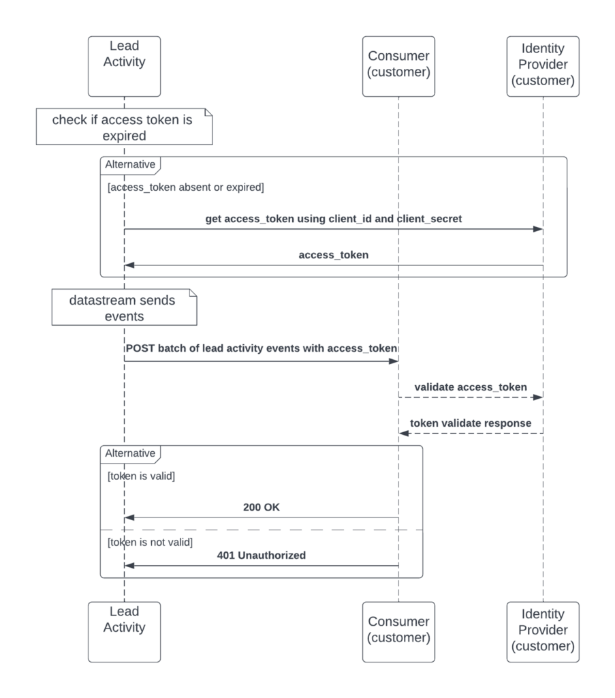

# Flux de données

>[!NOTE]
>
>Vous trouverez désormais les informations actuelles sur les flux de données à l’adresse [Utilisation des flux de données](https://developer.adobe.com/events/docs/guides/using/marketo/marketo-data-streams#).
>

Les flux de données diffusent d’importants volumes de données Marketo Engage vers des systèmes externes en temps quasi réel. Utilisez des données diffusées pour prendre des décisions opportunes, réaliser des campagnes ciblées, mettre en place des processus marketing externes et réaliser des audits.

Les flux de données offrent les avantages suivants :

- Réduisez la dépendance aux requêtes d’API à débit limité.
- Réduisez les alertes de limite d’API.
- Diffuser des données sans exécuter d’exportations en bloc.

Les flux de données sont disponibles pour ceux qui ont acheté un package [Marketo Engage Performance Tier](https://nation.marketo.com/t5/product-documents/marketo-engage-performance-tiers/ta-p/328835).

## Flux de données d’activité du lead - Aperçu

Le flux de données d’activité de prospect envoie d’importants volumes de données d’activité de prospect à un système externe en temps quasi réel. Utilisez le flux pour auditer les événements de lead et les modèles d’utilisation, afficher les modifications de lead et déclencher des workflows à partir d’événements de lead.

Vous pouvez vous abonner à plus de 144 types d’activités.

Le flux peut inclure les éléments suivants :

1. Modifications de tous les champs de prospect et prospects nouvellement créés.
1. Tous les types d’activité de prospect documentés.
1. Leads supprimés.
1. Tous les objets personnalisés de prospect, le cas échéant. Vous ne pouvez pas sélectionner des objets personnalisés individuels.

Les cas d’utilisation courants incluent :

- Alertes personnalisées : ajout de prospects présentant des conditions incohérentes à une liste. Le flux envoie l’activité Ajouter à la liste à un processus de suivi.
- Modèles de machine learning : utilisez des informations sur les activités dans des modèles de notation externes, puis envoyez des notes à Marketo pour influencer les campagnes d’éducation ou d’autres processus.

Liste des activités diffusées en continu :

| AchieveGoalInReferral | ClickPredictiveContent | ReceivedForwardToFriendEmail |
| --- | --- | --- |
| AddToList | ClickRTPCallToAction | ReceiveSalesEmail |
| AddToNurture | ClickSalesEmail | ReferToSocialApp |
| Ajouter à l’opportunité | ClickSharedLink | RemoveFromList |
| AddToSalesCampaign | ConvertLead | RemoveFromOpportunity |
| CallWebhook | Supprimer le lead | Campagne de demande |
| ChangeDataValue | Disqualifier les tirages au sort | SalesEmailBounce |
| ChangeLeadPartition | EarnEntryInSocialApp | SendAlert |
| ChangeCultureCadence | E-mail non remis | SendEmail |
| ChangeNurtureTrack | EmailBounceSoft | SendSalesEmail |
| Modifier le propriétaire | E-mail diffusé | SentForwardToFriendEmail |
| ModifierDonnéesProgramme | EnrichWithDataDotCom | Activité SFDCA |
| ModifierDonnéesMembreProgramme | EnterSweepstakes | ShareContent |
| ChangeRevenueStage | FillOutFacebookLeadAdsForm | SignUpForReferralOffer |
| ChangeRevenueStageManually | FillOutForm | SyncLeadVersMicrosoft |
| ChangeScore | Moment intéressant | SyncLeadVersSFDC |
| ModifierSegment | MergeLeads | UnsubscribeEmail |
| ChangeStatusInProgression | NewLead | UpdateOpportunity |
| ChangeStatusInSalesCampaign | OpenEmail | VisitWebPage |
| ClickEmail | OpenSalesEmail | VoteInPoll |
| ClickLink | PushLeadToMarketo | WinSweepstakes |

Lors de la diffusion en continu d’objets personnalisés, incluez tous les objets personnalisés liés au prospect. Vous ne pouvez pas sélectionner des objets personnalisés individuels.

## Flux de données d’audit de l’utilisateur - Aperçu

Le flux de données d’audit des utilisateurs suit les modifications des utilisateurs sur les ressources en temps quasi réel. Utilisez-le pour auditer les événements de ressource, afficher les modifications d’utilisateur et déclencher des processus à partir des événements d’audit.

Adobe I/O Events envoie les modifications vers un point d’entrée configurable. Abonnez-vous aux types d’événements requis pour chaque type de ressource.

Voici un cas d’utilisation :

- Suivi des modifications dans les systèmes marketing : lorsqu’un CRM ou un autre système échange des prospects avec Marketo, utilisez les événements d’audit pour identifier le système qui a apporté la dernière modification.

Liste des événements d’audit d’utilisateur diffusés en continu :

| COMPOSANT | LISTE DES TYPES D’ÉVÉNEMENTS |
| --- | --- |
| Programme par défaut | cloner, créer, supprimer, modifier le canal, exporter, modifier la configuration du programme, modifier le jeton de programme, renommer |
| E-mail | approuver, cloner, créer, supprimer, modifier, déplacer, renommer, annuler l’approbation |
| Programme d&#39;e-mail en masse | approuver, childUpdate, cloner, créer, supprimer, modifier, modifier le canal, modifier le planning du programme, modifier la configuration du programme, modifier le jeton du programme, renommer, annuler l’approbation |
| Modèle d’e-mail | approuver, cloner, créer, supprimer, draftCreate, draftDiscard, modifier, renommer, annuler l&#39;approbation |
| Programme d’engagement | cloner, créer, supprimer, modifier le canal, modifier la configuration du programme, modifier le flux du programme, modifier le jeton du programme, renommer |
| Programme d’événement | cloner, créer, supprimer, modifier le canal, modifier le planning du programme, modifier la configuration du programme, modifier le jeton du programme, renommer |
| Dossier | créer, supprimer, modifier, renommer |
| Form | approuver, cloner, créer, supprimer, brouillonCréer, modifier, déplacer, renommer |
| Formulaire -> Formulaire de la page de destination | créer, cloner, modifier, supprimer, approuver, renommer |
| Page de destination | approuver, cloner, créer, supprimer, brouillonIgnorer, modifier, renommer, annuler l&#39;approbation |
| Modèle de page de destination | approuver, cloner, créer, supprimer, draftCreate, draftDiscard, modifier, renommer, annuler l&#39;approbation |
| Liste intelligente | cloner, créer, supprimer, modifier, exporter, modifier la configuration de la liste dynamique, renommer |
| Dossier marketing | créer, modifier, supprimer |
| Programme de fidélisation | cloner, créer, supprimer, modifier le canal, modifier la configuration du programme, modifier le flux du programme, modifier le jeton du programme, renommer |
| Segment | créer, supprimer, modifier, renommer |
| Segmentation | approuver, créer, supprimer, draftCreated, draftDiscarded, renommer, annuler l&#39;approbation |
| Campagne intelligente | abandonner, activer, cloner, créer, désactiver, supprimer, modifier, modifier le planning de campagne, modifier l’action d’étape de flux, modifier la configuration de la liste dynamique, déplacer, renommer |
| Extrait | approuver, approuver sans brouillon, cloner, créer, supprimer, modifier, renommer, annuler l’approbation |
| Admin UI -> Launchpoint -> Intégration | créer, supprimer, modifier |
| Interface utilisateur d’administration -> Utilisateur | créer, modifier, supprimer (identique pour l’utilisateur de l’API uniquement) |
| Connexion administrateur -> utilisateur | connexion réussie, échec de connexion |
| Programme -> Programme par lots d’e-mails | Modifier l’API de ressources (pour modifier l’adresse e-mail sélectionnée) |
| Programme -> Programme marketing | créer, cloner |

Exemple d’événement d’audit d’utilisateur :

```json
{
    "event_id": "a1b2c3d4-zyxw-9876-9z8y-a1b2c3d4e5f6",
    "event": {
        "specversion": "1.0",
        "id": "b77c743a-8e28-40f2-8aab-9541bbc85e68",
        "type": "com.adobe.platform.marketo.audit.user.email",
        "source": "https://www.marketo.com",
        "time": "2020-05-28T19:20:47.28Z",
        "datacontenttype": "application/json",
        "dataschema": "V1.0",
        "data": {
            "componentId": 232459,
            "componentType": "Email",
            "eventAction": "approve",
            "munchkinId": "123-ABC-456",
            "imsOrgId": "ADOBEORGID@AdobeOrg",
            "user": 253,
            "userId": "example@marketo.com"
        }
    }
}
```

## Présentation Du Flux De Données De Notification

Le flux de données de notification est disponible dans le cadre des offres de niveau de performances de Marketo Engage.

Le centre de notifications Marketo peut envoyer des notifications à une adresse e-mail. Le flux de données de notification envoie également ces notifications à un point d’entrée configurable via Adobe I/O Events. Il s’agit des mêmes notifications que celles disponibles à partir de l’icône représentant une cloche dans l’interface utilisateur de Marketo.

Liste des événements de notification :

| COMPOSANT | LISTE DES TYPES D’ÉVÉNEMENTS |
| --- | --- |
| Notification | abandon de campagne, échec de campagne, maturation (programme épuisé), échec de synchronisation de Salesforce, groupe de test (résultat du test A/B), services web (quota quotidien) |

Exemple d’événement de notification :

```json
{
    "event_id": "a1b2c3d4-zyxw-9876-9z8y-a1b2c3d4e5f6",
    "event": {
        "specversion": "1.0",
        "type": "com.adobe.platform.marketo.notification.campaign_abort",
        "source": "https://www.marketo.com",
        "time": "2021-05-27T10:22:37.489-5:00",
        "datacontenttype": "application/json",
        "dataschema": "V1.0",
        "data": {
            "componentType": "campaign_abort",
            "subType": "user_campaign_abort",
            "eventAction": {
                "campaignId":1234,
                "userId":"example@marketo.com",
            }
            "imsOrgId":"ADOBEORGID@AdobeOrg",
            "munchkinId":"123-ABC-456"
        }
    }
}
```

## Détails techniques

Les sections suivantes décrivent la configuration requise pour recevoir des données de chaque flux. Chaque flux nécessite la configuration du point d’entrée et le code d’intégration.

### Flux de données d’activité du lead

Le flux d’activité de lead envoie les événements d’activité de lead avec abonnement présentant les caractéristiques suivantes :

- Par défaut, les données sont transmises toutes les deux secondes.
- Chaque abonnement utilise des lots de 100 à 500 enregistrements.
- Le service REST du client dispose d’un délai d’expiration de 20 secondes et de trois reprises à intervalles de trois minutes. Une nouvelle tentative réussie active automatiquement le service. Après trois échecs, le service s’interrompt et tente de relancer toutes les trois minutes, sauf s’il a été déconfiguré manuellement.
- Les données placées en file d’attente sont conservées jusqu’à sept jours.

Pour implémenter le flux de données de l’activité du prospect :

1. Exposez un point d’entrée HTTP qui peut recevoir des requêtes POST avec un corps JSON d’Internet public. Le flux de données des notifications push d’activité envoie des requêtes à :
1. Fournissez les éléments suivants à Adobe :
   1. Marketo Munchkin ID pour son abonnement
   1. URL du point d’entrée à l’étape 1
   1. Les types d&#39;activités qu&#39;ils souhaitent recevoir (liste complète ci-dessus)
   1. Moyen d’authentification permettant au client de vérifier que les demandes sont légitimes. Soit :
      1. Une URL de fournisseur d’identité, un ID client et un secret client pour OAuth [authentification par informations d’identification client](https://www.oauth.com/oauth2-servers/access-tokens/client-credentials/)
      1. Jeton API pouvant être inclus dans les requêtes envoyées par le flux de données de l’activité du prospect dans un en-tête HTTP d’autorisation

Adobe active le flux de données après réception des informations requises. Le point d’entrée commence alors à recevoir des données.

Diagramme UML d’un appel de flux de données d’activité de lead type :



Exemple de création de point d’entrée d’URL :

```javascript
/*
Copyright 2022 Adobe
All Rights Reserved.

NOTICE: Adobe permits you to use, modify, and distribute this file in
accordance with the terms of the Adobe license agreement accompanying
it.
*/
constexpress=require('express')
constwinston=require('winston');
constport=3000

constapp=express().use(express.json())

constlogger=winston.createLogger({
  level: 'info',
  format: winston.format.json(),
  defaultMeta: {service: 'activity-stream-consumer-example'},
  transports: [
    // - Write all logs with level `error` and below to `error.log`
    newwinston.transports.File({filename: 'error.log',level: 'error'}),
    // - Write all logs with level `info` and below to `combined.log`
    newwinston.transports.File({filename: 'combined.log'}),
    newwinston.transports.Console({format: winston.format.simple()})
  ],
});

app.get('/',(req,res)=>{
  logger.info(JSON.stringify(req.query))
  res.sendStatus(200)
})

app.post('/',(req,res)=>{
  logger.info(JSON.stringify(req.body))
  res.sendStatus(200)
})

app.listen(port,()=>{
  logger.info(`app listening on port ${port}`)
})
```

Consultez l’[exemple de consommateur de flux de données d’activité de lead](https://github.com/ihgrant/activity-stream-consumer-example) pour obtenir un exemple de code d’application.

### Flux de données d’audit d’utilisateur et flux de données de notification

Les événements User Audit sont envoyés via Adobe I/O. Pour les utiliser avec un Adobe ID :

1. Fournissez à Adobe les informations suivantes :
   1. Adobe ID
   1. Marketo Munchkin ID pour son abonnement
1. Exposez un point d’entrée REST, généralement un webhook, pour consommer des événements.
1. Après réception des informations de point d’entrée, Adobe active le flux de l’abonnement.
1. Configurez le flux dans Adobe I/O.
   1. Cette étape nécessite une organisation Adobe
   1. Nécessite que l’utilisateur de l’organisation Adobe ait un rôle de développeur ou d’administrateur système

Pour configurer Adobe I/O, voir [Configuration de flux de données de contrôle des utilisateurs Marketo avec Adobe I/O](https://developer.adobe.com/events/docs/guides/using/marketo/marketo-user-audit-data-stream-setup#).

### Configuration du flux de données d’audit des utilisateurs dans Marketo

Le flux de données de contrôle de l’utilisateur est actuellement disponible dans le cadre des packages de performances avec les 3 autres flux de données. Pour plus d’informations sur les packages, reportez-vous à la [page de description du produit](https://helpx.adobe.com/fr/legal/product-descriptions/adobe-marketo-engage---product-description.html) pour connaître les limites et fonctionnalités du produit.

### Configuration d’Adobe I/O

[Consultez Prise en main de Adobe I/O Events .](https://developer.adobe.com/runtime/docs/guides/getting-started/)

Pour obtenir des instructions de base sur ce cas d’utilisation, à partir de [console.adobe.io](https://developer.adobe.com/console) :

Lorsque vous y êtes invité, sélectionnez **[!UICONTROL Créer un projet]** ou **[!UICONTROL Ajouter un événement]**.

### Prise en main de votre nouveau projet

Pour commencer à utiliser les services Adobe, ajoutez une API, des événements ou un runtime, consultez notre [documentation](https://developer.adobe.com/runtime/docs/).

## Documentation publique

- [Flux de données Marketo](https://developer.adobe.com/events/docs/guides/using/marketo/marketo-data-streams/)
- [Présentation des événements et Webhooks d’Adobe IO](https://developer.adobe.com/events/docs/guides/)
- [Blog sur les flux de données](https://blog.developer.adobe.com/introducing-the-adobe-marketo-engage-data-streams-61198b567fbb)
