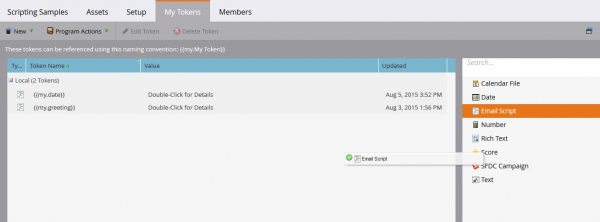
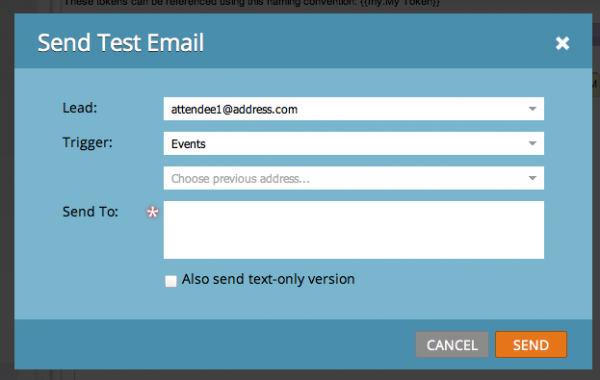

# Script de l&#39;e-mail

Lisez le [Guide d’utilisation de Velocity](https://velocity.apache.org/engine/devel/user-guide.html) pour une explication détaillée du comportement du langage de modèle Velocity.

[Apache Velocity](https://velocity.apache.org/) est un langage Java permettant de créer des modèles et des scripts de contenu HTML. Utilisez Velocity dans les jetons de script d’e-mail Marketo pour accéder aux données stockées dans les opportunités et les objets personnalisés et créer du contenu d’e-mail dynamique.

Velocity fournit un flux de contrôle `if`/`else`, `for` et `foreach` pour le contenu conditionnel et itératif.

## Variables

Préfixez les variables avec `$`. Créez-les ou mettez-les à jour avec les `#set` suivantes :

```velocity
#set($variable = "value")
```

Récupérez des valeurs de variable avec des types référence qui fournissent différents comportements :

```text
$variable ##outputs 'value'
$variablename ##outputs '$variablename'
${variable}name ##outputs 'valuename'
```


La notation de référence silencieuse inclut les `!` après `$`. Par défaut, Velocity laisse la chaîne de référence en place lorsqu’une référence est indéfinie. Une référence silencieuse n’émet aucune valeur lorsqu’elle est indéfinie :

```velocity
##Defined Reference

#set($foo = "bar")
$foo ##outputs "bar"

##Undefined Reference

##normal
$baz ##outputs "$baz"

##quiet
$!baz ##outputs nothing
```

Pour plus d’informations sur la référence à des variables, consultez le [Guide d’utilisation d’Apache](https://velocity.apache.org/engine/devel/user-guide.html#formal-reference-notation).

## Outils Velocity

Le projet Apache Velocity fournit des [outils Velocity](https://velocity.apache.org/tools/devel/apidocs/overview-summary.html). Ces wrappers exposent les méthodes d’objet Java par le biais de variables globales disponibles pour tous les scripts.

- [AlternatorTool](https://velocity.apache.org/tools/devel/apidocs/org/apache/velocity/tools/generic/AlternatorTool.html)
- [ComparisonDateTool](https://velocity.apache.org/tools/devel/apidocs/org/apache/velocity/tools/generic/ComparisonDateTool.html)
- [Outil de conversion](https://velocity.apache.org/tools/devel/apidocs/org/apache/velocity/tools/generic/ConversionTool.html)
- [Outil de date](https://velocity.apache.org/tools/devel/apidocs/org/apache/velocity/tools/generic/DateTool.html)
- [DisplayTool](https://velocity.apache.org/tools/devel/apidocs/org/apache/velocity/tools/generic/DisplayTool.html)
- [Outil mathématique](https://velocity.apache.org/tools/devel/apidocs/org/apache/velocity/tools/generic/MathTool.html)
- [Outil Numérique](https://velocity.apache.org/tools/devel/apidocs/org/apache/velocity/tools/generic/NumberTool.html)
- [EscapeTool](https://velocity.apache.org/tools/devel/apidocs/org/apache/velocity/tools/generic/EscapeTool.html)
- [LoopTool](https://velocity.apache.org/tools/devel/apidocs/org/apache/velocity/tools/generic/LoopTool.html)

Par exemple, pour utiliser une méthode à partir de `ComparisonDateTool`, accédez-y à partir de la variable `$date` dans un jeton de script :

```velocity
#set($birthday = $convert.parseDate("2015-08-07","yyyy-MM-dd"))
##use whenIs to determine how many days away it is
$date.whenIs($birthday).days ##outputs 1
```

## Création d’un jeton de script

Ajoutez des scripts Velocity aux e-mails avec des jetons de script d’e-mail. Créez un jeton dans les Activités marketing au sein d’un dossier ou d’un programme marketing.

Pour utiliser un jeton, l’e-mail doit être un enfant du programme propriétaire du jeton ou hériter de celui-ci d’un dossier marketing. Accédez à un dossier ou un programme et sélectionnez l’onglet [!UICONTROL Mes jetons]. Faites glisser l’option Script d’e-mail du menu de droite vers la liste de jetons.



Modifiez le nom du jeton, puis sélectionnez [!UICONTROL Cliquer pour modifier] pour ouvrir l’éditeur :


Dans l’éditeur, créez un script qui accède aux variables dans les objets accessibles par script. Pour ajouter une référence de champ d’objet, faites-la glisser de l’arborescence de droite vers le script :


## Incorporation et test de scripts

Après avoir défini le script dans un programme Mon jeton, référencez-le à partir d’un e-mail dans l’éditeur d’e-mail de Marketo.


Testez le script avec l’action [!UICONTROL Envoyer un exemple d’e-mail] dans le concepteur d’e-mail Marketo. Sélectionnez un prospect existant dans le champ [!UICONTROL Prospect] afin que le script procède correctement.

Lors du test des `$TriggerObject`, sélectionnez l’objet de déclenchement avec le paramètre [!UICONTROL Trigger]. Marketo utilise l’objet de ce type mis à jour le plus récemment comme variable `$TriggerObject`.



Vous pouvez également effectuer des tests avec [!UICONTROL Aperçu de l’e-mail]. Sélectionnez **[!UICONTROL Afficher en tant que : Détails du lead]**, puis sélectionnez un lead dans une liste statique. L’aperçu affiche également les exceptions à l’exécution du script :


## Meilleures pratiques

La longueur combinée de tous les jetons de script d’e-mail dans un e-mail donné ne peut pas dépasser 100 000 octets. Cette limite concerne la longueur totale des chaînes de jeton elles-mêmes (et non la longueur totale après le développement des jetons).

- Les variables référencées dans le script de courrier électronique doivent exister dans Marketo sur l’un des objets disponibles pour le script.
- Vous pouvez référencer des objets personnalisés de premier et deuxième niveau provenant de votre CRM nativement intégré directement connectés au lead ou au contact, mais pas des objets personnalisés de troisième niveau. Les objets personnalisés ne peuvent pas être des parents du prospect ou de l&#39;entreprise
- Pour les objets personnalisés Marketo, vous pouvez référencer des objets personnalisés de deuxième niveau avec une relation parent-enfant. Par exemple `Lead <- Parent <- Child`. Vous ne pouvez pas référencer d’objets personnalisés de deuxième niveau avec une relation Edge-Bridge. par exemple, `Lead <- Bridge -> Edge`
- Vous pouvez référencer des objets personnalisés connectés à un prospect, un contact ou un compte, mais pas plus d’un.
- Les objets personnalisés ne peuvent être référencés que par le biais d’une seule connexion, d’un seul lead, contact ou compte
- Cochez la case dans l’éditeur de script pour les champs que vous utilisez ou ils ne sont pas traités
- Pour chaque objet personnalisé, les dix derniers enregistrements mis à jour par personne/contact sont disponibles au moment de l’exécution. Les enregistrements sont classés du plus récemment mis à jour à l’index 0 au plus ancien à l’index 9. Vous pouvez augmenter le nombre d&#39;enregistrements disponibles en [suivant les instructions](https://experienceleague.adobe.com/fr/docs/marketo/using/product-docs/administration/email-setup/change-custom-object-retrieval-limits-in-velocity-scripting).
- Si vous incluez plusieurs scripts d’e-mail dans un e-mail, ils s’exécutent de haut en bas. L’étendue des variables définies dans le premier script à exécuter est disponible dans les scripts suivants.
- Référence des outils : [&#128279;](https://velocity.apache.org/tools/2.0/index.html)
- Remarque concernant les jetons qui contiennent des caractères de nouvelle ligne « \n » ou « \r\n ». Lorsqu’un e-mail est envoyé via Envoyer un exemple ou via une campagne par lots, les caractères de nouvelle ligne dans les jetons sont remplacés par des espaces. Lorsque l’e-mail est envoyé via Trigger Campaign, les caractères de nouvelle ligne ne sont pas touchés.
- Pour garantir une analyse d’URL correcte, définissez le chemin d’accès complet en tant que variable, puis imprimez-le. N’imprimez pas de variables dans les références d’URL. Incluez le protocole (`http://` ou `https://`) séparément du reste de l’URL. Génère une balise d’ancrage complète (`<a>`) afin que les liens puissent être suivis. Les liens sortants d’une boucle `for` ou `foreach` ne sont pas suivis.

```html
<!-- Correct -->
#set($url = "www.example.com/${object.id}")
<a href="http://${url}">Link Text</a>

<!-- Correct -->
<a href="http://www.example.com/${object.id}">Link Text</a>

<!-- Incorrect -->
<a href="${url}">Link Text</a>

<!-- Incorrect -->
<a href="{{my.link}}">Link Text</a>

<!-- Incorrect -->
<a href="http://{{my.link}}">Link Text</a>
```
