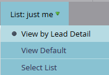

# Script de l&#39;e-mail

REMARQUE : Il est vivement recommandé de lire le [Guide de l’utilisateur Velocity](https://velocity.apache.org/engine/devel/user-guide.html) pour en savoir plus sur le comportement du langage de modèle Velocity.

[Apache Velocity](https://velocity.apache.org/) est un langage basé sur Java qui est conçu pour modéliser et scripter le contenu des HTMLS. Marketo permet de l’utiliser dans le contexte des emails à l’aide de jetons de script. Cela permet d’accéder aux données stockées dans Opportunités et Objets personnalisés et de créer du contenu dynamique dans les emails. Velocity offre un flux de contrôle de haut niveau standard avec si/sinon, pour et pour chacun d’eux afin de permettre une manipulation conditionnelle et itérative du contenu. Voici un exemple simple pour imprimer un message de salutation correct :

```java
//check if the lead is male
if(${lead.MarketoSocialGender} == "Male")
    if the lead is male, use the salutation 'Mr.'
    set($greeting = "Dear Mr. ${lead.LastName},")
//check is the lead is female
elseif(${lead.MarketoSocialGender} == "Female")
    if female, use the salutation 'Ms.'
    set($greeting = "Dear Ms. ${lead.LastName},")
else
    //otherwise, use the first name
    set($greeting = "Dear ${lead.FirstName},")
end
print the greeting and some content
${greeting}

    Lorem ipsum dolor sit amet...
```

## Variables

Les variables sont toujours précédées du préfixe &#39;$&#39; et sont définies et mises à jour à l’aide de #set :

```
#set($variable = "value")
```

Leurs valeurs peuvent ensuite être récupérées via plusieurs types de référence différents avec des comportements différents :

```
$variable ##outputs 'value'
$variablename ##outputs '$variablename'
${variable}name ##outputs 'valuename'
```

Il existe également une notation de référence silencieuse, où il existe une `!` Inclus après le `$`. Normalement, lorsque la vitesse rencontre une référence non définie, la chaîne représentant la référence est conservée. Avec une notation de référence silencieuse, si une référence non définie est rencontrée, aucune valeur n’est émise :

```
##Defined Reference

#set($foo = "bar")
$foo ##outputs "bar"

##Undefined Reference

##normal
$baz ##outputs "$baz"

##quiet
$!baz ##outputs nothing
```

Pour plus d’informations sur la manière de référencer des variables, voir [Guide de l’utilisateur Apache](https://velocity.apache.org/engine/devel/user-guide.html#formal-reference-notation).

## Outils de vitesse

Le projet Apache Velocity met à disposition des fonctionnalités à l’aide de la fonction [Outils de vitesse](https://velocity.apache.org/tools/devel/apidocs/overview-summary.html). Il s’agit simplement de wrappers pour les objets Java et d’exposer leurs méthodes par le biais de variables globales mises à la disposition de tous les scripts.

- [AlternatorTool](https://velocity.apache.org/tools/devel/apidocs/org/apache/velocity/tools/generic/AlternatorTool.html)
- [ComparisonDateTool](https://velocity.apache.org/tools/devel/apidocs/org/apache/velocity/tools/generic/ComparisonDateTool.html)
- [ConversionTool](https://velocity.apache.org/tools/devel/apidocs/org/apache/velocity/tools/generic/ConversionTool.html)
- [DateTool](https://velocity.apache.org/tools/devel/apidocs/org/apache/velocity/tools/generic/DateTool.html)
- [DisplayTool](https://velocity.apache.org/tools/devel/apidocs/org/apache/velocity/tools/generic/DisplayTool.html)
- [MathTool](https://velocity.apache.org/tools/devel/apidocs/org/apache/velocity/tools/generic/MathTool.html)
- [NumberTool](https://velocity.apache.org/tools/devel/apidocs/org/apache/velocity/tools/generic/NumberTool.html)
- [EscapeTool](https://velocity.apache.org/tools/devel/apidocs/org/apache/velocity/tools/generic/EscapeTool.html)
- [LoopTool](https://velocity.apache.org/tools/devel/apidocs/org/apache/velocity/tools/generic/LoopTool.html)

Par exemple, pour utiliser une méthode de `ComparisonDateTool`, accédez à si à partir de `$date` dans un jeton de script :

```
#set($birthday = $convert.parseDate("2015-08-07","yyyy-MM-dd"))
##use whenIs to determine how many days away it is
$date.whenIs($birthday).days ##outputs 1
```

## Création d’un jeton de script

Le script Velocity est inclus dans les emails à l’aide de jetons de script de messagerie. Ils peuvent être créés dans Activités marketing dans un dossier marketing ou un programme. Pour qu’un jeton soit utilisé dans un email, celui-ci doit être un enfant d’un programme qui possède le jeton ou en hérite depuis un dossier marketing. Pour créer un jeton, accédez à un dossier ou à un programme, puis sélectionnez l’option [!UICONTROL Mes jetons] . Dans le menu de droite, faites glisser l&#39;option &quot;Script de l&#39;email&quot; dans la liste des jetons.


À partir de là, vous pouvez modifier le nom du jeton et ouvrir l’éditeur via le [!UICONTROL Cliquez sur Modifier .] option :


Une fois que vous êtes dans l’éditeur, vous pouvez créer un script ayant accès à toutes les variables des objets accessibles par script. Pour obtenir une référence de champ à partir d’un objet, faites-la glisser dans votre script à partir de l’arborescence de droite :


## Incorporation et test de script

Une fois que votre script est défini dans un programme Mon jeton, vous pouvez le référencer dans un email donné à l’aide de l’éditeur de messagerie de Marketo.


Vous pouvez tester votre script à l’aide de la fonction [!UICONTROL Envoyer un exemple de courrier électronique] action de courrier électronique dans le concepteur d’email de Marketo. Pour que le script soit traité correctement, vous devez sélectionner une piste existante à emprunter pour emprunter l’identité du [!UICONTROL prospect] champ . Si vous effectuez un test avec `$TriggerObject`, vous pouvez sélectionner l’objet de déclenchement à l’aide de l’option [!UICONTROL Déclencheur] param. Cette méthode utilise les données de l’objet mis à jour le plus récemment de ce type comme `$TriggerObject` Variable .


Vous pouvez également utiliser la variable [!UICONTROL Email Preview] pour tester votre script. Pour ce faire, vous devez sélectionner **[!UICONTROL Afficher sous : détails de la piste]**, puis sélectionnez une piste dans une liste statique disponible. Cela a pour avantage de générer des exceptions qui peuvent s’être produites lors de l’exécution du script :



## Conseils utiles

La longueur combinée de tous les jetons de script de courrier électronique dans un email donné ne peut pas dépasser 100 000 octets. Cette limite concerne la longueur totale des chaînes de jeton elles-mêmes (et non la longueur totale après l’extension des jetons).

- Les variables référencées dans le script de courrier électronique doivent exister dans Marketo sur l’un des objets disponibles dans le script.
- Vous pouvez référencer des objets personnalisés de premier et de second niveau issus de votre gestion de la relation client native directement connectés au prospect ou au contact, mais pas des objets personnalisés de troisième niveau. Les objets personnalisés ne sont pas nécessairement des parents du prospect ou de la société
- Pour les objets personnalisés Marketo, vous pouvez référencer des objets personnalisés de second niveau avec une relation Parent-Enfant. Par exemple `Lead <- Parent <- Child`. Vous ne pouvez pas référencer des objets personnalisés de second niveau avec une relation Edge-Bridge. par exemple,  `Lead <- Bridge -> Edge`
- Vous pouvez référencer des objets personnalisés connectés à un prospect, un contact ou un compte, mais pas plus d’un.
- Les objets personnalisés ne peuvent être référencés que par une seule connexion, un seul prospect, un seul contact ou un seul compte.
- Vous devez cocher la case dans l’éditeur de script pour les champs que vous utilisez ou qu’ils ne traiteront pas.
- Pour chaque objet personnalisé, les dix enregistrements les plus récemment mis à jour par personne/contact sont disponibles au moment de l’exécution et sont classés de la mise à jour la plus récente (à 0) à la mise à jour la plus récente (à 9). Vous pouvez augmenter le nombre d&#39;enregistrements disponibles par [suivant les instructions](https://experienceleague.adobe.com/en/docs/marketo/using/product-docs/administration/email-setup/change-custom-object-retrieval-limits-in-velocity-scripting).
- Si vous incluez plusieurs scripts de courrier électronique dans un courrier électronique, ils s’exécutent de haut en bas. La portée des variables définies dans le premier script à exécuter sera disponible dans les scripts suivants.
- Référence des outils : [https://velocity.apache.org/tools/2.0/index.html](https://velocity.apache.org/tools/2.0/index.html)
- Remarque concernant les jetons contenant des caractères de saut de page &quot;\\n&quot; ou &quot;\\r\\n&quot;. Lorsqu’un email est envoyé via l’option Envoyer un exemple ou via une campagne par lots, les caractères de saut de ligne des jetons sont remplacés par des espaces. Lorsque l&#39;email est envoyé par l&#39;intermédiaire de la campagne de déclenchement, les caractères de saut de page ne sont pas touchés.
- Pour garantir une analyse correcte des URL, l’intégralité du chemin doit être définie sous la forme d’une variable puis imprimée, et la variable ne doit pas être imprimée dans les références d’URL. Le protocole (http:// ou https://) doit être inclus et séparé du reste de l’URL. L’URL doit également faire partie d’une ancre entièrement formée (<a>). Le script doit générer une balise d’ancrage entièrement formée afin que les liens soient suivis. Les liens ne sont pas suivis s’ils sont générés dans une boucle for ou foreach.

```html
<!-- Correct -->
#set($url = "www.example.com/${object.id}")
<a href="http://${url}">Link Text</a>

<!-- Correct -->
<a href="http://www.example.com/${object.id}">Link Text</a>

<!-- Incorrect -->
<a href="${url}">Link Text</a>

<!-- Incorrect -->
<a href="{{my.link}}">Link Text</a>

<!-- Incorrect -->
<a href="http://{{my.link}}">Link Text</a>
```
