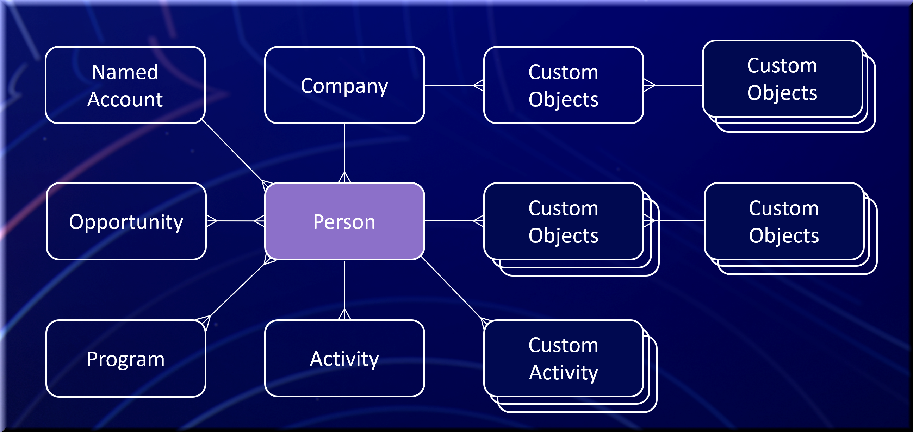

# Prise en main

Marketo Engage est une plateforme d’automatisation marketing permettant la gestion de programmes et de campagnes multicanaux personnalisés pour les prospects et les clients. Vous pouvez étendre la plateforme à travers ses points d’intégration.

Cette page présente les principales entités Marketo Engage et leurs relations.

>[!NOTE]
>
>L’API SOAP sera abandonnée et ne sera plus disponible après le 31 juillet 2026. Utilisez l’API Marketo [REST](./rest-api/rest-api.md) pour tous les nouveaux développements. Migrez les services existants d’ici cette date pour éviter les interruptions de service. Si un service utilise l’API SOAP, reportez-vous au [&#x200B; Guide de migration de l’API SOAP &#x200B;](./soap-api/migration.md).
>

Lorsque la connexion Native SFDC ou MS Dynamics CRM est activée sur une instance Marketo Engage, ces objets sont en lecture seule :

- Société
- Opportunité
- Rôle de l’opportunité
- Vendeur

## Personne (Leads)

Les personnes sont la base de l’automatisation du marketing. Marketo fait référence à tous les enregistrements autres que les commerciaux en tant que leads, que les ventes les considèrent comme des leads, des prospects, des suspects ou des contacts.

L’objet de prospect comprend des champs standard tels que l’adresse électronique, le prénom et le nom. Vous pouvez ajouter des champs pour stocker d’autres informations et lire et écrire des attributs personnalisés de la même manière que pour les champs standard. Recherchez la liste complète des champs sous **[!UICONTROL Admin]** > **[!UICONTROL Gestion des champs]** dans Marketo.

Marketo identifie les prospects de manière unique par le champ d’identifiant . Vous devez appliquer d’autres clés uniques en dehors du système.

API associées : [REST](https://developer.adobe.com/marketo-apis/api/mapi#tag/Leads), [JavaScript](javascript-api/lead-tracking.md#lead-tracking-api)

## Activités

Les prospects peuvent interagir avec votre entreprise de plusieurs manières, par exemple en visitant une page web, en assistant à un salon ou en téléchargeant un livre blanc. Marketo capture ces actions en tant qu’activités afin que les spécialistes marketing puissent comprendre ce qu’a fait un prospect et quand il s’est produit.

Les activités sont toujours liées aux prospects par ID de prospect.

Vous pouvez également définir des activités personnalisées. Après avoir créé et publié une activité personnalisée, vous pouvez en ajouter des instances via l’API Marketo. Pour plus d’informations, voir [Présentation des activités personnalisées](https://experienceleague.adobe.com/fr/docs/marketo/using/product-docs/administration/marketo-custom-activities/understanding-custom-activities).

API associées : [REST](https://developer.adobe.com/marketo-apis/api/mapi#tag/Activities), [JavaScript](javascript-api/lead-tracking.md#munchkin-behavior)

## Programmes et campagnes

Un programme organise les efforts marketing d’un professionnel du marketing dans un emplacement. Par exemple, une explosion d’e-mail peut être un programme.

Un prospect peut effectuer plusieurs actions ou activités associées à un programme. Ce processus est connu sous le nom de progression du plomb. Pour un programme d’explosion d’e-mail, la progression peut enregistrer le moment où Marketo envoie l’e-mail, le moment où la personne l’ouvre et si la personne clique sur un lien.

Une campagne remplit un objectif spécifique au sein d’un programme. Par exemple, une campagne peut sélectionner un groupe de prospects et envoyer une explosion d’e-mail. Une autre campagne peut avertir un commercial lorsqu’un prospect clique sur un lien dans l’e-mail envoyé en masse.

API associées : [REST](https://developer.adobe.com/marketo-apis/api/mapi#tag/Campaigns)

## Balises

Les balises regroupent et catégorisent les données de programme pour la création de rapports. Utilisez les balises pour mesurer l’efficacité et le retour sur investissement du programme.

En tant qu’administrateur Marketo, vous pouvez créer des types de balises obligatoires et facultatifs que les utilisateurs sélectionnent lors de la création d’un programme. Vous définissez les valeurs possibles pour chaque type de balise en fonction des exigences de reporting de votre société.

Par exemple, créez un type de balise « Region » personnalisé avec des valeurs telles que Nord-Est et Sud-Est pour analyser la région qui génère le plus de prospects. Créez un type de balise « Propriétaire » pour comparer les propriétaires de programme, tels que Maria, David ou John, qui ont le plus d’impact sur la création de prospects et d’opportunités. Pour plus d’informations, voir [Présentation des balises](https://experienceleague.adobe.com/fr/docs/marketo/using/product-docs/core-marketo-concepts/programs/working-with-programs/understanding-tags).

API associées : [REST](https://developer.adobe.com/marketo-apis/api/asset)

## Listes

Les listes organisent des collections de prospects. Marketo propose deux types :

- Une liste statique est une collection fixe à partir de laquelle un professionnel du marketing peut ajouter ou supprimer des prospects.
- Une liste dynamique est une collection dynamique basée sur des caractéristiques définies.

Par exemple, une liste dynamique nommée « Tous les prospects qui ont visité la page de tarification de notre site Web » continue de s’allonger à mesure que de nouveaux prospects visitent cette page. Pour plus d’informations, consultez la documentation de [&#128279;](https://experienceleague.adobe.com/fr/docs/marketo/using/home).

API associées : [REST](https://developer.adobe.com/marketo-apis/api/asset#tag/Static-Lists)

## Opportunités

Une opportunité représente une transaction de vente potentielle que les marketeurs proposent aux ventes. Dans Marketo, une opportunité est associée à un prospect ou un contact et à une organisation.

Un rôle d’opportunité connecte un prospect à une organisation et décrit la fonction du prospect dans cette organisation.

API associées : [REST](https://developer.adobe.com/marketo-apis/api/mapi#tag/Opportunities)

## Sociétés

Une organisation, parfois appelée compte dans Marketo, est l’organisation à laquelle appartient une personne.

Pour une attribution précise du retour sur investissement dans les rapports de retour sur investissement de Marketo ou Revenue Cycle Analytics (RCA), associez les personnes à leurs organisations et opportunités.

API associées : [REST](https://developer.adobe.com/marketo-apis/api/mapi#tag/Companies)

## Ressources

Assets comprend des pages de destination, des e-mails, des formulaires et des images utilisés dans un programme. Une ressource peut être locale à un programme spécifique ou globale. Les ressources globales sont disponibles pour chaque programme.

API associées : [REST](https://developer.adobe.com/marketo-apis/api/asset)

## Jetons

Les jetons permettent aux marketeurs de personnaliser les messages avec les ressources et d’ajouter une logique aux actions de flux. Marketo fournit des jetons pour l’ensemble du système, des programmes, des prospects et des sociétés.

Par exemple, placez le jeton de prospect `{{lead.First Name}}` dans un e-mail pour afficher le prénom du prospect.

Les jetons définis au niveau du programme ou du dossier sont appelés « Mes jetons » dans Marketo. Mes jetons ont trois types :

- Local : créé dans un dossier ou un programme de campagne spécifique et disponible uniquement dans ce dossier ou ce programme.
- Hérité : créé au niveau du dossier de campagne et disponible pour tous les programmes de ce dossier.
- Remplacé : modifié avec une valeur personnalisée au niveau du programme sans modifier la valeur parent de Mon jeton au niveau du dossier de programme.

Mes jetons utilisent la convention de nommage `{{my.My Token}}`, avec le mot « my » au début du nom du jeton. Par exemple, un type de date Mon jeton nommé EventDate porte le nom de jeton `{{my.EventDate}}`. Pour plus d’informations, voir [&#x200B; Présentation de mes jetons dans un programme &#x200B;](https://experienceleague.adobe.com/fr/docs/marketo/using/product-docs/core-marketo-concepts/programs/tokens/understanding-my-tokens-in-a-program).

API associées : [REST](https://developer.adobe.com/marketo-apis/api/asset#tag/Tokens)

## Objets personnalisés

Un objet personnalisé Marketo crée une relation un-à-plusieurs ou plusieurs-à-plusieurs (Edge-Bridge-Edge) entre les prospects Marketo et les enregistrements d’objet personnalisé.

Après avoir créé et publié un objet personnalisé Marketo, vous pouvez y effectuer des opérations CRUD par le biais de l’API Marketo. Lorsque de nouveaux enregistrements sont ajoutés, vous pouvez utiliser un déclencheur de liste dynamique pour répondre. Vous pouvez également utiliser les données d’objet personnalisées comme filtre de liste dynamique pour la segmentation ou dans les e-mails via [Script de messagerie](email-scripting.md). Pour plus d&#39;informations sur la création d&#39;objets personnalisés, consultez la documentation de Marketo Engage [&#128279;](https://experienceleague.adobe.com/fr/docs/marketo/using/home).

API associées : [REST](https://developer.adobe.com/marketo-apis/api/mapi#tag/Custom-Objects)

## Vendeurs

Vous pouvez gérer les enregistrements de commercial et leurs relations de prospect dans Marketo lorsqu’aucune intégration CRM native n’est activée. Ces enregistrements contiennent des informations telles que le nom, l’adresse électronique et le titre de la tâche. Lorsqu&#39;un commercial possède un prospect, vous pouvez utiliser ces informations pour le filtrage et les jetons.

Gérez la relation avec un commercial au niveau du prospect via le champ « externalSalesPersonId ». Mettez à jour ce champ via l’API [Leads de synchronisation](https://developer.adobe.com/marketo-apis/api/mapi#tag/Leads/operation/syncLeadUsingPOST).

API associées : [REST](https://developer.adobe.com/marketo-apis/api/mapi#tag/Sales-Persons)
