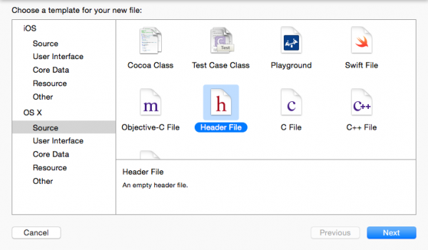

# Installation

Installez et initialisez Marketo Mobile SDK pour envoyer des notifications push, des messages in-app, ou les deux.

## Installation de Marketo SDK sur iOS

### Conditions préalables

1. [Ajoutez une application dans Marketo Admin](https://experienceleague.adobe.com/en/docs/marketo/using/product-docs/mobile-marketing/admin/add-a-mobile-app) et obtenez la clé secrète de l’application et l’ID Munchkin.
1. Facultatif : [Configurer des notifications push](push-notifications.md).

### Installation de Framework via CocoaPods

1. Installez CocoaPods. `$ sudo gem install cocoapods`
1. Remplacez le répertoire par le répertoire de votre projet et créez un fichier PDF avec des valeurs par défaut intelligentes. `$ pod init`
1. Ouvrez votre fichier PDF. `$ open -a Xcode Podfile`
1. Ajoutez la ligne suivante à votre fichier PDF. `$ pod 'Marketo-iOS-SDK'`
1. Enregistrez et fermez votre fichier PDF.
1. Télécharger et installer Marketo iOS SDK. `$ pod install`
1. Ouvrez l’espace de travail dans Xcode. `$ open App.xcworkspace`

### Installer Framework à l’aide du gestionnaire de packages Swift

1. Sélectionnez votre projet dans le navigateur de projets. Sous « Ajouter une dépendance de package », sélectionnez « + ».

   

1. Ajoutez le package Marketo à partir de l’<https://github.com/Marketo/ios-sdk> .

   

1. Ajoutez le lot de ressources. Recherchez `MarketoFramework.XCframework` dans le navigateur de projets et ouvrez-le dans le Finder. Faire glisser `MKTResources.bundle` pour copier les ressources du bundle.

### Configurer l&#39;en-tête de pontage Swift

1. Accédez à Fichier > Nouveau > Fichier et sélectionnez « Fichier d’en-tête ».

   

1. Nommez le fichier « &lt;_ProjectName_>-Bridging-Header ».

1. Accédez à Projet > Cible > Phases de création > Compilateur Swift > Génération de code. Ajoutez le chemin suivant à l’en-tête de pontage d’objectifs :

   `$(PODS_ROOT)/<_ProjectName_>-Bridging-Header.h`

   

## Initialiser SDK

Initialisez le SDK Marketo iOS avec votre ID de compte Munchkin et la clé secrète de l’application. Recherchez les deux valeurs sous « Applications mobiles et appareils » dans Marketo Admin.

1. Ouvrez le fichier AppDelegate.m pour Objective-C ou le fichier Bridging pour Swift. Importez le fichier d’en-tête Marketo.h.

   ```
   #import <MarketoFramework/MarketoFramework.h>
   ```

1. Collez le code suivant dans la fonction `application:didFinishLaunchingWithOptions` : .

   Transmettez « natif » comme type de framework pour les applications natives.

>[!BEGINTABS]

>[!TAB Objectif C]

```objectivec
Marketo *sharedInstance = [Marketo sharedInstance];

[sharedInstance initializeWithMunchkinID:@"munchkinAccountId" appSecret:@"secretKey" mobileFrameworkType:@"native" launchOptions:launchOptions];
```

>[!TAB Swift]

```swift
let sharedInstance: Marketo = Marketo.sharedInstance()

sharedInstance.initialize(withMunchkinID: "munchkinAccountId", appSecret: "secretKey", mobileFrameworkType: "native", launchOptions: launchOptions)
```

>[!ENDTABS]

1. Remplacez `munkinAccountId` et `secretKey` par l’« ID de compte Munchkin » et la « Clé secrète » de Marketo **[!UICONTROL Admin]** > **[!UICONTROL Applications et appareils mobiles]**.

## Appareils de test iOS

1. Sélectionnez Projet > Cible > Informations > Types d’URL.
1. Ajoutez l&#39;identifiant ${PRODUCT_NAME}.
1. Définissez les schémas d’URL sur `mkto-<Secret Key_>`.
1. Ajoutez application:openURL:sourceApplication:annotation: au fichier AppDelegate.m pour Objective-C.

## Gérer le type d’URL personnalisé dans AppDelegate

>[!BEGINTABS]

>[!TAB Objectif C]

```objectivec
- (BOOL)application:(UIApplication *)app
            openURL:(NSURL *)url
            options:(NSDictionary<UIApplicationOpenURLOptionsKey,id> *)options{

    return [[Marketo sharedInstance] application:app
                                         openURL:url
                                         options:options];
}
```

>[!TAB Swift]

```swift
private func application(_ app: UIApplication, open url: URL, options: [UIApplication.OpenURLOptionsKey : Any] = [:]) -> Bool
    {
        return Marketo.sharedInstance().application(app, open: url, options: options)
    }
```

>[!ENDTABS]

## Installation de Marketo SDK sur Android

### Conditions préalables

1. [Ajoutez une application dans Marketo Admin](https://experienceleague.adobe.com/en/docs/marketo/using/product-docs/mobile-marketing/admin/add-a-mobile-app) et obtenez la clé secrète de l’application et l’ID Munchkin.
1. Facultatif : [Configurer des notifications push](push-notifications.md#android_setup_push).
1. [Télécharger Marketo SDK pour Android](https://codeload.github.com/Marketo/android-sdk/zip/refs/heads/master)

### Configuration d’Android SDK avec Gradle

1. Dans le fichier build.gradle de niveau application, ajoutez la dépendance sous la section dependencies.

   `implementation 'com.marketo:MarketoSDK:0.8.9'`

1. Ajoutez la configuration suivante au fichier de `build.gradle` racine.

   ```
   buildscript {
       repositories {
           google()
           mavenCentral()
       }
   ```

1. Synchronisez le projet avec les fichiers Gradle.

### Configurer les autorisations

Ouvrez `AndroidManifest.xml` et ajoutez les autorisations suivantes. Votre application doit demander les autorisations « INTERNET » et « ACCESS_NETWORK_STATE ». Ignorez cette étape si l’application le demande déjà.

```xml
<uses‐permission android:name="android.permission.INTERNET"></uses‐permission>
<uses‐permission android:name="android.permission.ACCESS_NETWORK_STATE"></uses‐permission>
```

### Initialiser SDK

1. Ouvrez la classe Application ou Activity . Importez le SDK Marketo dans l’activité avant setContentView ou dans le contexte de l’application.

   ```java
   // Initialize Marketo
   Marketo marketoSdk = Marketo.getInstance(getApplicationContext());
   marketoSdk.initializeSDK("native","munchkinAccountId","secretKey");
   ```

1. Configuration de ProGuard (en option)

   Si votre application utilise ProGuard, ajoutez les lignes suivantes au fichier `proguard.cfg` dans le dossier du projet. Cette configuration exclut le SDK Marketo de l’obscurcissement.

   ```
   -dontwarn com.marketo.*
   -dontnote com.marketo.*
   -keep class com.marketo.`{ *; }
   ```

## Appareils de test Android

Ajoutez « MarketoActivity » à `AndroidManifest.xml` dans la balise de l’application.

```xml
<activity android:name="com.marketo.MarketoActivity"  android:configChanges="orientation|screenSize" >
    <intent-filter android:label="MarketoActivity" >
        <action  android:name="android.intent.action.VIEW"/>
        <category  android:name="android.intent.category.DEFAULT"/>
        <category  android:name="android.intent.category.BROWSABLE"/>
        <data android:host="add_test_device" android:scheme="mkto" />
    </intent-filter>
</activity>
```

## Prise en charge de Firebase Cloud Messaging

MME SDK pour Android prend en charge l’utilisation directe de Google [Firebase Cloud Messaging](https://firebase.google.com/docs/cloud-messaging/) (FCM).

### Ajout de FCM à votre application

1. Intégrez la dernière version de Marketo Android SDK dans l’application Android. Voir les étapes sur [GitHub](https://github.com/Marketo/android-sdk).
1. Configurez l’application Firebase dans la console Firebase.
   1. Créez/ajoutez un projet sur la console [](https://accounts.google.com/ServiceLogin?passive=1209600&osid=1&continue=https://console.firebase.google.com/&followup=https://console.firebase.google.com/)Firebase).
      1. Dans la [console Firebase](https://accounts.google.com/ServiceLogin?passive=1209600&osid=1&continue=https://console.firebase.google.com/&followup=https://console.firebase.google.com/), sélectionnez `Add Project`.
      1. Sélectionnez votre projet GCM dans la liste des projets Google Cloud existants, puis sélectionnez `Add Firebase`.
      1. Dans l&#39;écran d&#39;accueil de Firebase, sélectionnez `Add Firebase to your Android App`.
      1. Indiquez le nom de votre package et SHA-1, puis sélectionnez `Add App`. Un nouveau fichier `google-services.json` pour votre application Firebase est téléchargé.
      1. Sélectionnez `Continue` et suivez les instructions détaillées pour ajouter le plug-in Google Services dans Android Studio.

   1. Accédez aux « Paramètres du projet » dans la Présentation du projet
      1. Cliquez sur l’onglet « Général ». Téléchargez le fichier « google-services.json ».
      1. Cliquez sur l’onglet « Cloud Messaging ». Copiez « Clé du serveur » et « Identifiant de l’expéditeur ». Fournissez ces champs « Clé du serveur » et « ID de l’expéditeur » à Marketo.
   1. Configurez FCM dans l’application Android.
      1. Basculez vers la vue Projet dans Android Studio pour afficher le répertoire racine du projet
         1. Déplacez le fichier « google-services.json » téléchargé dans le répertoire racine du module d’application Android
         1. Dans le fichier build.gradle au niveau du projet, ajoutez ce qui suit :

            ```
            buildscript {
              dependencies {
                classpath 'com.google.gms:google-services:4.0.0'
              }
            }
            ```

         1. Dans le fichier build.gradle de niveau application, ajoutez ce qui suit :

            ```
            dependencies {
              compile 'com.google.firebase:firebase-core:17.4.0'
            }
            // Add to the bottom of the file
            apply plugin: 'com.google.gms.google-services'
            ```

         1. Enfin, sélectionnez **[!UICONTROL Synchroniser maintenant]** dans la barre qui s’affiche dans l’ID
   1. Modifiez le manifeste de l’application. Le SDK FCM ajoute automatiquement les autorisations requises et la fonctionnalité de récepteur. Supprimez les éléments obsolètes suivants, qui peuvent entraîner la duplication des messages :

      ```xml
      <uses-permission android:name="android.permission.WAKE_LOCK" />
      <permission android:name="<your-package-name>.permission.C2D_MESSAGE" android:protectionLevel="signature" />
      <uses-permission android:name="<your-package-name>.permission.C2D_MESSAGE" />
      
      ...
      
      <receiver>
        android:name="com.google.android.gms.gcm.GcmReceiver"
        android:exported="true"
        android:permission="com.google.android.c2dm.permission.SEND"
        <intent-filter>
          <action android:name="com.google.android.c2dm.intent.RECEIVE" />
          <category android:name="<your-package-name> />
        </intent-filter>
      </receiver>
      ```
