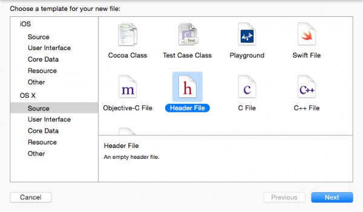

# Installation

Instructions d’installation du SDK Mobile Marketo. Les étapes ci-dessous sont requises pour envoyer des notifications push et/ou des messages In-App.

## Installation du SDK Marketo sur iOS

### Conditions préalables

1. [Ajoutez une application dans l’administrateur Marketo](https://experienceleague.adobe.com/en/docs/marketo/using/product-docs/mobile-marketing/admin/add-a-mobile-app) (obtenez votre clé secrète et votre identifiant Munchkin)
1. [Configuration de notifications push](push-notifications.md) (facultatif)

### Installation de la structure via CocoaPods

1. Installez CocoaPods. `$ sudo gem install cocoapods`
1. Définissez le répertoire sur votre répertoire de projet et créez un fichier de capsule avec les valeurs par défaut intelligentes. `$ pod init`
1. Ouvrez votre fichier de capsule. `$ open -a Xcode Podfile`
1. Ajoutez la ligne suivante à votre fichier de capsule. `$ pod 'Marketo-iOS-SDK'`
1. Enregistrez et fermez votre fichier de capsule.
1. Téléchargez et installez le SDK Marketo iOS. `$ pod install`
1. Ouvrez l’espace de travail dans Xcode. `$ open App.xcworkspace`

### Installation de la structure à l’aide de Swift Package Manager

1. Sélectionnez votre projet dans le Navigateur de projets, puis sous &quot;Ajouter une dépendance de module&quot;, cliquez sur &quot;+&quot; comme illustré ci-dessous :

   

1. Ajoutez le package Marketo à partir de ce référentiel. Ajoutez cette URL pour ce référentiel : https://github.com/Marketo/ios-sdk.

   

1. Ajoutez maintenant le lot Ressource comme indiqué : Localisez `MarketoFramework.XCframework` dans le navigateur de projet et ouvrez-le dans le Finder. Effectuez un glisser-déposer de `MKTResources.bundle` pour copier les ressources du lot.

### Configuration de l’en-tête de liaison Swift

1. Accédez à Fichier > Nouveau > Fichier et sélectionnez &quot;Fichier d’en-tête&quot;.

   

1. Nommez le fichier &quot;&lt;_ProjectName_>-Bridging-Header&quot;.

1. Accédez à Projet > Cible > Créer des phases > Compilateur Swift > Génération de code. Ajoutez le chemin suivant à l’en-tête de liaison d’objectif :

   `$(PODS_ROOT)/<_ProjectName_>-Bridging-Header.h`

   

## Initialisation du SDK

Avant de pouvoir utiliser le SDK Marketo iOS, vous devez l’initialiser avec votre ID de compte Munchkin et votre clé secrète d’application. Vous trouverez chacune d’elles dans la zone d’administration de Marketo sous &quot;Applications et périphériques mobiles&quot;.

1. Ouvrez votre fichier AppDelegate.m (Objective-C) ou Bridging (Swift) et importez le fichier d’en-tête Marketo.h.

   ```
   #import <MarketoFramework/MarketoFramework.h>
   ```

1. Collez le code suivant dans la fonction `application:didFinishLaunchingWithOptions` : .

   Notez que nous devons transmettre &quot;native&quot; comme type de structure pour les applications natives.

>[!BEGINTABS]

>[!TAB Objective C]

```
Marketo *sharedInstance = [Marketo sharedInstance];

[sharedInstance initializeWithMunchkinID:@"munchkinAccountId" appSecret:@"secretKey" mobileFrameworkType:@"native" launchOptions:launchOptions];
```

>[!TAB Swift]

```
let sharedInstance: Marketo = Marketo.sharedInstance()

sharedInstance.initialize(withMunchkinID: "munchkinAccountId", appSecret: "secretKey", mobileFrameworkType: "native", launchOptions: launchOptions)
```

>[!ENDTABS]

1. Remplacez `munkinAccountId` et `secretKey` ci-dessus à l’aide de votre &quot;ID de compte Munchkin&quot; et de votre &quot;clé secrète&quot;, qui se trouvent dans la section Marketo **[!UICONTROL Admin]** > **[!UICONTROL Applications mobiles et appareils]** .

## Appareils de test iOS

1. Sélectionnez Projet > Cible > Informations > Types d’URL.
1. Ajouter un identifiant : ${PRODUCT_NAME}
1. Définition des schémas d’URL : `mkto-<Secret Key_>`
1. Inclure l’application :openURL:sourceApplication:annotation: au fichier AppDelegate.m (Objective-C)

## Gestion du type d’URL personnalisé dans AppDelegate

>[!BEGINTABS]

>[!TAB Objective C]

```
- (BOOL)application:(UIApplication *)app
            openURL:(NSURL *)url
            options:(NSDictionary<UIApplicationOpenURLOptionsKey,id> *)options{
   
    return [[Marketo sharedInstance] application:app
                                         openURL:url
                                         options:options];    
}
```

>[!TAB Swift]

```
private func application(_ app: UIApplication, open url: URL, options: [UIApplication.OpenURLOptionsKey : Any] = [:]) -> Bool
    {
        return Marketo.sharedInstance().application(app, open: url, options: options)
    }
```

>[!ENDTABS]

## Installation du SDK Marketo sur Android

### Conditions préalables

1. [Ajoutez une application dans l’administrateur Marketo](https://experienceleague.adobe.com/en/docs/marketo/using/product-docs/mobile-marketing/admin/add-a-mobile-app) (obtenez votre clé secrète et votre identifiant Munchkin)
1. [Configuration de notifications push](push-notifications.md#android_setup_push) (facultatif)
1. [Télécharger le SDK Marketo pour Android](https://codeload.github.com/Marketo/android-sdk/zip/refs/heads/master)

### Configuration du SDK Android avec Gradle

1. Dans le fichier build.gradle du niveau de l’application, sous la section dependencies, ajoutez

`implementation 'com.marketo:MarketoSDK:0.8.9'`

1. Le fichier racine `build.gradle` doit avoir la valeur

   ```
   buildscript {
       repositories {
           google()
           mavenCentral()
       }
   ```

1. Synchronisation de votre projet avec les fichiers Gradle

### Configuration des autorisations

Ouvrez `AndroidManifest.xml` et ajoutez les autorisations suivantes. Votre application doit demander les autorisations &quot;INTERNET&quot; et &quot;ACCESS_NETWORK_STATE&quot;. Si votre application demande déjà ces autorisations, ignorez cette étape.

```xml
<uses‐permission android:name="android.permission.INTERNET"></uses‐permission>
<uses‐permission android:name="android.permission.ACCESS_NETWORK_STATE"></uses‐permission>
```

### Initialisation du SDK

1. Ouvrez la classe Application ou Activity dans votre application et importez le SDK Marketo dans votre activité avant setContentView ou dans le contexte de l’application.

   ```java
   // Initialize Marketo
   Marketo marketoSdk = Marketo.getInstance(getApplicationContext());
   marketoSdk.initializeSDK("native","munchkinAccountId","secretKey");
   ```

1. Configuration de ProGuard (facultatif)

   Si vous utilisez ProGuard pour votre application, ajoutez les lignes suivantes à votre fichier `proguard.cfg`. Le fichier se trouve dans le dossier de votre projet. L’ajout de ce code exclut le SDK Marketo du processus d’obscurcissement.

   ```
   -dontwarn com.marketo.*
   -dontnote com.marketo.*
   -keep class com.marketo.`{ *; }
   ```

## Appareils de test Android

Ajoutez &quot;MarketoActivity&quot; au fichier `AndroidManifest.xml` dans la balise de l’application.

```xml
<activity android:name="com.marketo.MarketoActivity"  android:configChanges="orientation|screenSize" >
    <intent-filter android:label="MarketoActivity" >
        <action  android:name="android.intent.action.VIEW"/>
        <category  android:name="android.intent.category.DEFAULT"/>
        <category  android:name="android.intent.category.BROWSABLE"/>
        <data android:host="add_test_device" android:scheme="mkto" />
    </intent-filter>
</activity>
```

## Prise en charge de Firebase Cloud Messaging

Le SDK (Software Development Kit) MME pour Android a été mis à jour vers un framework plus moderne, stable et évolutif qui offre davantage de flexibilité et de nouvelles fonctionnalités d’ingénierie pour votre développeur d’applications Android.

Les développeurs d’applications Android peuvent désormais utiliser directement le service Google [Firebase Cloud Messaging](https://firebase.google.com/docs/cloud-messaging/) (FCM) avec ce SDK.

### Ajout de FCM à votre application

1. Intégrer le dernier SDK Marketo Android dans l’application Android.  Les étapes sont disponibles à l’adresse [GitHub](https://github.com/Marketo/android-sdk).
1. Configurez l’application Firebase sur la console Firebase.
   1. Créez/ajoutez un projet sur [](https://accounts.google.com/ServiceLogin?passive=1209600&amp;osid=1&amp;continue=https://console.firebase.google.com/&amp;followup=https://console.firebase.google.com/)la console Firebase.
      1. Dans la [console Firebase](https://accounts.google.com/ServiceLogin?passive=1209600&amp;osid=1&amp;continue=https://console.firebase.google.com/&amp;followup=https://console.firebase.google.com/), sélectionnez `Add Project`.
      1. Sélectionnez votre projet GCM dans la liste des projets cloud Google existants, puis sélectionnez `Add Firebase`.
      1. Dans l&#39;écran de bienvenue de Firebase, sélectionnez `Add Firebase to your Android App`.
      1. Indiquez le nom de votre package et SHA-1, puis sélectionnez `Add App`. Un nouveau fichier `google-services.json` pour votre application Firebase est téléchargé.
      1. Sélectionnez `Continue` et suivez les instructions détaillées pour ajouter le module externe Google Services dans Android Studio.

   1. Accédez à Paramètres du projet dans Aperçu du projet
      1. Cliquez sur l’onglet &quot;Général&quot;. Téléchargez le fichier &#39;google-services.json&#39;.
      1. Cliquez sur l’onglet &quot;Cloud Messaging&quot;. Copiez &quot;Server Key&quot; et &quot;Sender ID&quot;. Fournissez ces &quot;Clé serveur&quot; et &quot;Identifiant expéditeur&quot; à Marketo.
   1. Configuration des modifications FCM dans l’application Android
      1. Passez en vue Projet dans Android Studio pour afficher le répertoire racine du projet.
         1. Déplacez le fichier &quot;google-services.json&quot; téléchargé dans le répertoire racine du module d’application Android.
         1. Dans le fichier build.gradle au niveau du projet, ajoutez les éléments suivants :

            ```
            buildscript {
              dependencies {
                classpath 'com.google.gms:google-services:4.0.0'
              }
            }
            ```

         1. Dans le fichier build.gradle de niveau application, ajoutez les éléments suivants :

            ```
            dependencies {
              compile 'com.google.firebase:firebase-core:17.4.0'
            } 
            // Add to the bottom of the file 
            apply plugin: 'com.google.gms.google-services'
            ```

         1. Enfin, cliquez sur &quot;Synchroniser maintenant&quot; dans la barre qui s’affiche dans l’ID.
   1. Modifier le manifeste de votre application Le SDK FCM ajoute automatiquement toutes les autorisations requises et la fonctionnalité de récepteur requise. Veillez à supprimer du manifeste de votre application les éléments obsolètes (et potentiellement dangereux, car ils peuvent entraîner la duplication des messages) suivants :

      ```xml
      <uses-permission android:name="android.permission.WAKE_LOCK" />
      <permission android:name="<your-package-name>.permission.C2D_MESSAGE" android:protectionLevel="signature" />
      <uses-permission android:name="<your-package-name>.permission.C2D_MESSAGE" />
      
      ...
      
      <receiver>
        android:name="com.google.android.gms.gcm.GcmReceiver"
        android:exported="true"
        android:permission="com.google.android.c2dm.permission.SEND"
        <intent-filter>
          <action android:name="com.google.android.c2dm.intent.RECEIVE" />
          <category android:name="<your-package-name> />
        </intent-filter> 
      </receiver>
      ```
