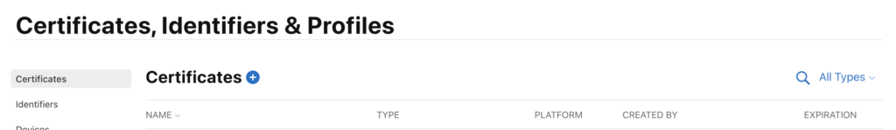
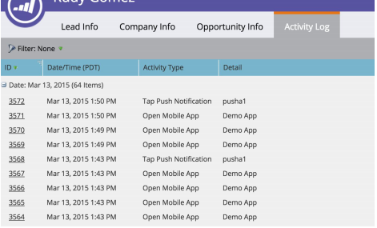

# Notifications push

Activez les notifications push pour les applications iOS ou Android qui utilisent Marketo Mobile SDK.

## Configurer les notifications push sur iOS

Il existe trois étapes pour activer les notifications push :

1. Configurez les notifications push dans votre compte de développeur Apple.
1. Activez les notifications push dans xCode.
1. Activez les notifications push dans l’application avec Marketo SDK.

### Configuration des notifications push sur le compte de développeur Apple

1. Connectez-vous au Developer [Member Center](https://developer.apple.com/membercenter) d’Apple.
1. Sélectionnez « Certificats, identifiants et profils ».
1. Sélectionnez le dossier « Certificats->Tous » sous « iOS, tvOS, watchOS ».
1. Sélectionnez le signe « + » en regard de Certificats dans le coin supérieur gauche. 
1. Sélectionnez « Apple Push Notification Service SSL (Sandbox &amp; Production) », puis sélectionnez Continuer.
1. Sélectionnez l’identifiant d’application utilisé pour créer l’application
1. Créez et chargez une demande de signature de certificat pour générer le certificat push. 
1. Téléchargez le certificat et double-cliquez dessus pour l’installer. 
1. Ouvrez « Keychain Access », cliquez avec le bouton droit sur le certificat et exportez les deux éléments vers le fichier `.p12`.
1. Chargez ce fichier via Marketo Admin Console pour configurer les notifications.
1. Mettez à jour les profils d’approvisionnement de l’application.

### Activer les notifications push dans xCode

Activez la fonctionnalité de notification push dans le projet xCode.

### Activation des notifications push dans l’application avec Marketo SDK

Ajoutez le code suivant au fichier `AppDelegate.m` pour diffuser des notifications push sur les appareils des clients.

**Remarque** - Si vous utilisez l’extension [!DNL Adobe Launch], utilisez `ALMarketo` comme nom de classe.

Ajoutez l’import suivant à `AppDelegate.h`.

>[!BEGINTABS]

>[!TAB Objectif C]

```objectivec
#import <UserNotifications/UserNotifications.h>
```

>[!TAB Swift]

```swift
import UserNotifications
```

>[!ENDTABS]

Ajoutez des `UNUserNotificationCenterDelegate` à `AppDelegate`, comme illustré ci-dessous.

>[!BEGINTABS]

>[!TAB Objectif C]

```objectivec
@interface AppDelegate : UIResponder <UIApplicationDelegate, UNUserNotificationCenterDelegate>
```

>[!TAB Swift]

```swift
class AppDelegate: UIResponder, UIApplicationDelegate , UNUserNotificationCenterDelegate
```

>[!ENDTABS]

Ajoutez le code suivant pour initialiser le service de notification push.

>[!BEGINTABS]

>[!TAB Objectif C]

```objectivec
BOOL)application:(UIApplication *)application didFinishLaunchingWithOptions:(NSDictionary *)launchOptions {
UNUserNotificationCenter *center = [UNUserNotificationCenter currentNotificationCenter];
        center.delegate = self;
        [center requestAuthorizationWithOptions:(UNAuthorizationOptionSound | UNAuthorizationOptionAlert | UNAuthorizationOptionBadge) completionHandler:^(BOOL granted, NSError * _Nullable error){
            if(!error){
                dispatch_async(dispatch_get_main_queue(), ^{
                    [[UIApplication sharedApplication] registerForRemoteNotifications];
                });
            }
        }];

    return YES;
}
```

>[!TAB Swift]

```swift
func application(_ application: UIApplication, didFinishLaunchingWithOptions launchOptions: [UIApplication.LaunchOptionsKey: Any]?) -> Bool {

    UNUserNotificationCenter.current().requestAuthorization(options: [.alert, .sound,    .badge]) { granted, error in
            if let error = error {
                print("\(error.localizedDescription)")
            } else {
                DispatchQueue.main.async {
                    application.registerForRemoteNotifications()
                }
            }
        }

        return true
}
```

>[!ENDTABS]

Appelez cette méthode pour démarrer l’enregistrement auprès du service de notifications push Apple. Si l’enregistrement réussit, l’application appelle la méthode `application:didRegisterForRemoteNotificationsWithDeviceToken:` de l’objet délégué d’application et lui transmet un jeton d’appareil.

Si l’enregistrement échoue, l’application appelle la méthode `application:didFailToRegisterForRemoteNotificationsWithError:` de son délégué d’application à la place.

Enregistrez le jeton push avec Marketo. Le jeton d’appareil doit être enregistré pour recevoir des notifications push de Marketo.

>[!BEGINTABS]

>[!TAB Objectif C]

```objectivec
- (void)application:(UIApplication *)application didRegisterForRemoteNotificationsWithDeviceToken:(NSData *)deviceToken {
    // Register the push token with Marketo
    [[Marketo sharedInstance] registerPushDeviceToken:deviceToken];
}
```

>[!TAB Swift]

```swift
func application(_ application: UIApplication, didRegisterForRemoteNotificationsWithDeviceToken deviceToken: Data) {
    // Register the push token with Marketo
    Marketo.sharedInstance().registerPushDeviceToken(deviceToken)
}
```

>[!ENDTABS]

Vous pouvez également annuler l’enregistrement du jeton lorsque l’utilisateur se déconnecte.

>[!BEGINTABS]

>[!TAB Objectif C]

```objectivec
[[Marketo sharedInstance] unregisterPushDeviceToken];
```

>[!TAB Swift]

```swift
Marketo.sharedInstance().unregisterPushDeviceToken
```

>[!ENDTABS]

Pour réenregistrer le jeton push, extrayez le code de l’étape 3 dans une méthode AppDelegate. Appelez cette méthode à partir de la méthode de connexion ViewController.

Gérer la notification push après l’enregistrement du jeton d’appareil auprès de Marketo.

>[!BEGINTABS]

>[!TAB Objectif C]

```objectivec
- (void)application:(UIApplication *)application didReceiveRemoteNotification:(NSDictionary *)userInfo
{
    [[Marketo sharedInstance] handlePushNotification:userInfo];
}
```

>[!TAB Swift]

```swift
func application(_ application: UIApplication, didReceiveRemoteNotification userInfo: [AnyHashable : Any]) {
    Marketo.sharedInstance().handlePushNotification(userInfo)
}
```

>[!ENDTABS]

Ajoutez la méthode suivante à AppDelegate.

Utilisez cette méthode pour afficher une alerte, émettre un son ou augmenter le badge lorsque l’application est en premier plan. Appelez le completionHandler approprié dans cette méthode.

>[!BEGINTABS]

>[!TAB Objectif C]

```objectivec
-(void)userNotificationCenter:(UNUserNotificationCenter *)center
    willPresentNotification:(UNNotification *)notification
        withCompletionHandler:(void (^)(UNNotificationPresentationOptions options))completionHandler{

    completionHandler(UNAuthorizationOptionSound | UNAuthorizationOptionAlert | UNAuthorizationOptionBadge);
}
```

>[!TAB Swift]

```swift
func userNotificationCenter(_ center: UNUserNotificationCenter,
            willPresent notification: UNNotification, withCompletionHandler completionHandler: @escaping (
    UNNotificationPresentationOptions) -> Void) {
    completionHandler([.alert, .sound,.badge])
}
```

>[!ENDTABS]

Gérez les notifications push nouvellement reçues dans AppDelegate.

Le délégué appelle cette méthode lorsque l’utilisateur répond à une notification en ouvrant l’application, en ignorant la notification ou en choisissant une action UNNotificationAction. Définissez le délégué avant que l’application ne renvoie de applicationDIDfinishLaunching :.

>[!BEGINTABS]

>[!TAB Objectif C]

```objectivec
- (void)userNotificationCenter:(UNUserNotificationCenter *)center
didReceiveNotificationResponse:(UNNotificationResponse *)response withCompletionHandler:(void(^)(void))completionHandler {
    [[Marketo sharedInstance] userNotificationCenter:center didReceiveNotificationResponse:response withCompletionHandler:completionHandler];
}
```

>[!TAB Swift]

```swift
func userNotificationCenter(_ center: UNUserNotificationCenter,
                                didReceive response: UNNotificationResponse,
                                withCompletionHandler
                                completionHandler: @escaping () -> Void) {
        Marketo.sharedInstance().userNotificationCenter(center, didReceive: response, withCompletionHandler: completionHandler)
}
```

>[!ENDTABS]

Effectuez le suivi des notifications push.

Si l’application est en arrière-plan ou inactive, l’appareil reçoit une notification push, comme illustré ci-dessous. Marketo effectue un suivi lorsque l’utilisateur sélectionne la notification.


Lorsque l’appareil reçoit une notification push, il transmet la notification au rappel `application:didReceiveRemoteNotification:` sur le délégué de l’application.

Le journal d’activité Marketo suivant affiche les événements d’application et les événements de notification push.



## Configurer les notifications push sur Android

1. Ajoutez les autorisations suivantes dans la balise d’application.

   Ouvrez `AndroidManifest.xml` et ajoutez les autorisations suivantes. Votre application doit demander les autorisations « INTERNET » et « ACCESS_NETWORK_STATE ». Ignorez cette étape si l’application le demande déjà.

   ```xml
   <uses‐permission android:name="android.permission.INTERNET"/>
   <uses‐permission android:name="android.permission.ACCESS_NETWORK_STATE"/>
   
   <!‐‐Following permissions are required for push notification.‐‐>
   <uses-permission android:name="android.permission.GET_ACCOUNTS"/>
   <!‐‐Keeps the processor from sleeping when a message is received.‐‐>
   <uses-permission android:name="android.permission.WAKE_LOCK"/>
   <permission android:name="<PACKAGE_NAME>.permission.C2D_MESSAGE" android:protectionLevel="signature" />
   <uses-permission android:name="<PACKAGE_NAME>.permission.C2D_MESSAGE" />
   <!-- This app has permission to register and receive data message. -->
   <uses-permission android:name="com.google.android.c2dm.permission.RECEIVE" />
   ```

1. Configurez FCM avec HTTPv1.

   - Activez MME FCM HTTPv1 dans le gestionnaire de fonctionnalités Marketo. 
   - Chargez le fichier Json du compte de service pour l’application dans MLM.
   - Téléchargez le fichier Json du compte de service à partir de la console Firebase. 
   - Patientez une heure après le chargement du fichier Json du compte de service dans Marketo avant d’envoyer les notifications push.

## Appareils de test Android

Ajoutez l’activité Marketo au fichier manifeste dans la balise d’application.

```xml
<activity android:name="com.marketo.MarketoActivity"  android:configChanges="orientation|screenSize">
    <intent-filter android:label="MarketoActivity">
        <action  android:name="android.intent.action.VIEW"/>
        <category  android:name="android.intent.category.DEFAULT"/>
        <category  android:name="android.intent.category.BROWSABLE"/>
        <data android:host="add_test_device" android:scheme="mkto"/>
    </intent-filter/>
</activity/>
```

## Enregistrer le service Marketo Push

1. Ajoutez le service de messagerie Firebase à `AndroidManifest.xml` avant la balise fermante de l&#39;application.

   ```xml
   <meta-data
       android:name="com.google.android.gms.version"
       android:value="@integer/google_play_services_version" />
   <service android:name=".MyFirebaseMessagingService">
   <intent-filter>
   <action android:name="com.google.firebase.INSTANCE_ID_EVENT"/>
   <action android:name="com.google.firebase.MESSAGING_EVENT"/>
   </intent-filter>
   </service>
   ```

1. Ajoutez les méthodes Marketo SDK pour `MyFirebaseMessagingService` comme suit.

   ```java
   import com.marketo.Marketo;
   
   public class MyFirebaseMessagingService extends FirebaseMessagingService {
   
       @Override
       public void onNewToken(String s) {
           super.onNewToken(s);
           Marketo marketoSdk = Marketo.getInstance(this.getApplicationContext());
           marketoSdk.setPushNotificaitonToken(s);
           // Add your code here...
       }
   
       @Override
       public void onMessageReceived(RemoteMessage remoteMessage) {
           Marketo marketoSdk = Marketo.getInstance(this.getApplicationContext());
           marketoSdk.showPushNotificaiton(remoteMessage);
           // Add your code here...
       }
   
   }
   ```

   **Remarque** - Si vous utilisez l’extension Adobe, ajoutez le code suivant.

   ```java
   import com.marketo.Marketo;
   
   public class MyFirebaseMessagingService extends FirebaseMessagingService {
   
       @Override
       public void onNewToken(String token) {
           super.onNewToken(token);
           ALMarketo.setPushNotificationToken(token);
           // Add your code here...
       }
   
       @Override
       public void onMessageReceived(RemoteMessage remoteMessage) {
           ALMarketo.showPushNotification(remoteMessage);
           // Add your code here...
       }
   
   }
   ```

**REMARQUE** : le SDK FCM ajoute automatiquement les autorisations requises et la fonctionnalité de récepteur. Si vous avez utilisé une version précédente de SDK, supprimez les éléments obsolètes suivants, ce qui peut entraîner la duplication des messages.

```xml
<receiver android:name="com.marketo.MarketoBroadcastReceiver" android:permission="com.google.android.c2dm.permission.SEND">
    <intent-filter>
        <!‐‐Receives the actual messages.‐‐>
        <action android:name="com.google.android.c2dm.intent.RECEIVE"/>
        <!‐‐Register to enable push notification‐‐>
        <action android:name="com.google.android.c2dm.intent.REGISTRATION"/>
        <!‐‐‐Replace YOUR_PACKAGE_NAME with your own package name‐‐>
        <category android:name="YOUR_PACKAGE_NAME"/>
    </intent-filter>
</receiver>

<!‐‐Marketo service to handle push registration and notification‐‐>
<service android:name="com.marketo.MarketoIntentService"/>
```

1. Initialisez la notification push Marketo. Après avoir enregistré la configuration, créez ou ouvrez la classe Application et ajoutez le code suivant. Obtenez l’ID de l’expéditeur à partir de la console Firebase.

   ```java
   Marketo marketoSdk = Marketo.getInstance(getApplicationContext());
   
   // Enable push notification here. The push notification channel name can by any string
   marketoSdk.initializeMarketoPush(SENDER_ID,"ChannelName");
   ```

   Si vous utilisez l’extension [!DNL Adobe Launch], utilisez le code suivant.

   ```java
   // Enable push notification here. The push notification channel name can by any string
   ALMarketo.initializeMarketoPush(SENDER_ID,"ChannelName");
   ```

   Si vous ne disposez pas d’un SENDER_ID, activez le service Google Cloud Messaging en suivant les étapes présentées dans [ce tutoriel](https://developers.google.com/cloud-messaging/).

   Vous pouvez également annuler l’enregistrement du jeton lorsque l’utilisateur se déconnecte.

   ```java
   marketoSdk.uninitializeMarketoPush();
   ```

   Si vous utilisez l’extension [!DNL Adobe Launch], utilisez le code suivant.

   ```java
   ALMarketo.uninitializeMarketoPush();
   ```

   Remarque : pour réenregistrer le jeton push, extrayez le code de l’étape 3 dans une méthode AppDelegate. Appelez cette méthode à partir de la méthode de connexion ViewController.

1. Facultatif : définissez une icône de notification. Appelez la méthode suivante pour configurer une icône de notification personnalisée.

   ```java
   MarketoConfig.Notification config = new MarketoConfig.Notification();
   // Optional bitmap for honeycomb and above
   config.setNotificationLargeIcon(bitmap);
   
   // Required icon Resource ID
   config.setNotificationSmallIcon(R.drawable.notification_small_icon);
   
   // Set the configuration
   //Use the static methods on ALMarketo class when using Adobe Extension
   Marketo.getInstance(context).setNotificationConfig(config);
   
   // Get the configuration set
   Marketo.getInstance(context).getNotificationConfig();
   ```

## Dépannage

Si les messages push mobiles ne fonctionnent pas comme prévu, vérifiez les problèmes de configuration courants avant d&#39;examiner les détails d&#39;implémentation.

### Le message push ne s’affiche pas

Vérifiez que les messages push sont désactivés sur l&#39;appareil. Les utilisateurs mobiles peuvent contrôler s&#39;ils reçoivent des messages pour chaque application, et les développeurs ou les spécialistes du marketing peuvent désactiver les messages pendant le développement.

Vérifiez si l’application est ouverte et active. Lorsque l’application est active, les messages push mobiles n’apparaissent pas à l’écran. Ils apparaissent à la place dans la zone des « notifications locales » de l’application.

### Affichage des journaux d’activité dans Marketo

Utilisez les journaux d’activité de Marketo pour vérifier qu’un message a été envoyé.

Vérifiez les enregistrements d’activité d’une personne qui aurait dû recevoir le message. Si le message a été envoyé, le journal d’activité contient un enregistrement. S’il n’existe aucun enregistrement, vérifiez le certificat iOS ou la configuration de la clé API Android dans Marketo.

### Certificat ou clé non valide

Vérifiez que le certificat correct est chargé pour Sandbox ou Production. Si nécessaire, réexportez les certificats iOS ou les clés Android et rechargez-les dans Marketo.

### Il manque un certificat ou une clé au fichier .p12 (iOS)

Lorsque vous exportez le certificat, exportez à la fois la clé et le certificat.

### Profils d’approvisionnement obsolètes (iOS)

Après avoir ajouté un appareil, mettez à jour les profils d’approvisionnement et générez de nouveaux certificats. Pointez le projet Xcode sur les profils et certificats appropriés, puis importez les certificats dans Marketo.

### Impossible De Charger Le Certificat iOS (IOS)

Assurez-vous que le mot de passe utilisé pour exporter le certificat ne contient pas d’espaces. Par exemple, au lieu de cela :

`Hello World 123`

utilisez ce qui suit :

`HelloWorld123`

### Résolution des problèmes liés aux certificats iOS

Pour les applications Sandbox, utilisez un certificat « développeur » ou « universel ». Pour les applications de production, chargez un certificat « distribution » ou « universel » valide.

### Bounce push / Jeton non valide

Un jeton d’enregistrement peut devenir non valide dans les scénarios suivants :

- Si l’application cliente se désenregistre auprès de GCM.
- L’annulation de l’enregistrement de l’application cliente peut se produire si l’utilisateur désinstalle l’application. Par exemple, sur iOS, si le service de retour d’APNS a signalé le jeton APNS comme non valide.
- Si le jeton d’enregistrement expire. Par exemple, Google peut décider d’actualiser les jetons d’enregistrement ou le jeton APNS a expiré pour les appareils iOS.
- Si l’application cliente est mise à jour mais que la nouvelle version n’est pas configurée pour recevoir des messages.
