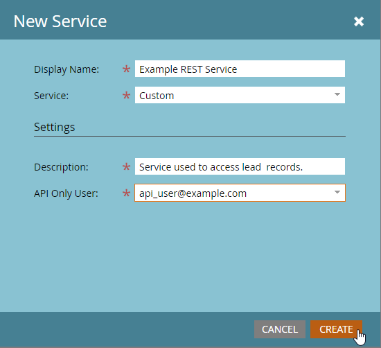

# Services personnalisés

Un service personnalisé fournit des informations d’identification pour l’authentification avec Marketo. Les informations d’identification sont nécessaires pour obtenir un jeton d’accès à partir de Marketo [Service Identity](https://developer.adobe.com/marketo-apis/api/identity/#tag/Identity/operation/identityUsingGET). Chaque service personnalisé est associé à un seul utilisateur API uniquement à partir duquel il obtient ses autorisations.

## Rôles

La première étape de la création d’un service personnalisé consiste à créer un rôle que vous pouvez appliquer à l’utilisateur API uniquement approprié. Cette opération s’effectue à partir de la fonction **[!UICONTROL Administration]** > **[!UICONTROL Utilisateurs et rôles]** > **[!UICONTROL Rôles]** .

Les rôles sont des conteneurs pour les autorisations individuelles qui permettent ou limitent l’accès à certaines fonctions. Dans les abonnements pour lesquels les espaces de travail et les partitions sont activés, les autorisations sont attribuées par espace de travail. Si un utilisateur dispose d’une autorisation dans un espace de travail, mais pas dans un autre, il pourra uniquement effectuer les actions autorisées dans cet espace de travail. Pour créer un rôle, cliquez sur le bouton Nouveau rôle .

Veillez à donner un nom explicite à votre rôle. Les utilisateurs d’API uniquement disposent d’un ensemble spécifique d’autorisations distinctes des autorisations utilisateur normales. Les autorisations d’API existent dans leur propre hiérarchie sous l’arborescence &quot;API d’accès&quot;.

### Autorisations de rôle

Seules les autorisations du groupe &quot;API d’accès&quot; sont appliquées aux utilisateurs de l’API, c’est-à-dire qu’accorder toutes les autorisations d’administrateur n’accorde aucune autorisation d’API à un utilisateur.

Lors de la création d’un rôle, réfléchissez attentivement aux actions que vous devriez permettre à l’application de l’utiliser. Attribuez uniquement le jeu minimal d’autorisations nécessaires pour effectuer ces actions. L’autorisation d’un ensemble d’autorisations inutilement permissif peut permettre aux intégrations d’effectuer des actions indésirables dans votre abonnement. Vous pouvez utiliser la variable [outil d&#39;autorisations](endpoint-reference.md) pour déterminer votre jeu minimal d’autorisations. Consultez la liste complète des [permissions](#permission_list).

## Utilisateurs et utilisatrices

Après avoir créé un rôle, vous devez créer un utilisateur &quot;API uniquement&quot;. Les utilisateurs d’API uniquement sont un type spécial d’utilisateur dans Marketo, car ils sont gérés par d’autres utilisateurs et ne peuvent pas être utilisés pour se connecter à Marketo. Les utilisateurs d’API uniquement peuvent :

- Création de services personnalisés
- Autorisations de portée pour ces services
- Accès aux API REST

>[!MORELIKETHIS]
>
>Pour créer un utilisateur API uniquement, accédez au **[!UICONTROL Administration]** > **[!UICONTROL Utilisateurs et rôles]** > **[!UICONTROL Utilisateurs]** et cliquez sur [!UICONTROL Inviter un nouvel utilisateur].

Donnez à votre utilisateur un nom et une adresse email descriptifs (il ne doit pas être valide), en fonction du service et de l’application pour lesquels il sera utilisé. Renseignez les champs requis dans le menu de la boîte de dialogue, cliquez sur la case &quot;API seulement&quot; et attribuez l’un de vos rôles d’API à l’utilisateur. Cela affecte les autorisations définies à ce rôle à l’utilisateur.

Enfin, cliquez sur &quot;Envoyer&quot; pour créer l’utilisateur API uniquement.

Lors de la mise en service d’une nouvelle application avec des informations d’identification, envisagez vivement de créer un nouvel utilisateur pour le service, même s’il dispose du même jeu d’autorisations qu’une autre intégration existante. Les statistiques d’utilisation des appels API et les erreurs sont suivies par utilisateur. L’approvisionnement d’un utilisateur pour chaque application peut donc vous aider à isoler l’utilisation et les problèmes d’applications spécifiques. Cela s’avère pratique si vous rencontrez des problèmes liés à l’accès à vos limites d’appels d’API quotidiennes ou des erreurs résultant d’appels d’API effectués par des intégrations.

## Services personnalisés

Les services personnalisés fournissent les informations d’identification réelles, l’identifiant du client et le secret du client, requises pour effectuer l’authentification avec une instance Marketo. Pour en configurer un, accédez à **[!UICONTROL Administration]** > **[!UICONTROL Intégrations]** > **[!UICONTROL LaunchPoint]** et sélectionnez **[!UICONTROL Nouveau service]**.

Donnez un nom explicite à votre service et, dans la liste &quot;Service&quot;, sélectionnez &quot;Personnalisé&quot;. Donnez une description détaillée à votre service et sélectionnez un utilisateur approprié dans la liste Utilisateurs API uniquement , puis cliquez sur [!UICONTROL Créer].

Cela ajoute un nouveau service à votre liste de services LaunchPoint et l’option Afficher les détails. Cliquez sur &quot;Afficher les détails&quot; et vous recevez l’identifiant du client et le secret du client requis pour l’authentification, l’utilisateur propriétaire et une option permettant d’obtenir le jeton à des fins de test à court terme. Le jeton obtenu à partir de cette boîte de dialogue a la même durée de vie que les jetons obtenus normalement à partir du [Service Identity](https://developer.adobe.com/marketo-apis/api/identity/#tag/Identity/operation/identityUsingGET) et est valide pendant 3 600 secondes à compter de la création.

## Espaces de travail et partitions

Dans les abonnements avec des espaces de travail et des partitions, la possibilité d’accéder à un enregistrement ou à une ressource donnée est accordée en fonction des autorisations dont dispose le rôle d’un utilisateur dans un espace de travail donné. Chaque espace de travail a accès à une ou plusieurs partitions dans le menu Espaces de travail et Partitions , et une piste appartient à une seule partition. Si l&#39;utilisateur API uniquement a accès à des enregistrements de piste en lecture ou écriture dans un espace de travail, il peut alors accéder à tous les enregistrements des partitions auxquelles l&#39;espace de travail a accès.

Les ressources appartiennent à des espaces de travail. Par conséquent, la possibilité de lire ou d’écrire une ressource est déterminée par le rôle de l’utilisateur dans l’espace de travail approprié, qui est autorisé à lire ou à écrire ce type d’enregistrement de ressource dans l’espace de travail.

## Liste des autorisations

Voici une liste de toutes les autorisations disponibles pour les utilisateurs d’API uniquement et ce qu’ils autorisent un utilisateur disposant de cette autorisation à faire.

| Autorisation de rôle | Accorde l’accès à... |
| --- | --- |
| Approuver les ressources | Approbation des ressources |
| Lancer la campagne | Demander ou planifier une campagne |
| Activité en lecture seule | Récupération des activités de piste |
| Métadonnées d’activité en lecture seule | Récupération des métadonnées d’activité de piste |
| Ressources en lecture seule | Récupération des détails de la ressource |
| Campagne en lecture seule | Récupération des détails de campagne |
| Société en lecture seule | Récupération des détails de la société |
| Objet personnalisé en lecture seule | Récupération des détails d’objet personnalisé |
| Lead en lecture seule | Récupération des détails de piste |
| Compte nommé en lecture seule | Récupération des détails du compte nommé |
| Liste de comptes nommés en lecture seule | Récupération des détails de la liste de comptes nommés |
| Opportunité en lecture seule | Récupération des détails de l’opportunité |
| Commercial en lecture seule | Récupération des détails sur les vendeurs |
| Activité en lecture/écriture | Récupération et création d’activités de piste |
| Métadonnées d’activité en lecture/écriture | Récupération et création de métadonnées d’activité de piste |
| Ressources accessibles en lecture/écriture | Récupération, création et mise à jour des ressources |
| Campagne accessible en lecture/écriture | Récupération, création et mise à jour des campagnes |
| Société accessible en lecture/écriture | Récupération, création et mise à jour des entreprises |
| Objet personnalisé accessible en lecture/écriture | Récupération, création et mise à jour d’objets personnalisés |
| Lead en lecture/écriture | Récupération, création et mise à jour des détails de piste |
| Compte nommé en lecture / écriture | Récupération, création et mise à jour des comptes nommés |
| Liste de comptes nommés en lecture/écriture | Récupération, création et mise à jour des listes de comptes nommés |
| Opportunité accessible en lecture/écriture | Récupérer, créer et mettre à jour des opportunités |
| Commercial accessible en lecture/écriture | Récupération, création et mise à jour des vendeurs |
