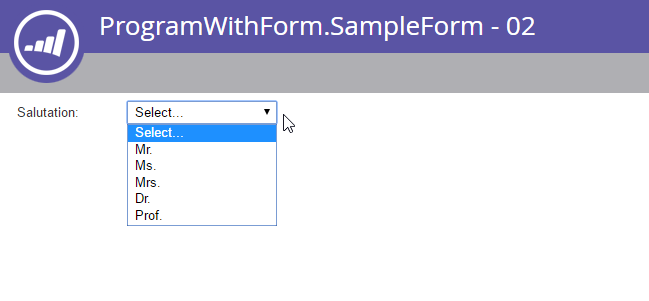

# Formulaires

[Référence du point d’entrée Forms](https://developer.adobe.com/marketo-apis/api/asset#tag/Forms)

[Référence des points d’entrée des champs de formulaire](https://developer.adobe.com/marketo-apis/api/asset#tag/Form-Fields)

Utilisez les points d’entrée de formulaires pour gérer les formulaires des systèmes distants. Un formulaire peut inclure plusieurs types d’objets :

- Formulaires
- Champs
- Fieldsets
- Règles de visibilité
- Règles de page de suivi

## Requête

Forms prend en charge les méthodes standard de récupération des ressources : [par identifiant](https://developer.adobe.com/marketo-apis/api/asset#operation/getLpFormByIdUsingGET), [par nom](https://developer.adobe.com/marketo-apis/api/asset#operation/getLpFormByNameUsingGET) et par [navigation](https://developer.adobe.com/marketo-apis/api/asset#operation/browseForms2UsingGET). Une réponse de formulaire contient chaque propriété de formulaire, à l’exception de la liste de champs.

### Par ID

Transmettez un `id` de formulaire en tant que paramètre de chemin d’accès à [Obtenir le formulaire par ID](https://developer.adobe.com/marketo-apis/api/asset#operation/getLpFormByIdUsingGET). Le point d’entrée renvoie l’enregistrement de formulaire correspondant.

```http
GET /rest/asset/v1/form/{id}.json
```

```json
{
    "success": true,
    "warnings": [],
    "errors": [],
    "requestId": "948f#154e3bad8e3",
    "result": [
        {
            "id": 736,
            "name": "newForm",
            "description": "test",
            "createdAt": "2016-05-24T17:05:54Z+0000",
            "updatedAt": "2016-05-24T17:05:54Z+0000",
            "url": "https://app-devlocal1.marketo.com/#FO736B2",
            "status": "draft",
            "theme": "simple",
            "language": "French",
            "locale": "fr_FR",
            "progressiveProfiling": false,
            "labelPosition": "left",
            "fontFamily": "Helvetica",
            "fontSize": "13px",
            "folder": {
                "type": "Folder",
                "value": 293,
                "folderName": "yyLNLHzgOM"
            },
            "knownVisitor": {
                "type": "form",
                "template": null
            },
            "thankYouList": [
                {
                    "followupType": "none",
                    "followupValue": null,
                    "default": true
                }
            ],
            "buttonLocation": 120,
            "buttonLabel": "Envoyer",
            "waitingLabel": "Veuillez patienter"
        }
    ]
}
```

### Par nom

Transmettez un `name` de formulaire à [Obtenir le formulaire par nom](https://developer.adobe.com/marketo-apis/api/asset#operation/getLpFormByNameUsingGET). Le point d’entrée renvoie l’enregistrement de formulaire correspondant.

```http
GET /rest/asset/v1/form/byName.json?name=newForm
```

```json
{
    "success": true,
    "warnings": [],
    "errors": [],
    "requestId": "948f#154e3bad8e3",
    "result": [
        {
            "id": 736,
            "name": "newForm",
            "description": "test",
            "createdAt": "2016-05-24T17:05:54Z+0000",
            "updatedAt": "2016-05-24T17:05:54Z+0000",
            "url": "https://app-devlocal1.marketo.com/#FO736B2",
            "status": "draft",
            "theme": "simple",
            "language": "French",
            "locale": "fr_FR",
            "progressiveProfiling": false,
            "labelPosition": "left",
            "fontFamily": "Helvetica",
            "fontSize": "13px",
            "folder": {
                "type": "Folder",
                "value": 293,
                "folderName": "yyLNLHzgOM"
            },
            "knownVisitor": {
                "type": "form",
                "template": null
            },
            "thankYouList": [
                {
                    "followupType": "none",
                    "followupValue": null,
                    "default": true
                }
            ],
            "buttonLocation": 120,
            "buttonLabel": "Envoyer",
            "waitingLabel": "Veuillez patienter"
        }
    ]
}
```

### Parcourir

[Get Forms](https://developer.adobe.com/marketo-apis/api/asset#operation/browseForms2UsingGET) suit le modèle de navigation standard de l’API Assets. Il prend en charge les filtres facultatifs suivants :

- `status` : filtre par `approved`, `approved with draft` ou `draft`.
- `maxReturn` : limite le nombre d&#39;enregistrements renvoyés.
- `offset` : permet de parcourir le jeu de résultats.

```http
GET /rest/asset/v1/forms.json
```

```json
{
    "success": true,
    "warnings": [],
    "errors": [],
    "requestId": "645d#154e3d499ac",
    "result": [
        {
            "id": 227,
            "name": "aKAUVDfbsX",
            "description": "",
            "createdAt": "2016-05-18T20:36:20Z+0000",
            "updatedAt": "2016-05-18T20:36:20Z+0000",
            "url": "https://app-devlocal1.marketo.com/#FO227B2",
            "status": "draft",
            "theme": "simple",
            "language": "English",
            "locale": "en_US",
            "progressiveProfiling": false,
            "labelPosition": "left",
            "fontFamily": "Helvetica",
            "fontSize": "13px",
            "folder": {
                "type": "Folder",
                "value": 293,
                "folderName": "yyLNLHzgOM"
            },
            "knownVisitor": {
                "type": "form",
                "template": null
            },
            "thankYouList": [
                {
                    "followupType": "none",
                    "followupValue": null,
                    "default": true
                }
            ],
            "buttonLocation": 120,
            "buttonLabel": "Submit",
            "waitingLabel": "Please Wait"
        },
        {
            "id": 695,
            "name": "AoMXgfFbma",
            "description": "",
            "createdAt": "2016-05-19T18:50:40Z+0000",
            "updatedAt": "2016-05-19T18:50:40Z+0000",
            "url": "https://app-devlocal1.marketo.com/#FO695B2",
            "status": "draft",
            "theme": "simple",
            "language": "English",
            "locale": "en_US",
            "progressiveProfiling": true,
            "labelPosition": "left",
            "fontFamily": "Helvetica",
            "fontSize": "13px",
            "folder": {
                "type": "Folder",
                "value": 565,
                "folderName": "WfUvYmlcyT"
            },
            "knownVisitor": {
                "type": "form",
                "template": null
            },
            "thankYouList": [
                {
                    "followupType": "none",
                    "followupValue": null,
                    "default": true
                }
            ],
            "buttonLocation": 120,
            "buttonLabel": "Submit",
            "waitingLabel": "Please Wait"
        }
    ]
}
```

### Liste de champs

Récupérez la liste des champs séparément pour chaque formulaire en transmettant l’identifiant du formulaire.

```http
GET /rest/asset/v1/form/{id}/fields.json
```

```json
{
    "success": true,
    "warnings": [],
    "errors": [],
    "requestId": "2165#154eee00d01",
    "result": [
        {
            "id": "FirstName",
            "label": "First Name:",
            "dataType": "text",
            "validationMessage": "This field is required.",
            "rowNumber": 0,
            "columnNumber": 0,
            "maxLength": 255,
            "required": false,
            "formPrefill": true,
            "visibilityRules": {
                "ruleType": "alwaysShow"
            }
        },
        {
            "id": "LastName",
            "label": "Last Name:",
            "dataType": "text",
            "validationMessage": "This field is required.",
            "rowNumber": 1,
            "columnNumber": 0,
            "maxLength": 255,
            "required": false,
            "formPrefill": true,
            "visibilityRules": {
                "ruleType": "alwaysShow"
            }
        },
        {
            "id": "Email",
            "label": "Email Address:",
            "dataType": "email",
            "validationMessage": "Must be valid email. <span class='mktoErrorDetail'>example@yourdomain.com</span>",
            "rowNumber": 2,
            "columnNumber": 0,
            "required": false,
            "formPrefill": true,
            "visibilityRules": {
                "ruleType": "alwaysShow"
            }
        },
        {
            "id": "Profiling",
            "dataType": "profiling",
            "rowNumber": 3,
            "columnNumber": 0
        }
    ]
}
```

Avant de mettre à jour ou de supprimer des champs ou de modifier leur comportement, récupérez la liste de champs du formulaire. Utilisez l’identifiant de champ renvoyé dans les requêtes suivantes.

### Types de champs

| Type d’interface utilisateur | Nom de l&#39;API |
| --- | --- |
| Cases à cocher | case à cocher |
| Bouton Radio | radio |
| Zone de texte | zone de texte |
| Liste de sélection | liste à sélection |
| Chaîne | Chaîne |
| E-mail | E-mail |
| Date | Date |
| Nombre | Nombre |
| Double | double |
| Téléphone | téléphone |
| URL | url |
| Devise | currency |
| Case à cocher | single_checkbox |
| Curseur | gamme |

### Dépendances

Transmettez un `id` de formulaire comme paramètre de chemin d’accès à [Obtenir le formulaire utilisé par](https://developer.adobe.com/marketo-apis/api/asset#operation/getFormUsedByUsingGET). Le point d’entrée renvoie les ressources qui dépendent du formulaire.

Les types de ressources suivants peuvent utiliser des formulaires :

- Pages de destination
- Listes intelligentes
- Campagnes intelligentes
- Rapports
- Programmes d’e-mail

```http
GET /rest/asset/v1/form/{id}/usedBy.json
```

```json
{
    "success": true,
    "errors": [],
    "requestId": "fdf4#17285b25038",
    "warnings": [],
    "result": [
        {
            "id": 1038,
            "name": "LP Redirect Rules Program.LP Test 01",
            "type": "Landing Page",
            "status": "approved",
            "updatedAt": "2020-02-23T01:31:21Z+0000"
        }
    ]
}
```

## Créer et mettre à jour

Pour [créer un formulaire](https://developer.adobe.com/marketo-apis/api/asset#operation/createLpFormsUsingPOST), renseignez deux champs obligatoires :

- Dossier parent du formulaire.
- Nom du formulaire.

Tous les autres paramètres sont facultatifs et possèdent des valeurs par défaut. Un nouveau formulaire comprend trois champs par défaut : Prénom, Nom et Adresse électronique.

```http
POST /rest/asset/v1/forms.json
```

```text
Content-Type: application/x-www-form-urlencoded
```

```text
name=newForm&description=test&folder={"type": "Folder","id": 293}&language=French
```

```json
{
    "success": true,
    "warnings": [],
    "errors": [],
    "requestId": "948f#154e3bad8e3",
    "result": [
        {
            "id": 736,
            "name": "newForm",
            "description": "test",
            "createdAt": "2016-05-24T17:05:54Z+0000",
            "updatedAt": "2016-05-24T17:05:54Z+0000",
            "url": "https://app-devlocal1.marketo.com/#FO736B2",
            "status": "draft",
            "theme": "simple",
            "language": "French",
            "locale": "fr_FR",
            "progressiveProfiling": false,
            "labelPosition": "left",
            "fontFamily": "Helvetica",
            "fontSize": "13px",
            "folder": {
                "type": "Folder",
                "value": 293,
                "folderName": "yyLNLHzgOM"
            },
            "knownVisitor": {
                "type": "form",
                "template": null
            },
            "thankYouList": [
                {
                    "followupType": "none",
                    "followupValue": null,
                    "default": true
                }
            ],
            "buttonLocation": 120,
            "buttonLabel": "Envoyer",
            "waitingLabel": "Veuillez patienter"
        }
    ]
}
```

Pour [mettre à jour un formulaire](https://developer.adobe.com/marketo-apis/api/asset#operation/updateFormsUsingPOST), transmettez son identifiant. Lors de la création ou de la mise à jour, vous pouvez définir les paramètres de style de base qui contrôlent l’aspect du formulaire pour l’utilisateur.

```http
POST /rest/asset/v1/form/736.json
```

```text
Content-Type: application/x-www-form-urlencoded
```

```text
name=updated name&description=This is a test for updateapi&language=English&progressiveProfiling=true&locale=en_US
```

```json
{
    "success": true,
    "warnings": [],
    "errors": [],
    "requestId": "6307#154e3cf6efe",
    "result": [
        {
            "id": 736,
            "name": "updated name",
            "description": "This is a test for update api",
            "createdAt": "2016-05-24T17:05:54Z+0000",
            "updatedAt": "2016-05-24T17:28:23Z+0000",
            "status": "draft",
            "theme": "simple",
            "language": "English",
            "locale": "en_US",
            "progressiveProfiling": true,
            "labelPosition": "left",
            "fontFamily": "Helvetica",
            "fontSize": "13px",
            "folder": {
                "type": "Folder",
                "value": 293,
                "folderName": "yyLNLHzgOM"
            },
            "knownVisitor": {
                "type": "form",
                "template": null
            },
            "thankYouList": [
                {
                    "followupType": "none",
                    "followupValue": null,
                    "default": true
                }
            ],
            "buttonLocation": 120,
            "buttonLabel": "Submit",
            "waitingLabel": "Please Wait"
        }
    ]
}
```

Les points d’entrée de formulaire créer et mettre à jour ne modifient pas le comportement connu des visiteurs ou des pages de remerciement. Utilisez les points d’entrée correspondants pour gérer ces comportements.

## Métadonnées de champ

Avant d’ajouter ou de modifier des champs de formulaire, récupérez les champs valides de l’instance cible. Les opérations de champ utilisent la propriété `id` renvoyée pour chaque champ.

Pour les champs de prospect, utilisez le point d’entrée [Obtenir les champs de formulaire disponibles](https://developer.adobe.com/marketo-apis/api/asset#operation/getAllFieldsUsingGET). La réponse inclut le type de données de chaque champ et les métadonnées par défaut appliquées lorsque le champ est ajouté à un formulaire.

```http
GET /rest/asset/v1/form/fields.json
```

```json
{
    "success": true,
    "errors": [],
    "requestId": "176ca#167a9808f4c",
    "warnings": [],
    "result": [
        {
            "id": "AnnualRevenue",
            "isRequired": false,
            "dataType": "currency"
        },
        {
            "id": "City",
            "isRequired": false,
            "dataType": "string",
            "maxLength": 255
        },
        {
            "id": "Company",
            "isRequired": false,
            "dataType": "string",
            "maxLength": 255
        },
        {
            "id": "Country",
            "isRequired": false,
            "dataType": "string",
            "maxLength": 255
        },
        {
            "id": "Description",
            "isRequired": false,
            "dataType": "textarea",
            "maxLength": 32000,
            "visibleRows": 2
        },
        {
            "id": "Email",
            "isRequired": false,
            "dataType": "email"
        },
        {
            "id": "Fax",
            "isRequired": false,
            "dataType": "phone"
        },
        {
            "id": "FirstName",
            "isRequired": false,
            "dataType": "string",
            "maxLength": 255
        },
        {
            "id": "Industry",
            "isRequired": false,
            "dataType": "string",
            "maxLength": 255
        },
        {
            "id": "LastName",
            "isRequired": false,
            "dataType": "string",
            "maxLength": 255
        },
        {
            "id": "LeadSource",
            "isRequired": false,
            "dataType": "string",
            "maxLength": 255
        },
        {
            "id": "MobilePhone",
            "isRequired": false,
            "dataType": "phone"
        },
        {
            "id": "NumberOfEmployees",
            "isRequired": false,
            "dataType": "int"
        },
        {
            "id": "Phone",
            "isRequired": false,
            "dataType": "phone"
        },
        {
            "id": "PostalCode",
            "isRequired": false,
            "dataType": "string",
            "maxLength": 255
        },
        {
            "id": "Rating",
            "isRequired": false,
            "dataType": "string",
            "maxLength": 255
        },
        {
            "id": "Salutation",
            "isRequired": false,
            "dataType": "picklist",
            "picklistValues": "Mr.,Ms.,Mrs.,Dr.,Prof."
        },
        {
            "id": "State",
            "isRequired": false,
            "dataType": "picklist",
            "picklistValues": "AK::AK,AL::AL,AR::AR,AZ::AZ,CA::CA,CO::CO,CT::CT,DE::DE,FL::FL,GA::GA,HI::HI,IA::IA,ID::ID,IL::IL,IN::IN,KS::KS,KY::KY,LA::LA,MA::MA,MD::MD,ME::ME,MI::MI,MN::MN,MO::MO,MS::MS,MT::MT,NC::NC,ND::ND,NE::NE,NH::NH,NJ::NJ,NM::NM,NV::NV,NY::NY,OH::OH,OK::OK,OR::OR,PA::PA,RI::RI,SC::SC,SD::SD,TN::TN,TX::TX,UT::UT,VA::VA,VT::VT,WA::WA,WI::WI,WV::WV,WY::WY"
        },
        {
            "id": "Street",
            "isRequired": false,
            "dataType": "textarea",
            "maxLength": 2000,
            "visibleRows": 2
        },
        {
            "id": "Title",
            "isRequired": false,
            "dataType": "picklist"
        }
    ]
}
```

Pour les champs personnalisés de membre de programme, appelez le point d’entrée [Obtenir les champs de membre de programme de formulaire disponibles](https://developer.adobe.com/marketo-apis/api/asset#operation/getAllProgramMemberFieldsUsingGET). La réponse inclut les types de données de champ personnalisé du membre de programme et les métadonnées par défaut.

Pour utiliser ces champs, le formulaire doit se trouver sous un programme, et non dans Design Studio. Une page de destination contenant un formulaire avec ces champs doit également se trouver sous un programme. Il ne peut pas être ni cloné dans Design Studio.

```http
GET /rest/asset/v1/form/programMemberFields.json
```

```json
{
    "success": true,
    "errors": [],
    "requestId": "109c6#16fa0b9c51a",
    "warnings": [],
    "result": [
        {
            "id": "pMCFCustomField01",
            "isRequired": false,
            "dataType": "string",
            "maxLength": 255
        },
        {
            "id": "pMCFCustomField02",
            "isRequired": false,
            "dataType": "string",
            "maxLength": 255
        },
        {
            "id": "myPMCF",
            "isRequired": false,
            "dataType": "string",
            "maxLength": 255
        }
    ]
}
```

### Modifier le champ

Chaque formulaire possède une liste modifiable de champs affichée pour l’utilisateur ou l’utilisatrice au chargement du formulaire. Utilisez le point d’entrée correspondant pour ajouter, mettre à jour ou supprimer un champ à la fois.

Pour [ajouter un champ](https://developer.adobe.com/marketo-apis/api/asset#operation/addFieldToAFormUsingPOST), fournissez l’ID du formulaire parent et le `fieldId` du champ. Toutes les autres propriétés sont vides ou utilisent des valeurs par défaut en fonction du type de données et des métadonnées du champ.

Envoyez les données sous la forme d’un POST avec `application/x-www-form-urlencoded`, et non d’un JSON.

```http
POST /rest/asset/v1/form/{id}/fields.json
```

```text
Content-Type: application/x-www-form-urlencoded
```

```text
fieldId=NumberOfEmployees&maxLength=125&defaultValue=this is default&required=true&fieldWidth=100&validationMessage=hey, you there?&label=employee count&hintText=Hint me&minValue=10
```

```json
{
    "success": true,
    "warnings": [],
    "errors": [],
    "requestId": "1826e#154f41b214c",
    "result": [
        {
            "id": "NumberOfEmployees",
            "label": "employee count",
            "fieldWidth": 100,
            "dataType": "number",
            "defaultValue": "this is default",
            "validationMessage": "hey, you there?",
            "rowNumber": 5,
            "columnNumber": 0,
            "required": true,
            "formPrefill": true,
            "fieldMetaData": {
                "minValue": 10,
                "maxValue": null
            },
            "visibilityRules": {
                "ruleType": "alwaysShow"
            },
            "hintText": "Hint me"
        }
    ]
}
```

Une mise à jour peut modifier les mêmes propriétés que celles utilisées lors de l’ajout d’un champ. Il nécessite également l’ID et le `fieldId` de formulaire, mais le point d’entrée de mise à jour `fieldId` transmet en tant que paramètre de chemin d’accès plutôt qu’en tant que paramètre de requête.

```http
POST /rest/asset/v1/form/{id}/field/LastName.json
```

```text
Content-Type: application/x-www-form-urlencoded
```

```text
label=enter the last name here
```

```json
{
    "success": true,
    "warnings": [],
    "errors": [],
    "requestId": "5634#15508303abb",
    "result": [
        {
            "id": "LastName",
            "label": "enter the last name here",
            "dataType": "text",
            "validationMessage": "This field is required.",
            "rowNumber": 0,
            "columnNumber": 0,
            "maxLength": 255,
            "required": false,
            "formPrefill": true,
            "visibilityRules": {
                "ruleType": "alwaysShow"
            }
        }
    ]
}
```

L’exemple précédent met à jour `LastName`, qui est un champ de chaîne simple. D’autres champs de formulaire comportent des métadonnées plus complexes. Par exemple, `Salutation` est un champ `select` avec une liste d’éléments et une valeur par défaut.

Lors de l’ajout ou de la mise à jour d’un champ de sélection, définissez la valeur de `isDefault` d’un choix sur `true`. Dans le cas contraire, le premier choix n’a aucune valeur et est libellé `Select...`.



Pour mettre à jour les éléments de la liste, mettez en forme le paramètre `values` comme illustré dans l&#39;exemple suivant :

```http
POST /rest/asset/v1/form/{id}/field/Salutation.json
```

```text
Content-Type: application/x-www-form-urlencoded
```

```sql
values=[{"label":"Select...","value":"","isDefault":true,"selected":true}, {"label":"MR","value":"MR"}, {"label":"MS","value":"MS"}, {"label":"MRS","value":"MRS"}, {"label":"DR","value":"DR"}, {"label":"PROF","value":"PROF"}]
```

```json
{
  "success": true,
  "warnings": [ ],
  "errors": [ ],
  "requestId": "71fd#1588d9d1b0c",
  "result": [
    {
      "id": "Salutation",
      "label": "Salutation:",
      "dataType": "select",
      "validationMessage": "This field is required.",
      "rowNumber": 3,
      "columnNumber": 0,
      "required": false,
      "formPrefill": true,
      "fieldMetaData": {
        "multiSelect": false,
        "values": [
          {
            "label": "Select...",
            "value": "",
            "isDefault": true,
            "selected": true
          },
          {
            "label": "MR",
            "value": "MR"
          },
          {
            "label": "MS",
            "value": "MS"
          },
          {
            "label": "MRS",
            "value": "MRS"
          },
          {
            "label": "DR",
            "value": "DR"
          },
          {
            "label": "PROF",
            "value": "PROF"
          }
        ],
        "visibleLines": 1
      },
      "visibilityRules": {
        "ruleType": "alwaysShow"
      }
    }
  ]
}
```

Utilisez la réponse Ajouter un champ au formulaire pour déterminer comment formater un champ de formulaire complexe.

### Réorganisation du champ

Utilisez le point d’entrée [ Modifier la position des champs de formulaire ](https://developer.adobe.com/marketo-apis/api/asset#operation/updateFieldPositionsUsingPOST) pour réorganiser tous les champs de formulaire en une seule unité. Le point d’entrée nécessite `positions`, un tableau JSON d’objets avec trois membres :

- `columnNumber`
- `rowNumber`
- `fieldName`, qui fait référence à l’ID de champ

Les champs de formulaire utilisent une disposition de type tableau avec jusqu’à trois colonnes et 10 lignes. Les index de ligne et de colonne commencent à 0. Par conséquent, la première ligne et la première colonne utilisent toutes deux 0. Chaque champ doit occuper une position unique.

Si le champ cible est un champ , son enregistrement dans `positions` doit également contenir des `fieldList`. Ce paramètre est un tableau d’objets ayant les mêmes membres `columnNumber`, `rowNumber` et `fieldName`.

La liste parente traite le jeu de champs comme un seul champ. Les positions dans `fieldList` déterminent la disposition de ses champs enfants.

```http
POST /rest/asset/v1/form/{id}/reArrange.json
```

```text
Content-Type: application/x-www-form-urlencoded
```

```text
positions=[{"columnNumber":0,"rowNumber":0,"fieldName":"FirstName"},{"columnNumber":0,"rowNumber":1,"fieldName":"LastName"}, {"columnNumber":0,"rowNumber":2, "fieldName":"Email"}]
```

```json
{
    "success": true,
    "warnings": [],
    "errors": [],
    "requestId": "bb18#15508ef9c04",
    "result": [
        {
            "id": 764
        }
    ]
}
```

### Texte complet

Utilisez un [point d’entrée distinct](https://developer.adobe.com/marketo-apis/api/asset#operation/addRichTextFieldUsingPOST) pour ajouter des champs de texte enrichi. Transmettez le contenu en tant qu’HTML dans une requête `multipart/form-data`. HTML ne doit pas contenir de scripts, de balises meta ou de balises de lien.

```http
POST /rest/asset/v1/form/{id}/richText.json
```

```html
Content-Type: multipart/form-data; boundary=---------------------------9051914041544843365972754266
-----------------------------9051914041544843365972754266
Content-Disposition: form-data; name="text"
Content-Type: text/html
<div>Fancy Rich Text Component</div>
-----------------------------9051914041544843365972754266--
```

```json
{
    "success": true,
    "warnings": [],
    "errors": [],
    "requestId": "82c8#154f423bf5c",
    "result": [
        {
            "id": "SHRtbFRleHRfMjAxNi0wNS0yN1QxNDozNDoyNC4xMTVa",
            "labelWidth": 260,
            "dataType": "htmltext",
            "rowNumber": 8,
            "columnNumber": 0,
            "visibilityRules": {
                "ruleType": "alwaysShow"
            },
            "text": "<div>Fancy Rich Text Component</div>"
        }
    ]
}
```

### Jeu de champs

Un jeu de champs est un groupe facultatif de champs. La liste de champs de niveau supérieur traite un jeu de champs comme un champ pour les règles de positionnement et de visibilité. Par exemple, la sélection de Oui pour un champ Exigences de conformité peut afficher un jeu de champs contenant des champs de conformité HIPAA et PCI.

Un champ doit être unique dans le formulaire. Le même champ ne peut pas apparaître à la fois dans la liste des champs parents du formulaire et dans un jeu de champs enfant.

Ajoutez un jeu de champs avec le point d’entrée [ Ajouter un jeu de champs au formulaire ](https://developer.adobe.com/marketo-apis/api/asset#operation/addFieldSetUsingPOST). Le jeu de champs apparaît ensuite dans la réponse [Obtenir les champs du formulaire](https://developer.adobe.com/marketo-apis/api/asset#operation/getFormFieldByFormVidUsingGET). Pour ajouter des champs à l’ensemble de champs, utilisez [Mettre à jour la position des champs](https://developer.adobe.com/marketo-apis/api/asset#operation/updateFieldPositionsUsingPOST) pour les déplacer dans son `fieldList`.

Pour ces points d’entrée, envoyez les données sous la forme d’un POST avec `application/x-www-form-urlencoded`, et non d’un fichier JSON.

## Règle De Visibilité

Les règles de visibilité déterminent si un visiteur peut voir un champ en fonction des valeurs saisies dans le formulaire. Chaque règle compare la valeur d’une `subjectField` dans le formulaire à une liste de valeurs dans la règle.

Un champ peut avoir un seul type de règle de visibilité : `show`, `hide` ou `alwaysShow`. L’API évalue les règles du champ de haut en bas et applique la première règle qui est évaluée comme vraie.

La modification des règles de visibilité est une mise à jour destructrice.

```http
POST /rest/asset/v1/form/{id}/field/Email/visibility.json
```

```text
Content-Type: application/x-www-form-urlencoded
```

```text
visibilityRule={"ruleType":"show", "rules":[{"subjectField": "LastName", "operator": "isNotEmpty", "values": [], "altLabel": "Email:"}]}
```

```json
{
    "success": true,
    "warnings": [],
    "errors": [],
    "requestId": "ab4a#15509030601",
    "result": [
        {
            "formFieldId": "Email",
            "ruleType": "show",
            "rules": [
                {
                    "subjectField": "LastName",
                    "operator": "isNotEmpty",
                    "values": [],
                    "altLabel": "Email:"
                }
            ]
        }
    ]
}
```

Pour obtenir la liste complète des opérateurs, voir [ Ajouter des règles de visibilité des champs de formulaire ](https://developer.adobe.com/marketo-apis/api/asset#operation/addFormFieldVisibilityRuleUsingPOST).

## Suivi

Les règles de relance dynamique peuvent rediriger les visiteurs vers une page ou les maintenir sur la page active en fonction des valeurs de champ désignées lors de l’envoi. Les règles de page de remerciement et les règles de page de suivi se rapportent au même comportement.

Représenter les règles sous la forme d’un tableau JSON dont les enregistrements contiennent `followupType`, `followupValue`, `operator`, `subjectField`, `values` et `default`. Un seul enregistrement du tableau peut avoir la `default` booléenne définie sur `true`. Le formulaire utilise cet enregistrement lorsqu’un visiteur ne remplit pas les critères d’une autre règle.

La valeur `followupType` peut être `lp` ou `url`. La valeur `lp` indique que `followupValue` est un ID de page de destination Marketo. La valeur `url` indique que `followupValue` est l’URL d’une autre page. L’opérateur compare la valeur du champ de l’objet aux valeurs fournies.

## Bouton d&#39;envoi

Utilisez le point d’entrée [Mettre à jour le bouton Envoyer](https://developer.adobe.com/marketo-apis/api/asset#operation/updateFormSubmitButtonUsingPOST) pour modifier le style du bouton d’envoi. Vous pouvez mettre à jour `buttonPosition`, `buttonStyle`, `label` et `waitingLabel`. La `waitingLabel` s’affiche alors que l’envoi est en attente.

Il s’agit d’une mise à jour destructrice.

## Validation

Forms suit un cycle de vie approuvé par le brouillon. Un formulaire peut avoir une version préliminaire, une version approuvée ou les deux. Les mises à jour s’appliquent toujours au brouillon et ne deviennent actives qu’après approbation.

L’approbation d’un formulaire remplace la version approuvée existante, le cas échéant, par le brouillon actuel. L’annulation de l’approbation d’un formulaire dynamique supprime tous les brouillons actuels et rétrograde la version approuvée au statut brouillon uniquement. Désapprouvez toujours un formulaire avant de tenter de le supprimer.

## Profilage progressif

Lorsque le profilage progressif est activé, la liste des champs du formulaire inclut un jeu de champs nommé `Profiling`. Utilisez le point d’entrée Mettre à jour les positions de champ pour ajouter ou supprimer des champs de la liste de profilage progressif.

Ce point d’entrée effectue des mises à jour destructives. De ce fait, chaque requête doit inclure tous les champs du formulaire. L&#39;exemple suivant ajoute `Phone` à la liste de profilage progressif.

```http
POST /rest/asset/v1/form/{id}/reArrange.json
```

```text
Content-Type: application/x-www-form-urlencoded
```

```text
positions=[{"columnNumber":0,"rowNumber":0,"fieldName":"Email"},{"columnNumber":0,"rowNumber":1,"fieldName":"LastName"},{"columnNumber":0,"rowNumber":2,"fieldName":"Company"},{"columnNumber":0,"rowNumber":3,"fieldName":"Website"},{"columnNumber":0,"rowNumber":4,"fieldName":"Profiling","fieldList":[{"columnNumber":0,"rowNumber":0,"fieldName":"Phone"}]}]
```

```json
{
    "success": true,
    "errors": [],
    "requestId": "3d6a#164190dbdf2",
    "result": [
        {
            "id": 1031
        }
    ]
}
```
