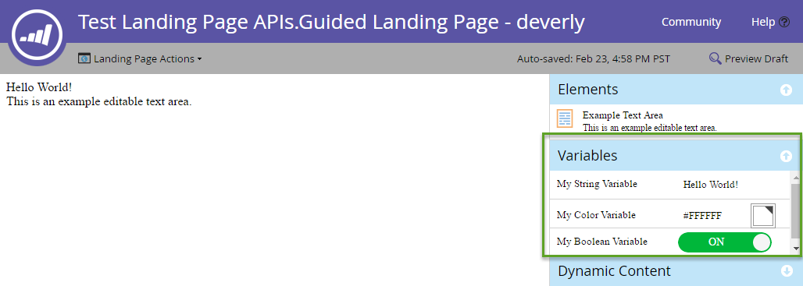

# Pages de destination

[Référence du point d’entrée de la page de destination](https://developer.adobe.com/marketo-apis/api/asset#tag/Landing-Pages)

Les landing pages sont des pages web hébergées par Marketo. Utilisez les API REST Landing Pages pour interroger et gérer leurs métadonnées, leur contenu, leur cycle de vie et leur aperçu.

## Requête

Interroger les pages de destination [par nom](https://developer.adobe.com/marketo-apis/api/asset#tag/Landing-Pages/operation/getLandingPageByNameUsingGET), [par ID](https://developer.adobe.com/marketo-apis/api/asset#tag/Landing-Pages/operation/getLandingPageByIdUsingGET) ou par [navigation](https://developer.adobe.com/marketo-apis/api/asset#tag/Landing-Pages/operation/browseLandingPagesUsingGET). Ces requêtes renvoient uniquement des métadonnées. interroger séparément les sections de contenu d’une page de destination par identifiant de page ;

L’interrogation du contenu d’une landing page renvoie ses sections de contenu disponibles. Une section doit apparaître dans cette liste avant de pouvoir la mettre à jour.

```http
GET /rest/asset/v1/landingPage/{id}/content.json
```

```json
{
    "success": true,
    "warnings": [],
    "errors": [],
    "requestId": "6307#154ea1689d7",
    "result": [
        {
            "id": "67",
            "type": "Form",
            "index": 1,
            "content": {
                "content": "189",
                "contentType": "Form",
                "contentUrl": "https://app-devlocal1.marketo.com/#FO189A1ZN13LA1"
            },
            "formattingOptions": {
                "zIndex": 15,
                "left": "359px",
                "top": "122px"
            }
        }
    ]
}
```

Les pages de destination guidées comprennent des sections définies par leur modèle. Les pages à structure libre n’incluent pas de sections prédéfinies. Ajoutez donc leur contenu avant de le modifier.

Le format de l’attribut `content` dépend de l’attribut `type` et du caractère statique ou dynamique du champ.

## Créer et mettre à jour

[Créer une landing page](https://developer.adobe.com/marketo-apis/api/asset#tag/Landing-Pages/operation/createLandingPageUsingPOST) à partir d&#39;un modèle. Le nom de la page, l’ID du modèle et le dossier de destination sont obligatoires. Voir la référence du point d’entrée pour les métadonnées facultatives.

Les points d’entrée [contenu de la page de destination](https://developer.adobe.com/marketo-apis/api/asset#tag/Landing-Page-Content) prennent en charge les types de contenu suivants : `richText`, `HTML`, `Form`, `Image`, `Rectangle` et `Snippet`.

```http
POST rest/asset/v1/landingPages.json
```

```text
Content-Type: application/x-www-form-urlencoded
```

```text
name=createLandingPage&folder={"type": "Folder", "id": 11}&template=1&description=this is a test&workspace=default&title=test create&keywords=awesome&formPrefill=false
```

```json
{
    "success": true,
    "warnings": [],
    "errors": [],
    "requestId": "7a39#154cf7922c6",
    "result": [
        {
            "id": 27,
            "name": "createLandingPage",
            "description": "this is a test",
            "createdAt": "2016-05-20T18:41:43Z+0000",
            "updatedAt": "2016-05-20T18:41:43Z+0000",
            "folder": {
                "type": "Folder",
                "value": 11,
                "folderName": "Landing Pages"
            },
            "workspace": "Default",
            "status": "draft",
            "template": 1,
            "title": "test create",
            "keywords": "awesome",
            "robots": "index, nofollow",
            "formPrefill": false,
            "mobileEnabled": false,
            "URL": "https://app-devlocal1.marketo.com/lp/622-LME-718/createLandingPage.html",
            "computedUrl": "https://app-devlocal1.marketo.com/#LP27B2"
        }
    ]
}
```

Les métadonnées de page de destination peuvent être mises à jour avec le point d’entrée [Mettre à jour les métadonnées de page de destination](https://developer.adobe.com/marketo-apis/api/asset#tag/Landing-Pages/operation/updateLandingPageUsingPOST).

## Validation

Les landing pages utilisent le modèle standard brouillon et approuvé. Les mises à jour s’appliquent au brouillon et ne deviennent actives qu’après approbation.

## Supprimer

Avant de supprimer une page de destination, assurez-vous qu’elle n’est pas approuvée et qu’aucune autre ressource Marketo ne la référence. Supprimez des pages individuellement avec le point d’entrée [Supprimer la page de destination](https://developer.adobe.com/marketo-apis/api/asset#tag/Landing-Pages/operation/deleteLandingPageByIdUsingPOST). Vous ne pouvez pas utiliser cette API pour supprimer des pages avec des boutons de réseaux sociaux incorporés.

## Cloner

Clonez une page de destination avec une requête POST `application/x-www-url-formencoded`.

Le paramètre de chemin d’accès `id` spécifie la page de destination source.

Le paramètre `name` spécifie le nom de la nouvelle page de destination.

Le paramètre `folder` spécifie le dossier parent. Transmettez-le en tant qu’objet JSON incorporé contenant `id` et `type`.

Le paramètre `template` spécifie l’identifiant du modèle de page de destination source.

Le paramètre facultatif `description` décrit la nouvelle page de destination.

```http
POST /rest/asset/v1/landingPage/{id}/clone.json
```

```text
Content-Type: application/x-www-form-urlencoded
```

```text
name=MyNewLandingPage&folder={"type":"Program","id":1119}&template=57
```

```json
{
    "success": true,
    "errors": [],
    "requestId": "1078d#1683e4881c6",
    "warnings": [],
    "result": [
        {
            "id": 3291,
            "name": "MyNewLandingPage",
            "createdAt": "2019-01-11T18:59:25Z+0000",
            "updatedAt": "2019-01-11T18:59:25Z+0000",
            "folder": {
                "type": "Program",
                "value": 1119,
                "folderName": "DefaultProgramWithGuidedLP"
            },
            "workspace": "Default",
            "status": "draft",
            "template": 57,
            "robots": "index, nofollow",
            "formPrefill": false,
            "mobileEnabled": false,
            "URL": "http://na-abm.marketo.com/lp/284-RPR-133/DefaultProgramWithGuidedLPPerkutoTestLP-Clone-1.html",
            "computedUrl": "https://app-abm.marketo.com/#LP3291A1LA1"
        }
    ]
}
```

## Section Gérer le contenu

Les sections de contenu sont classées selon leur propriété `index` et affichées selon les règles CSS du client. Utilisez les points d’entrée [Ajouter](https://developer.adobe.com/marketo-apis/api/asset#tag/Landing-Page-Content/operation/addLandingPageContentUsingPOST), [Mettre à jour](https://developer.adobe.com/marketo-apis/api/asset#tag/Landing-Page-Content/operation/updateLandingPageContentUsingPOST) et [Supprimer](https://developer.adobe.com/marketo-apis/api/asset#tag/Landing-Page-Content/operation/removeLandingPageContentUsingPOST) pour gérer les sections. Utilisez [Obtenir le contenu de la page de destination](https://developer.adobe.com/marketo-apis/api/asset#tag/Landing-Page-Content/operation/getLandingPageContentUsingGET) pour effectuer une requête.

Chaque section comporte des paramètres `type` et `value`. Le `type` détermine le `value` attendu. Transmettez des données à ces points d’entrée en tant que `x-www-form-urlencoded` POST, et non en tant que JSON.

**Types de section**

| Type | Valeur |
| --- | --- |
| Contenu dynamique | Identifiant de la segmentation. |
| Form | Identifiant du formulaire. |
| HTML | Envoyez du texte au contenu HTML. |
| Image | Identifiant de la ressource image. |
| Rectangle | Vide. |
| RichText | Envoyez du texte au contenu HTML.  Ne peut contenir que des éléments de texte enrichi. |
| Extrait | Identifiant du fragment de code. |
| SocialButton | Identifiant du bouton social. |
| Vidéo | Identifiant de la vidéo. |

Pour les pages à structure libre, ajoutez chaque section de contenu requise. Marketo les incorpore dans l’élément `div` avec l’ID `mktoContent`.

Les pages guidées peuvent inclure des éléments prédéfinis renvoyés par [Obtenir le contenu de la page de destination](https://developer.adobe.com/marketo-apis/api/asset#tag/Landing-Page-Content/operation/getLandingPageContentUsingGET). Utilisez les points d’entrée correspondants pour ajouter des éléments ou [mettre à jour leur contenu](https://developer.adobe.com/marketo-apis/api/asset#tag/Landing-Page-Content/operation/updateLandingPageContentUsingPOST).

### Contenu dynamique

Pour rendre une section dynamique, assurez-vous d’abord qu’elle apparaît dans la liste de contenu de la page de destination. Utilisez ensuite [Mettre à jour la section de contenu de la page de destination](https://developer.adobe.com/marketo-apis/api/asset#tag/Landing-Page-Content/operation/updateLandingPageContentUsingPOST) pour définir son type sur `DynamicContent`.

Marketo crée des sections dynamiques sous-jacentes qui héritent du type de base et du contenu de l’élément converti.

```http
GET /rest/asset/v1/landingPage/{id}/dynamicContent/RVMtNDg=.json
```

```json
{
  "success": true,
  "warnings": [],
  "errors": [],
  "requestId": "46e#1560fa169d9",
  "result": [
    {
      "createdAt": "2016-07-21",
      "updatedAt": "2016-07-21",
      "segmentation": 1007,
      "segments": [
        {
          "segmentId": 1018,
          "segmentName": "Default",
          "type": "RichText",
          "content": "\n\t\t\t\t\t\t\tAlice was beginning to get very tired of sitting by her sister on the bank, and having nothing to do: once or twice she had peeped into the book her sister was reading, but it had no pictures or conversations in it.\n\t\t\t\t\t\t"
        },
        {
          "segmentId": 1017,
          "segmentName": "New Segment",
          "type": "RichText",
          "content": "\n\t\t\t\t\t\t\tAlice was beginning to get very tired of sitting by her sister on the bank, and having nothing to do: once or twice she had peeped into the book her sister was reading, but it had no pictures or conversations in it.\n\t\t\t\t\t\t"
        }
      ]
    }
  ]
}
```

[La mise à jour du contenu](https://developer.adobe.com/marketo-apis/api/asset#tag/Landing-Page-Content/operation/updateLandingPageDynamicContentUsingPOST) pour chaque segment individuel est effectuée sur la base de l’identifiant du segment.

```http
POST /rest/asset/v1/landingPage/{id}/dynamicContent/{dynamicContentId}.json
```

```text
Content-Type: application/x-www-form-urlencoded
```

```text
segment=New Segment&value=New Content
```

```json
 {
  "success": true,
  "warnings": [],
  "errors": [],
  "requestId": "7516#14e08fe7cbbc",
  "result": [
    {
      "id": 1012
    }
  ]
}
```

## Variables

Les pages de destination guidées prennent en charge les variables modifiables contenant des valeurs d’élément. Modifiez des variables dans l’éditeur de page de destination :



Les variables sont des balises meta dans l’élément `<head>` d’un modèle de page de destination guidée. Les types pris en charge sont String, Color et Boolean. L’exemple suivant définit une variable de chaque type :

```html
<head>
  <meta charset="utf-8">
  <meta class="mktoString" mktoName="My String Variable" id="stringVar" default="Hello World!">
  <meta class="mktoColor" mktoName="My Color Variable" id="colorVar" default="#ffffff">
  <meta class="mktoBoolean" mktoName="My Boolean Variable" id="boolVar" default="true">
</head>
```

Pour plus d’informations, consultez la section « Variable modifiable » de la documentation [Création d’un modèle de page de destination guidé](https://experienceleague.adobe.com/fr/docs/marketo/using/product-docs/demand-generation/landing-pages/landing-page-templates/create-a-guided-landing-page-template).

### Requête

Récupérez les variables d’une page de destination guidée en transmettant l’ID de la page de destination au point d’entrée Obtenir les variables de page de destination.

```http
GET /rest/asset/v1/landingPage/{id}/variables.json
```

```json
{
    "success": true,
    "warnings": [],
    "errors": [],
    "requestId": "10843#15a6d7e5fa1",
    "result": [
        {
            "id": "stringVar",
            "value": "Hello World!",
            "type": "string"
        },
        {
            "id": "colorVar",
            "value": "#FFFFFF",
            "type": "color"
        },
        {
            "id": "boolVar",
            "value": "true",
            "type": "boolean"
        }
    ]
}
```

Cette page de destination guidée contient trois variables : `stringVar`, `colorVar` et `boolVar`.

### Mise à jour

Mettez à jour une variable pour une page de destination guidée en transmettant l’identifiant de page de destination, l’identifiant de variable et la valeur de variable au point d’entrée Mettre à jour les variables de page de destination .

```http
POST /rest/asset/v1/landingPage/{id}/variable/{variableId}.json?value={newValue}
```

```json
{
    "success": true,
    "warnings": [],
    "errors": [],
    "requestId": "2b07#15a6db77da3",
    "result": [
        {
            "id": "stringVar",
            "value": "Hello Brave New World!",
            "type": "String"
        }
    ]
}
```

## Aperçu de la page de destination

Utilisez [Obtenir le contenu complet de la page de destination](https://developer.adobe.com/marketo-apis/api/asset#tag/Landing-Pages/operation/getLandingPageFullContentUsingGET) pour récupérer un aperçu généré par le navigateur. Le paramètre de chemin de `id` de la page de destination est obligatoire. Le point d’entrée accepte également deux paramètres de requête facultatifs :

- `segmentation` : tableau d’objets JSON contenant des `segmentationId` et des `segmentId`. L’aperçu représente un prospect correspondant à ces segments.
- `leadId` : ID de lead entier. L’aperçu représente le prospect spécifié.

```http
GET /rest/asset/v1/landingPage/{id}/fullContent.json?leadId=1001&segmentation=[{"segmentationId":1030,"segmentId":1103}]
```

```json
{
  "success": true,
  "errors": [],
  "requestId": "119ab#17692849f1e",
  "warnings": [],
  "result": [
    {
      "id": 1023,
      "content": "<!DOCTYPE html>\n<html>\n <head>\n <meta charset=\"utf-8\">\n \n \n <meta name=\"robots\" content=\"index, nofollow\">\n <title></title>\n <style>\n body {background:#FFFFFF} \n #myConditionalDisplayArea {\n display: true;\n }\n </style>\n <link rel=\"shortcut icon\" href=\"/favicon.ico\" type=\"image/x-icon\" >\n<link rel=\"icon\" href=\"/favicon.ico\" type=\"image/x-icon\" >\n\n\n<style>.mktoGen.mktoImg {display:inline-block; line-height:0;}</style>\n </head>\n <body id=\"bodyId\">\n \n Hello Brave New World!\n <div class=\"mktoText\" id=\"exampleText\"><div>This is an example editable text area.</div>\n<div>Lead Full Name = Hanna Crawford</div>\n<div><br /></div>\n <script type=\"text/javascript\" src=\"//munchkin.marketo.net//munchkin.js\"></script><script>Munchkin.init('123-ABC-456', {customName: 'Test-Landing-Page-APIs_Guided-Landing-Page---deverly', PURL_VISIT_TOKEN, wsInfo: 'j1RR'});</script>\n<div id=\"mktoClickBlockingDiv\"></div>\n </body>\n</html>\n"
    }
  ]
}
```
