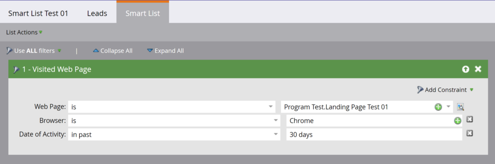

# Listes intelligentes

[Référence des points d’entrée des listes dynamiques](https://developer.adobe.com/marketo-apis/api/asset#tag/Smart-Lists)

Utilisez les API REST de listes dynamiques pour interroger, cloner et supprimer des listes dynamiques.

Ces API prennent uniquement en charge les listes dynamiques créées par l’utilisateur. Ils ne prennent pas en charge les [listes intelligentes intégrées ou système](https://experienceleague.adobe.com/en/docs/marketo/using/product-docs/core-marketo-concepts/smart-lists-and-static-lists/using-smart-lists/use-built-in-system-smart-lists).

## Requête

Interroger des listes dynamiques [par ID](https://developer.adobe.com/marketo-apis/api/asset#tag/Smart-Lists/operation/getSmartListByIdUsingGET), [par nom](https://developer.adobe.com/marketo-apis/api/asset#tag/Smart-Lists/operation/getSmartListByNameUsingGET) ou par [navigation](https://developer.adobe.com/marketo-apis/api/asset#tag/Smart-Lists/operation/getSmartListsUsingGET).

### Par Id

[Requête par ID](https://developer.adobe.com/marketo-apis/api/asset#tag/Smart-Lists/operation/getSmartListByIdUsingGET) prend un paramètre de chemin d’accès `id` de liste dynamique et renvoie l’enregistrement correspondant. Définissez le paramètre booléen `includeRules` facultatif pour inclure des règles de liste dynamique.



```http
GET /rest/asset/v1/smartList/{id}.json?includeRules=true
```

```json
{
    "success": true,
    "errors": [],
    "requestId": "6efc#16c8967a21f",
    "warnings": [],
    "result": [
        {
            "id": 4363,
            "name": "Smart List Test 01",
            "createdAt": "2019-06-03T23:01:13Z+0000",
            "updatedAt": "2019-06-04T17:37:45Z+0000",
            "url": "https://app-sjqe.marketo.com/#SL4363A1LA1",
            "folder": {
                "id": 1041,
                "type": "Program"
            },
            "workspace": "Default",
            "rules": {
                "filterMatchType": "all",
                "triggers": [],
                "filters": [
                    {
                        "id": 459,
                        "name": "Visited Web Page",
                        "ruleTypeId": 1,
                        "ruleType": "Activity",
                        "operator": "occurs",
                        "conditions": [
                            {
                                "activityAttributeId": 1,
                                "activityAttributeName": "Web Page",
                                "operator": "is",
                                "values": [
                                    "Program Test.Landing Page Test 01"
                                ],
                                "isPrimary": true
                            },
                            {
                                "activityAttributeId": 6,
                                "activityAttributeName": "Browser",
                                "operator": "is",
                                "values": [
                                    "Chrome"
                                ],
                                "isPrimary": false
                            },
                            {
                                "activityAttributeId": -101,
                                "activityAttributeName": "Date of Activity",
                                "operator": "in past",
                                "values": [
                                    "30 days"
                                ],
                                "isPrimary": false
                            }
                        ]
                    }
                ]
            }
        }
    ]
}
```

### Par Identifiant De Campagne Dynamique

[Requête par identifiant de campagne intelligente](https://developer.adobe.com/marketo-apis/api/asset#tag/Smart-Campaigns/operation/getSmartListBySmartCampaignIdUsingGET) prend un paramètre de chemin d’`id` de campagne intelligente et renvoie son enregistrement de liste intelligente. Définissez le paramètre booléen `includeRules` facultatif pour inclure des règles de liste dynamique.

```http
GET /rest/asset/v1/smartCampaign/{smartCampaignId}/smartList.json
```

```json
{
    "success": true,
    "errors": [],
    "requestId": "6efc#16c8967a21f",
    "warnings": [],
    "result": [
        {
            "id": 4363,
            "name": "Smart List Test 01",
            "createdAt": "2019-06-03T23:01:13Z+0000",
            "updatedAt": "2019-06-04T17:37:45Z+0000",
            "url": "https://app-sjqe.marketo.com/#SL4363A1LA1",
            "folder": {
                "id": 1041,
                "type": "Program"
            },
            "workspace": "Default"
         }
    ]
}
```

### Par ID de programme

[Requête par ID de programme](https://developer.adobe.com/marketo-apis/api/asset#tag/Programs/operation/getSmartListByProgramIdUsingGET) prend un paramètre de chemin d’`id` de programme d’e-mail et renvoie son enregistrement de liste dynamique. Définissez le paramètre booléen `includeRules` facultatif pour inclure des règles de liste dynamique.

```http
GET /rest/asset/v1/program/{programId}/smartList.json
```

```json
{
    "success": true,
    "errors": [],
    "requestId": "6efc#16c8967a21f",
    "warnings": [],
    "result": [
        {
            "id": 4363,
            "name": "Smart List Test 01",
            "createdAt": "2019-06-03T23:01:13Z+0000",
            "updatedAt": "2019-06-04T17:37:45Z+0000",
            "url": "https://app-sjqe.marketo.com/#SL4363A1LA1",
            "folder": {
                "id": 1041,
                "type": "Program"
            },
            "workspace": "Default"
         }
    ]
}
```

### Par nom

[Requête par nom](https://developer.adobe.com/marketo-apis/api/asset#tag/Smart-Lists/operation/getSmartListByNameUsingGET) prend un paramètre de `name` de liste dynamique. Le point d’entrée effectue une correspondance de nom exacte et renvoie l’enregistrement correspondant.

```http
GET /rest/asset/v1/smartList/byName.json?name=2018 Leads
```

```json
{
    "success": true,
    "errors": [],
    "requestId": "115d7#16423bc13b4",
    "result": [
        {
            "id": 283988,
            "name": "2018 Leads",
            "createdAt": "2008-10-07T15:20:39Z+0000",
            "updatedAt": "2010-04-13T15:34:32Z+0000",
            "url": "https://app-abm.marketo.com/#SL283988A1",
            "folder": {
                "id": 31,
                "type": "Folder"
            },
            "workspace": "Default"
        }
    ]
}
```

### Parcourir

Utilisez le point d’entrée de navigation pour [récupérer des listes intelligentes par lots](https://developer.adobe.com/marketo-apis/api/asset#tag/Smart-Lists/operation/getSmartListsUsingGET). Le paramètre facultatif `folder` définit la portée de la requête sur un dossier parent. Transmettez-le en tant qu’objet JSON contenant `id` et `type`.

Utilisez `offset` et `maxReturn` pour la pagination. Utilisez les paramètres facultatifs `earliestUpdatedAt` et `latestUpdatedAt` pour filtrer par période `updatedAt`.

```http
GET /rest/asset/v1/smartLists.json?folder={"id":31,"type":"Folder"}
```

```json
{
    "success": true,
    "errors": [],
    "requestId": "9aa4#16423c0e969",
    "result": [
        {
            "id": 283988,
            "name": "2018 Leads",
            "createdAt": "2008-10-07T15:20:39Z+0000",
            "updatedAt": "2010-04-13T15:34:32Z+0000",
            "url": "https://app-abm.marketo.com/#SL283988A1",
            "folder": {
                "id": 31,
                "type": "Folder"
            },
            "workspace": "Default"
        },
        {
            "id": 299697,
            "name": "Active Prospects",
            "createdAt": "2008-10-17T02:09:49Z+0000",
            "updatedAt": "2010-03-27T18:27:46Z+0000",
            "url": "https://app-abm.marketo.com/#SL299697A1",
            "folder": {
                "id": 31,
                "type": "Folder"
            },
            "workspace": "Default"
        },
        {
            "id": 400517,
            "name": "Leads by Score",
            "createdAt": "2009-01-07T18:52:52Z+0000",
            "updatedAt": "2010-04-13T15:36:09Z+0000",
            "url": "https://app-abm.marketo.com/#SL400517A1",
            "folder": {
                "id": 31,
                "type": "Folder"
            },
            "workspace": "Default"
        }
    ]
}
```

## Cloner

Envoyez une requête `application/x-www-form-urlencoded` POST pour [cloner une liste dynamique](https://developer.adobe.com/marketo-apis/api/asset#tag/Smart-Lists/operation/cloneSmartListUsingPOST). Le paramètre de chemin d’accès `id` identifie la liste dynamique source.

Transmettez `folder` en tant qu’objet JSON contenant des `id` et des `type`. Le parent doit être un programme ou un dossier de liste dynamique. Le `name` doit être unique. Le paramètre facultatif `description` décrit la nouvelle liste.

```http
POST /rest/asset/v1/smartList/{id}/clone.json
```

```text
Content-Type: application/x-www-form-urlencoded
```

```text
folder={"id":31,"type":"Folder"}&name=2018 Leads Qualified
```

```json
{
    "success": true,
    "errors": [],
    "requestId": "a672#16423d755ed",
    "result": [
        {
            "id": 788645,
            "name": "2018 Leads Qualified",
            "createdAt": "2018-06-21T19:34:32Z+0000",
            "updatedAt": "2018-06-21T19:34:32Z+0000",
            "url": "https://app-abm.marketo.com/#SL788645A1",
            "folder": {
                "id": 31,
                "type": "Folder"
            },
            "workspace": "Default"
        }
    ]
}
```

## Supprimer

Pour [supprimer une liste dynamique](https://developer.adobe.com/marketo-apis/api/asset#tag/Smart-Lists/operation/deleteSmartListByIdUsingPOST), transmettez son `id` en tant que paramètre de chemin d’accès.

```http
POST /rest/asset/v1/smartList/{id}/delete.json
```

```json
{
    "success": true,
    "errors": [],
    "requestId": "8f5#16423dd0fbe",
    "result": [
        {
            "id": 788645
        }
    ]
}
```
