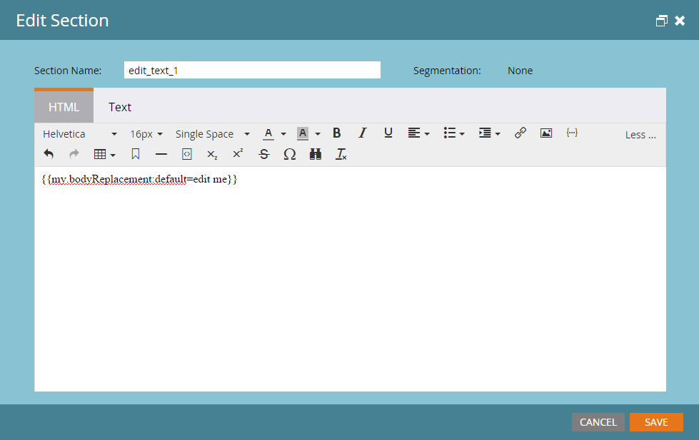

# E-mail transactionnel

Un cas d&#39;utilisation courant de l&#39;API Marketo consiste à déclencher l&#39;envoi d&#39;e-mails transactionnels à des enregistrements spécifiques via l&#39;appel API [Request Campaign](https://developer.adobe.com/marketo-apis/api/mapi/#tag/Campaigns/operation/triggerCampaignUsingPOST). Il existe quelques exigences de configuration dans Marketo pour exécuter l’appel requis avec l’API REST Marketo.

- Le destinataire doit avoir un enregistrement dans Marketo
- Un e-mail transactionnel doit être créé et approuvé dans votre instance Marketo.
- Il doit y avoir une campagne de déclenchement active avec le message « La campagne est demandée, 1. Source : API de service web », configurée pour envoyer l’e-mail

Tout d’abord[ créez et approuvez votre e-mail](https://experienceleague.adobe.com/docs/marketo/using/home.html?lang=fr). Si l’e-mail est véritablement transactionnel, vous devrez probablement le définir comme opérationnel, mais assurez-vous qu’il est juridiquement qualifié comme opérationnel. Elle est configurée à partir de l’écran Modifier sous Actions d’e-mail > Paramètres d’e-mail :


Validez-le et nous sommes prêts à créer notre campagne :


Si vous êtes un débutant dans la création de campagnes, consultez l’article [Créer une campagne dynamique](https://experienceleague.adobe.com/docs/marketo/using/product-docs/core-marketo-concepts/smart-campaigns/creating-a-smart-campaign/create-a-new-smart-campaign.html?lang=fr). Une fois que vous avez créé votre campagne, nous devons suivre ces étapes. Configurer votre liste dynamique avec le déclencheur Campagne est demandée :


Nous devons maintenant configurer le flux pour pointer une étape Envoyer un e-mail vers votre e-mail :


Avant l’activation, vous devez définir certains paramètres dans l’onglet Planification . Si cet e-mail particulier ne doit être envoyé qu’une seule fois à un enregistrement donné, laissez les paramètres de qualification tels quels. S’il est nécessaire qu’ils reçoivent l’e-mail plusieurs fois, cependant, vous pouvez l’ajuster à chaque fois ou à l’une des cadences disponibles :

Nous sommes maintenant prêts à activer :


## Envoi des appels API

**Remarque :** dans les exemples Java ci-dessous, nous utilisons le [package minimal-json](https://github.com/ralfstx/minimal-json) pour gérer les représentations JSON dans notre code.

La première partie de l’envoi d’un e-mail transactionnel par le biais de l’API consiste à s’assurer qu’un enregistrement avec l’adresse e-mail correspondante existe dans votre instance Marketo et que nous avons accès à son identifiant de prospect. Pour les besoins de cette publication, nous supposons que les adresses e-mail se trouvent déjà dans Marketo et que nous devons uniquement récupérer l’identifiant de l’enregistrement. Pour cela, nous utilisons l’appel [Get Leads by Filter Type](https://developer.adobe.com/marketo-apis/api/mapi/#tag/Leads/operation/getLeadsByFilterUsingGET). Examinons notre méthode principale pour demander la campagne :

```java
package dev.marketo.blog_request_campaign;

import com.eclipsesource.json.JsonArray;

public class App
{
    public static void main( String[] args )
    {
        //Create an instance of Auth so that we can authenticate with our Marketo instance
        Leads leadsRequest = new Leads(auth).setFilterType("email").addFilterValue("requestCampaign.test@marketo.com");

        //Create and parameterize an instance of Leads
        //Set your email filterValue appropriately
        Leads leadsRequest = new Leads(auth).setFilterType("email").addFilterValue("test.requestCamapign@example.com");

        //Get the inner results array of the response
        JsonArray leadsResult = leadsRequest.getData().get("result").asArray();

        //Get the id of the record indexed at 0
        int lead = leadsResult.get(0).asObject().get("id").asInt();

        //Set the ID of your campaign from Marketo
        int campaignId = 0;
        RequestCampaign rc = new RequestCampaign(auth, campaignId).addLead(lead);

        //Send the request to Marketo
        rc.postData();
    }
}
```

Pour obtenir ces résultats à partir de la réponse JsonObject de leadsRequest, nous devons écrire du code . Pour récupérer le premier résultat dans le tableau , nous devons extraire le tableau de JsonObject et obtenir l’objet indexé à 0 :

```java
JsonArray leadsResult = leadsRequest.getData().get("result").asArray();
int leadId = leadsResult.get(0).asObject().get("id").asInt();
```

À partir de là, nous n’avons plus qu’à lancer l’appel Demander la campagne . Pour ce faire, les paramètres requis sont ID dans l’URL de la requête et un tableau d’objets JSON contenant un membre, « id ». Examinons le code pour ceci :

```java
package dev.marketo.blog_request_campaign;
import java.io.IOException;
import java.io.InputStream;
import java.io.InputStreamReader;
import java.io.OutputStreamWriter;
import java.io.Reader;
import java.net.MalformedURLException;
import java.net.URL;
import java.util.ArrayList;
import javax.net.ssl.HttpsURLConnection;
import com.eclipsesource.json.JsonArray;
import com.eclipsesource.json.JsonObject;

public class RequestCampaign {
    private String endpoint;
    private Auth auth;
    public ArrayList leads = new ArrayList();
    public ArrayList tokens = new ArrayList();

    public RequestCampaign(Auth auth, int campaignId) {
        this.auth = auth;
        this.endpoint = this.auth.marketoInstance + "/rest/v1/campaigns/" + campaignId + "/trigger.json";
    }
    public RequestCampaign setLeads(ArrayList leads) {
        this.leads = leads;
        return this;
    }
    public RequestCampaign addLead(int lead){
        leads.add(lead);
        return this;
    }
    public RequestCampaign setTokens(ArrayList tokens) {
        this.tokens = tokens;
        return this;
    }
    public RequestCampaign addToken(String tokenKey, String val){
        JsonObject jo = new JsonObject().add("name", tokenKey);
        jo.add("value", val);
        tokens.add(jo);
        return this;
    }
    public JsonObject postData(){
        JsonObject result = null;
        try {
            JsonObject requestBody = buildRequest(); //builds the Json Request Body
            System.out.println("Executing RequestCampaign call\n" + "Endpoint: " + endpoint + "\nRequest Body:\n"  + requestBody);
            URL url = new URL(endpoint);
            HttpsURLConnection urlConn = (HttpsURLConnection) url.openConnection(); //Return a URL connection and cast to HttpsURLConnection
            urlConn.setRequestMethod("POST");
            urlConn.setRequestProperty("Content-type", "application/json");
            urlConn.setRequestProperty("accept", "text/json");
            urlConn.setDoOutput(true);
            OutputStreamWriter wr = new OutputStreamWriter(urlConn.getOutputStream());
            wr.write(requestBody.toString());
            wr.flush();
            InputStream inStream = urlConn.getInputStream(); //get the inputStream from the URL connection
            Reader reader = new InputStreamReader(inStream);
            result = JsonObject.readFrom(reader); //Read from the stream into a JsonObject
            System.out.println("Result:\n" + result);
        } catch (MalformedURLException e) {
            e.printStackTrace();
        } catch (IOException e) {
            e.printStackTrace();
        }
        return result;
    }

    private JsonObject buildRequest(){
        JsonObject requestBody = new JsonObject(); //Create a new JsonObject for the Request Body
        JsonObject input = new JsonObject();
        JsonArray leadsArray = new JsonArray();
        for (int lead : leads) {
            JsonObject jo = new JsonObject().add("id", lead);
            leadsArray.add(jo);
        }
        input.add("leads", leadsArray);
        JsonArray tokensArray = new JsonArray();
        for (JsonObject jo : tokens) {
            tokensArray.add(jo);
        }
        input.add("tokens", tokensArray);
        requestBody.add("input", input);
        return requestBody;
    }

}
```

Cette classe a un constructeur qui prend une authentification et l’identifiant de la campagne. Les leads sont ajoutés à l’objet soit en transmettant un `ArrayList<Integer>` contenant les identifiants des enregistrements à setLeads, soit en utilisant addLead, qui prend un entier et l’ajoute à ArrayList existant dans la propriété leads. Pour déclencher l’appel API afin de transmettre les enregistrements de prospect à la campagne, postData doit être appelé, qui renvoie un objet JsonObject contenant les données de réponse de la requête. Lorsque la campagne de requête est appelée, chaque prospect transmis à l’appel est traité par la campagne de déclenchement cible dans Marketo et l’e-mail précédemment créé lui est envoyé. Félicitations, vous avez déclenché un e-mail via l’API REST Marketo. Gardez un œil sur la Partie 2, où nous examinons la personnalisation dynamique du contenu d’un e-mail par le biais de Request Campaign.

### Création de votre e-mail

Pour personnaliser notre contenu, nous devons d’abord configurer un [programme](https://experienceleague.adobe.com/docs/marketo/using/product-docs/core-marketo-concepts/programs/creating-programs/create-a-program.html?lang=fr) et un [e-mail](https://experienceleague.adobe.com/docs/marketo/using/home.html?lang=fr) dans Marketo. Pour générer notre contenu personnalisé, nous devons créer des jetons dans le programme, puis les placer dans l’e-mail que nous allons envoyer. Pour plus de simplicité, nous n’utilisons qu’un seul jeton dans cet exemple, mais vous pouvez remplacer un nombre illimité de jetons dans un e-mail, dans l’e-mail de l’expéditeur, le nom de l’expéditeur, le destinataire de la réponse ou tout autre élément de contenu de l’e-mail. Créons donc un jeton de texte enrichi à remplacer et appelons-le « bodyReplacement ». Le texte enrichi nous permet de remplacer n’importe quel contenu du jeton par HTML arbitraire que nous voulons saisir.


Les jetons ne peuvent pas être enregistrés s’ils sont vides. Continuez donc et insérez du texte d’espace réservé ici. Nous devons maintenant insérer notre jeton dans l’e-mail :



Ce jeton sera désormais accessible pour remplacement par le biais d’un appel de campagne de demande. Ce jeton peut être aussi simple qu’une seule ligne de texte qui doit être remplacée par e-mail, ou peut inclure presque toute la disposition de l’e-mail.

### Le code

```java
package dev.marketo.blog_request_campaign;

import com.eclipsesource.json.JsonArray;

public class App
{
    public static void main( String[] args )
    {
        //Create an instance of Auth so that we can authenticate with our Marketo instance
        Auth auth = new Auth("Client ID - CHANGE ME", "Client Secret - CHANGE ME", "Host - CHANGE ME");

        //Create and parameterize an instance of Leads
        Leads leadsRequest = new Leads(auth).setFilterType("email").addFilterValue("requestCampaign.test@marketo.com");

        //get the inner results array of the response
        JsonArray leadsResult = leadsRequest.getData().get("result").asArray();

        //get the id of the record indexed at 0
        int lead = leadsResult.get(0).asObject().get("id").asInt();

        //Set the ID of our campaign from Marketo
        int campaignId = 1578;
        RequestCampaign rc = new RequestCampaign(auth, campaignId).addLead(lead);

        //Create the content of the token here, and add it to the request
        String bodyReplacement = "<div class=\"replacedContent\"><p>This content has been replaced</p></div>";
        rc.addToken("{{my.bodyReplacement}}", bodyReplacement);
        rc.postData();
    }
}
```

Si le code vous est familier, c’est qu’il ne comporte que deux lignes supplémentaires issues de la méthode principale ci-dessus. Cette fois, nous créons le contenu de notre jeton dans la variable bodyReplacement , puis nous utilisons la méthode addToken pour l’ajouter à la requête. addToken prend une clé et une valeur, puis crée une représentation JsonObject et l’ajoute au tableau de jetons interne. Elle est ensuite sérialisée pendant la méthode postData et crée un corps qui ressemble à ceci :

```json
{
    "input":
    {
        "leads": [
            {
                "id": 1
            }
        ],
        "tokens": [
            {
                "name": "{{my.bodyReplacement}}",
                "value": "<div class=\"replacedContent\"><p>This content has been replaced</p></div>"
            }
        ]
    }
}
```

Combinée, notre sortie console ressemble à ceci :

```bash
Token is empty or expired. Trying new authentication
Trying to authenticate with ...
Got Authentication Response: {"access_token":"19d51b9a-ff60-4222-bbd5-be8b206f1d40:st","token_type":"bearer","expires_in":3565,"scope":"apiuser@mktosupport.com"}
Executing RequestCampaign call
Endpoint: .../rest/v1/campaigns/1578/trigger.json
Request Body:
{"input":{"leads":[{"id":1}],"tokens":[{"name":"{{my.bodyReplacement}}","value":"<div class=\"replacedContent\"><p>This content has been replaced</p></div>"}]}}
Result:
{"requestId":"1e8d#14eadc5143d","result":[{"id":1578}],"success":true}
```

## Conclusion

Cette méthode peut être étendue de différentes manières, en modifiant le contenu des e-mails dans des sections de disposition individuelles ou en dehors des e-mails, ce qui permet de transmettre des valeurs personnalisées dans des tâches ou des moments intéressants. Chaque fois qu’un jeton peut être utilisé à partir d’un programme, il peut être personnalisé à l’aide de cette méthode. Une fonctionnalité similaire est également disponible avec l’appel [Planifier la campagne](https://developer.adobe.com/marketo-apis/api/mapi/#tag/Campaigns/operation/scheduleCampaignUsingPOST) qui vous permet de traiter les jetons dans une campagne par lots entière. Elles ne peuvent pas être personnalisées par prospect, mais sont utiles pour personnaliser le contenu d’un large éventail de prospects.
