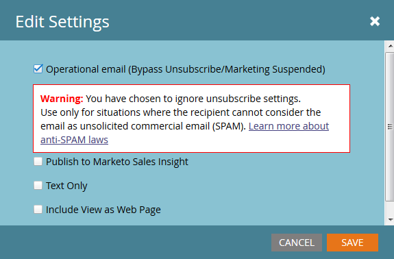
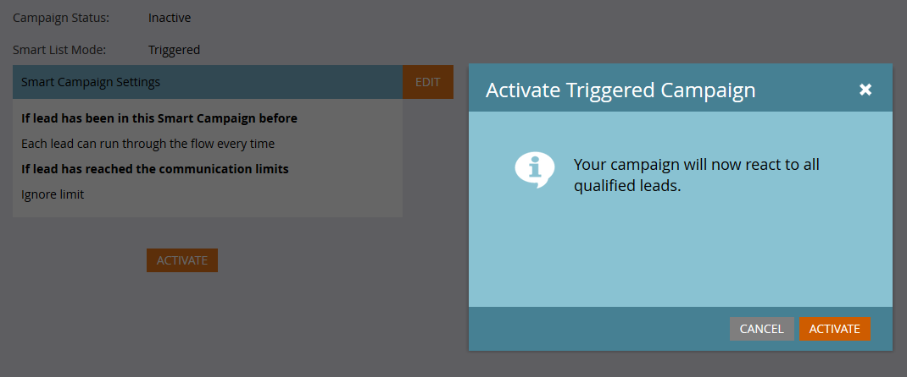

# Courrier électronique transactionnel

Un cas d’utilisation courant de l’API Marketo consiste à déclencher l’envoi d’emails transactionnels à des enregistrements spécifiques via l’appel de l’API [Demander la campagne](https://developer.adobe.com/marketo-apis/api/mapi/#tag/Campaigns/operation/triggerCampaignUsingPOST). Marketo requiert quelques configurations pour exécuter l’appel requis avec l’API REST Marketo.

- Le destinataire doit avoir un enregistrement dans Marketo
- Un email transactionnel doit être créé et approuvé dans votre instance Marketo.
- Il doit y avoir une campagne de déclenchement active avec &quot;La campagne est demandée, 1. Source : API de service Web&quot;, configurée pour envoyer le courrier électronique

Commencez par [créer et approuver votre email](https://experienceleague.adobe.com/docs/marketo/using/home.html). Si l&#39;email est réellement transactionnel, vous devrez probablement le définir comme opérationnel, mais vous devrez vous assurer qu&#39;il est légalement admissible comme opérationnel. Il est configuré à partir de l’écran Modifier sous Actions du courrier électronique > Paramètres de courrier électronique :




Approuvez-le et nous sommes prêts à créer notre campagne :


Si vous découvrez l’article [Créer une campagne dynamique](https://experienceleague.adobe.com/docs/marketo/using/product-docs/core-marketo-concepts/smart-campaigns/creating-a-smart-campaign/create-a-new-smart-campaign.html) si vous commencez à créer des campagnes. Une fois votre campagne créée, nous devons suivre ces étapes. Configurez votre liste dynamique à l’aide du déclencheur Campaign is Requested :


Maintenant, nous devons configurer le flux pour qu’il pointe une étape Envoyer un courrier électronique vers notre courrier électronique :


Avant l’activation, vous devez choisir certains paramètres dans l’onglet Planning . Si cet email particulier ne doit être envoyé qu’une seule fois à un enregistrement donné, laissez les paramètres de qualification tels quels. S’il est nécessaire qu’ils reçoivent le courrier électronique plusieurs fois, cependant, vous souhaitez l’ajuster à chaque fois ou à l’une des cadences disponibles :

Nous sommes maintenant prêts à activer :



## Envoi des appels d’API

**Remarque :** Dans les exemples Java ci-dessous, nous utilisons le [package minimal-json](https://github.com/ralfstx/minimal-json) pour gérer les représentations JSON dans notre code.

La première partie de l’envoi d’un email transactionnel via l’API consiste à s’assurer qu’un enregistrement avec l’adresse email correspondante existe dans votre instance Marketo et que nous avons accès à son ID de prospect. Pour les besoins de cette publication, nous supposons que les adresses électroniques se trouvent déjà dans Marketo et que nous ne devons récupérer que l’identifiant de l’enregistrement. Pour ce faire, nous utilisons l’appel [Get Leads by Filter Type](https://developer.adobe.com/marketo-apis/api/mapi/#tag/Leads/operation/getLeadsByFilterUsingGET) . Examinons notre Méthode principale pour demander la campagne :

```java
package dev.marketo.blog_request_campaign;

import com.eclipsesource.json.JsonArray;

public class App 
{
    public static void main( String[] args )
    {
        //Create an instance of Auth so that we can authenticate with our Marketo instance
        Leads leadsRequest = new Leads(auth).setFilterType("email").addFilterValue("requestCampaign.test@marketo.com");

        //Create and parameterize an instance of Leads
        //Set your email filterValue appropriately
        Leads leadsRequest = new Leads(auth).setFilterType("email").addFilterValue("test.requestCamapign@example.com");

        //Get the inner results array of the response
        JsonArray leadsResult = leadsRequest.getData().get("result").asArray();

        //Get the id of the record indexed at 0
        int lead = leadsResult.get(0).asObject().get("id").asInt();

        //Set the ID of your campaign from Marketo
        int campaignId = 0;
        RequestCampaign rc = new RequestCampaign(auth, campaignId).addLead(lead);

        //Send the request to Marketo
        rc.postData();
    }
}
```

Pour obtenir ces résultats à partir de la réponse JsonObject de leadRequest, nous devons écrire du code . Pour récupérer le premier résultat dans le tableau, nous devons extraire le tableau de JsonObject et obtenir l’objet indexé à 0 :

```java
JsonArray leadsResult = leadsRequest.getData().get("result").asArray();
int leadId = leadsResult.get(0).asObject().get("id").asInt();
```

À partir de maintenant, nous ne devons plus faire que l’appel de demande de campagne . Pour ce faire, les paramètres requis sont l’identifiant dans l’URL de la requête et un tableau d’objets JSON contenant un membre, &quot;id&quot;. Examinons le code pour ceci :

```java
package dev.marketo.blog_request_campaign;
import java.io.IOException;
import java.io.InputStream;
import java.io.InputStreamReader;
import java.io.OutputStreamWriter;
import java.io.Reader;
import java.net.MalformedURLException;
import java.net.URL;
import java.util.ArrayList;
import javax.net.ssl.HttpsURLConnection;
import com.eclipsesource.json.JsonArray;
import com.eclipsesource.json.JsonObject;

public class RequestCampaign {
    private String endpoint;
    private Auth auth;
    public ArrayList leads = new ArrayList();
    public ArrayList tokens = new ArrayList();
    
    public RequestCampaign(Auth auth, int campaignId) {
        this.auth = auth;
        this.endpoint = this.auth.marketoInstance + "/rest/v1/campaigns/" + campaignId + "/trigger.json";
    }
    public RequestCampaign setLeads(ArrayList leads) {
        this.leads = leads;
        return this;
    }
    public RequestCampaign addLead(int lead){
        leads.add(lead);
        return this;
    }
    public RequestCampaign setTokens(ArrayList tokens) {
        this.tokens = tokens;
        return this;
    }
    public RequestCampaign addToken(String tokenKey, String val){
        JsonObject jo = new JsonObject().add("name", tokenKey);
        jo.add("value", val);
        tokens.add(jo);
        return this;
    }
    public JsonObject postData(){
        JsonObject result = null;
        try {
            JsonObject requestBody = buildRequest(); //builds the Json Request Body
            String s = endpoint + "?access_token=" + auth.getToken(); //takes the endpoint URL and appends the access_token parameter to authenticate
            System.out.println("Executing RequestCampaign call\n" + "Endpoint: " + s + "\nRequest Body:\n"  + requestBody);
            URL url = new URL(s); 
            HttpsURLConnection urlConn = (HttpsURLConnection) url.openConnection(); //Return a URL connection and cast to HttpsURLConnection
            urlConn.setRequestMethod("POST");
            urlConn.setRequestProperty("Content-type", "application/json");
            urlConn.setRequestProperty("accept", "text/json");
            urlConn.setDoOutput(true);
            OutputStreamWriter wr = new OutputStreamWriter(urlConn.getOutputStream());
            wr.write(requestBody.toString());
            wr.flush();
            InputStream inStream = urlConn.getInputStream(); //get the inputStream from the URL connection
            Reader reader = new InputStreamReader(inStream);
            result = JsonObject.readFrom(reader); //Read from the stream into a JsonObject
            System.out.println("Result:\n" + result);
        } catch (MalformedURLException e) {
            e.printStackTrace();
        } catch (IOException e) {
            e.printStackTrace();
        }
        return result;
    }
    
    private JsonObject buildRequest(){
        JsonObject requestBody = new JsonObject(); //Create a new JsonObject for the Request Body
        JsonObject input = new JsonObject();
        JsonArray leadsArray = new JsonArray();
        for (int lead : leads) {
            JsonObject jo = new JsonObject().add("id", lead);
            leadsArray.add(jo);
        }
        input.add("leads", leadsArray);
        JsonArray tokensArray = new JsonArray();
        for (JsonObject jo : tokens) {
            tokensArray.add(jo);
        }
        input.add("tokens", tokensArray);
        requestBody.add("input", input);
        return requestBody;
    }

}
```

Cette classe comporte un constructeur prenant une authentification et l’identifiant de la campagne. Les pistes sont ajoutées à l’objet soit en transmettant un `ArrayList<Integer>` contenant les identifiants des enregistrements à setLeads, soit en utilisant addLead, qui prend un entier et l’ajoute à la liste ArrayList existante dans la propriété leads. Pour déclencher l’appel API afin de transmettre les enregistrements de piste à la campagne, postData doit être appelé, ce qui renvoie un objet JsonObject contenant les données de réponse de la requête. Lorsque la campagne de requête est appelée, chaque piste transmise à l’appel est traitée par la campagne de déclenchement cible dans Marketo et est envoyée à l’email qui a été créé précédemment. Félicitations, vous avez déclenché un courrier électronique via l’API REST Marketo. Gardez un oeil sur la Partie 2 où nous examinons la personnalisation dynamique du contenu d’un email via la campagne de demande.

### Création de votre email

Pour personnaliser notre contenu, nous devons d&#39;abord configurer un [programme](https://experienceleague.adobe.com/docs/marketo/using/product-docs/core-marketo-concepts/programs/creating-programs/create-a-program.html) et un [email](https://experienceleague.adobe.com/docs/marketo/using/home.html) dans Marketo. Pour générer notre contenu personnalisé, nous devons créer des jetons dans le programme, puis les placer dans l&#39;email que nous allons envoyer. Pour plus de simplicité, nous n’utilisons qu’un seul jeton dans cet exemple, mais vous pouvez remplacer n’importe quel nombre de jetons dans un email, dans le champ De l’email, Du nom, Réponse ou tout élément de contenu dans l’email. Créons donc un texte enrichi de jeton pour le remplacer et appelons-le &quot;bodyReplacement&quot;. Le texte enrichi nous permet de remplacer tout contenu du jeton par un HTML arbitraire que nous voulons saisir.


Les jetons ne peuvent pas être enregistrés lorsqu’ils sont vides. Insérez un texte d’espace réservé ici. Maintenant, nous devons insérer notre jeton dans l&#39;email :


Ce jeton sera désormais accessible pour remplacement via un appel de demande de campagne. Ce jeton peut être aussi simple qu’une seule ligne de texte qui doit être remplacée par email ou qui peut inclure presque toute la mise en page de l’email.

### Le code

```java
package dev.marketo.blog_request_campaign;

import com.eclipsesource.json.JsonArray;

public class App 
{
    public static void main( String[] args )
    {
        //Create an instance of Auth so that we can authenticate with our Marketo instance
        Auth auth = new Auth("Client ID - CHANGE ME", "Client Secret - CHANGE ME", "Host - CHANGE ME");
        
        //Create and parameterize an instance of Leads
        Leads leadsRequest = new Leads(auth).setFilterType("email").addFilterValue("requestCampaign.test@marketo.com");
        
        //get the inner results array of the response
        JsonArray leadsResult = leadsRequest.getData().get("result").asArray();
        
        //get the id of the record indexed at 0
        int lead = leadsResult.get(0).asObject().get("id").asInt();
        
        //Set the ID of our campaign from Marketo
        int campaignId = 1578;
        RequestCampaign rc = new RequestCampaign(auth, campaignId).addLead(lead);

        //Create the content of the token here, and add it to the request
        String bodyReplacement = "<div class=\"replacedContent\"><p>This content has been replaced</p></div>";
        rc.addToken("{{my.bodyReplacement}}", bodyReplacement);
        rc.postData();
    }
}
```

Si le code vous semble familier, c’est parce qu’il ne comporte que deux lignes supplémentaires provenant de la méthode principale ci-dessus. Cette fois, nous créons le contenu de notre jeton dans la variable bodyReplacement , puis nous utilisons la méthode addToken pour l’ajouter à la requête. addToken prend une clé et une valeur, puis crée une représentation JsonObject et l’ajoute au tableau de jetons internes. Il est ensuite sérialisé pendant la méthode postData et crée un corps qui ressemble à ceci :

```json
{
    "input":
    {
        "leads": [
            {
                "id": 1
            }
        ],
        "tokens": [
            {
                "name": "{{my.bodyReplacement}}",
                "value": "<div class=\"replacedContent\"><p>This content has been replaced</p></div>"
            }
        ]
    }
}
```

Combinée, la sortie de la console ressemble à ceci :

```bash
Token is empty or expired. Trying new authentication
Trying to authenticate with ...
Got Authentication Response: {"access_token":"19d51b9a-ff60-4222-bbd5-be8b206f1d40:st","token_type":"bearer","expires_in":3565,"scope":"apiuser@mktosupport.com"}
Executing RequestCampaign call
Endpoint: .../rest/v1/campaigns/1578/trigger.json?access_token=19d51b9a-ff60-4222-bbd5-be8b206f1d40:st
Request Body:
{"input":{"leads":[{"id":1}],"tokens":[{"name":"{{my.bodyReplacement}}","value":"<div class=\"replacedContent\"><p>This content has been replaced</p></div>"}]}}
Result:
{"requestId":"1e8d#14eadc5143d","result":[{"id":1578}],"success":true}
```

## Remplissage

Cette méthode est extensible de multiples façons, en modifiant le contenu des emails dans des sections de mise en page individuelles ou en dehors des emails, ce qui permet de transmettre des valeurs personnalisées dans des tâches ou des moments intéressants. Chaque fois qu’un jeton peut être utilisé à partir d’un programme, il est possible de le personnaliser à l’aide de cette méthode. Des fonctionnalités similaires sont également disponibles avec l’appel [Schedule Campaign](https://developer.adobe.com/marketo-apis/api/mapi/#tag/Campaigns/operation/scheduleCampaignUsingPOST) qui vous permet de traiter des jetons sur l’ensemble d’une campagne par lots. Elles ne peuvent pas être personnalisées par piste, mais sont utiles pour personnaliser le contenu sur un large ensemble de pistes.
