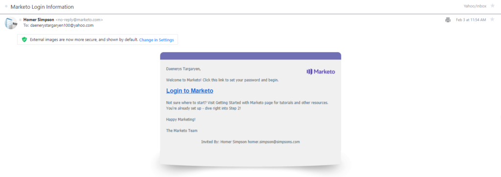

# Gestion des utilisateurs

[Référence des points d’entrée User Management](https://developer.adobe.com/marketo-apis/api/user/)

Les points d’entrée User Management de Marketo effectuent des opérations CRUD sur les enregistrements d’utilisateurs. Pour créer un utilisateur, envoyez une invitation. L’utilisateur définit ensuite un mot de passe et accède pour la première fois à Marketo.

Contrairement aux autres API REST Marketo, lors de l’utilisation des API User Management :

- Envoyer le jeton d’accès dans un en-tête HTTP Vous ne pouvez pas transmettre le jeton d’accès en tant que paramètre de chaîne de requête. Voir le [Guide d’authentification](authentication.md).
- Lors de la création du rôle utilisateur pour une API REST [Service personnalisé](https://experienceleague.adobe.com/en/docs/marketo/using/product-docs/administration/additional-integrations/create-a-custom-service-for-use-with-rest-api), sélectionnez une autorisation dans chacun de ces groupes :
  1. Autorisation « Accéder aux utilisateurs » à partir du groupe [Accéder aux administrateurs](https://experienceleague.adobe.com/en/docs/marketo/using/product-docs/administration/users-and-roles/descriptions-of-role-permissions)
  1. « Accéder à l’API User Management » à partir du groupe [API Access](https://experienceleague.adobe.com/en/docs/marketo/using/product-docs/administration/users-and-roles/descriptions-of-role-permissions)
- Évaluez le code de statut de la réponse HTTP car les corps de la réponse ne contiennent pas l’attribut booléen « success ». Un appel réussi renvoie le code d’état 200. Un appel ayant échoué renvoie un code d’état non 200 et le tableau « errors » standard avec un code d’erreur et un message descriptif.
- Formatez les chaînes datetime comme `yyyyMMdd'T'HH:mm:ss.SSS't'+|-hhmm`. Ce format s’applique aux `createdAt`, `updatedAt` et `expiresAt`.
- Ne préfixez pas les points d’entrée de l’API User Management avec « /rest ».

## Requête

Les requêtes User Management peuvent récupérer tous les utilisateurs, rôles et espaces de travail. Ils peuvent également récupérer un utilisateur ou les enregistrements de rôle et d’espace de travail associés par ID d’utilisateur.

### Utilisateur par ID

Le point d’entrée [Obtenir l’utilisateur par ID](https://developer.adobe.com/marketo-apis/api/user/#tag/User-Management/operation/getUserUsingGET) prend un seul paramètre de chemin d’accès `userid` et renvoie un seul enregistrement utilisateur pour un utilisateur qui a accepté son invitation.

```http
GET /userservice/management/v1/users/{userid}/user.json
```

```json
{
  "userid": "jamie@houselannister.com",
  "firstName": "Jamie",
  "lastName": "Lannister",
  "emailAddress": "jamie@lannister.com",
  "optedIn": false,
  "failedLogins": 0,
  "failedDeviceCode": 0,
  "isLocked": false,
  "lockedReason": null,
  "id": 0,
  "apiOnly": false,
  "userRoleWorkspaces": [
    {
      "accessRoleId": 1,
      "accessRoleName": "Admin",
      "workspaceId": 0,
      "workspaceName": "AllZones"
    },
    {
      "accessRoleId": 2,
      "accessRoleName":
      "Standard User",
      "workspaceId": 1008,
      "workspaceName": "World"
    }
  ],
  "expiresAt": "2020-12-31T08:00:00.000t+0000",
  "lastLoginAt": "2020-02-05T01:02:23.000t+0000"
}
```

### Utilisateur invité par ID

Le point d’entrée [Obtenir l’utilisateur invité par ID](https://developer.adobe.com/marketo-apis/api/user/#tag/User-Management/operation/getInvitedUserUsingGET) prend un seul paramètre de chemin d’accès `userid` et renvoie un seul enregistrement utilisateur pour un utilisateur « en attente » (n’a pas encore accepté son invitation).

```http
GET /userservice/management/v1/users/{userid}/invite.json
```

```json
{
    "id": 25112,
    "firstName": "Jamie",
    "lastName": "Lannister",
    "emailAddress": "jamie@lannister.com",
    "userId": "jamie@lannister.com",
    "subscriptionId": 3381,
    "status": "pending",
    "expiresAt": "20200807T20:49:54.0t+0000",
    "createdAt": "20200731T20:49:54.0t+0000",
    "updatedAt": "20200731T20:49:54.0t+0000"
}
```

### Rôles et espaces de travail par ID

Le point d’entrée [Obtenir les rôles et les espaces de travail par ID](https://developer.adobe.com/marketo-apis/api/user/#tag/User-Management/operation/getUserRolesAndWorkspacesUsingGET) prend un paramètre de chemin d’accès `userid` et renvoie les enregistrements de rôle et d’espace de travail de l’utilisateur. Chaque objet du tableau de réponse contient le rôle, l’identifiant et le nom de l’espace de travail.

```http
GET /userservice/management/v1/users/{userid}/roles.json
```

```json
[
  {
    "accessRoleId": 1,
    "accessRoleName": "Admin",
    "workspaceId": 0,
    "workspaceName": "AllZones"
  },
  {
    "accessRoleId": 2,
    "accessRoleName": "Standard User",
    "workspaceId": 1008,
    "workspaceName": "World"
  }
]
```

### Parcourir les utilisateurs

Le point d’entrée [Get Users](https://developer.adobe.com/marketo-apis/api/user/#tag/User-Management/operation/getUsersUsingGET) renvoie tous les enregistrements d’utilisateur. Il prend en charge les paramètres entiers facultatifs suivants :

- `pageSize` indique le nombre maximal d’entrées à renvoyer. La valeur par défaut est 20 et la valeur maximale est 200.
- `pageOffset` indique où commencer à récupérer les entrées. La valeur par défaut est 0 et peut être utilisée avec `pageSize`.

```http
GET /userservice/management/v1/users/allusers.json
```

```json
[
  {
    "userid": "jamie@lannister.com",
    "firstName": "Jamie",
    "lastName": "Lannister",
    "emailAddress": "jamie@houselannister.com",
    "id": 6785,
    "apiOnly": false
  },
  {
    "userid": "jeoffery@housebaratheon.com",
    "firstName": "Jeoffery",
    "lastName": "Baratheon",
    "emailAddress": "jeoffery@housebaratheon.com",
    "id": 7718,
    "apiOnly": false
  },
  {
    "userid": "rickon@housestark.com",
    "firstName": "Rickon",
    "lastName": "Stark",
    "emailAddress": "rickon@housestark.com",
    "id": 8612,
    "apiOnly": false
  }
]
```

>[!NOTE]
>
>Dans l’exemple de code ci-dessus, la `userid` affichée concerne un client qui a été migré vers Adobe IMS. Les clients qui n’ont pas encore migré verront une adresse e-mail régulière dans le champ `userid` .

### Parcourir les rôles

Le point d’entrée [Get Roles](https://developer.adobe.com/marketo-apis/api/user/#tag/User-Management/operation/getRolesUsingGET) renvoie une liste de tous les enregistrements de rôle.

```http
GET /userservice/management/v1/users/roles.json
```

```json
[
    {
        "id": 1,
        "name": "Admin",
        "description": "All permissions",
        "type": "system",
        "hidden": false,
        "onlyAllZones": true,
        "createdAt": "20100327T18:27:42.0t+0000",
        "updatedAt": "20100327T18:27:42.0t+0000"
    },
    {
        "id": 2,
        "name": "Standard User",
        "description": "All permissions except Admin",
        "type": "system",
        "hidden": false,
        "onlyAllZones": false,
        "createdAt": "20100327T18:27:42.0t+0000",
        "updatedAt": "20180423T02:33:29.0t+0000"
    },
    {
        "id": 24,
        "name": "RTP Launcher",
        "description": "Role required for launcher in RTP",
        "type": "system",
        "hidden": false,
        "onlyAllZones": false,
        "createdAt": "20151024T01:45:40.0t+0000",
        "updatedAt": "20171024T23:41:24.0t+0000"
    },
    {
        "id": 25,
        "name": "RTP Editor",
        "description": "Role required for editor in RTP",
        "type": "system",
        "hidden": false,
        "onlyAllZones": false,
        "createdAt": "20151024T01:45:40.0t+0000",
        "updatedAt": "20171024T23:41:24.0t+0000"
    },
    {
        "id": 101,
        "name": "Analytics User",
        "description": "Has access to Analytics",
        "type": "custom",
        "hidden": false,
        "onlyAllZones": false,
        "createdAt": "20100327T18:27:42.0t+0000",
        "updatedAt": "20180423T02:33:29.0t+0000"
    },
    {
        "id": 102,
        "name": "Marketing User",
        "description": "All permissions except Admin",
        "type": "custom",
        "hidden": false,
        "onlyAllZones": false,
        "createdAt": "20100327T18:27:42.0t+0000",
        "updatedAt": "20100327T18:27:42.0t+0000"
    },
    {
        "id": 103,
        "name": "Web Designer",
        "description": "Has access to Design Studio except approval permission",
        "type": "custom",
        "hidden": false,
        "onlyAllZones": false,
        "createdAt": "20100327T18:27:42.0t+0000",
        "updatedAt": "20180423T02:33:29.0t+0000"
    }
]
```

### Parcourir les espaces de travail

Le point d’entrée [Get Workspaces](https://developer.adobe.com/marketo-apis/api/user/#tag/User-Management/operation/getWorkspacesUsingGET) renvoie une liste de tous les enregistrements d’espace de travail.

```http
GET /userservice/management/v1/users/workspaces.json
```

```json
[
  {
    "id": 1,
    "name": "Default",
    "description": "Initial workspace for Marketing Activities, Design Studio, and so on.",
    "globalViz": 0,
    "status": "active",
    "currencyInfo": null,
    "createdAt": "20160910T23:08:05.0t+0000",
    "updatedAt": "20160910T23:08:05.0t+0000"
  },
  {
    "id": 1008,
    "name": "World",
    "description": "",
    "globalViz": 0,
    "status": "active",
    "currencyInfo": null,
    "createdAt": "20181119T21:59:36.0t+0000",
    "updatedAt": "20181119T21:59:36.0t+0000"
  },
  {
    "id": 1009,
    "name": "Reproduction - US English - All Leads",
    "description": "A Workspace for recreating customer-reported problems.",
    "globalViz": 1,
    "status": "active",
    "currencyInfo": null,
    "createdAt": "20190129T23:36:37.0t+0000",
    "updatedAt": "20190129T23:36:37.0t+0000"
  },
  {
    "id": 1010,
    "name": "US",
    "description": "United States - Qualified Leads",
    "globalViz": 0,
    "status": "active",
    "currencyInfo": null,
    "createdAt": "20190322T15:55:40.0t+0000",
    "updatedAt": "20190322T15:55:40.0t+0000"
  }
]
```

## Inviter un utilisateur

Sur les [abonnements intégrés à Adobe IMS](https://experienceleague.adobe.com/fr/docs/marketo/using/product-docs/administration/marketo-with-adobe-identity/adobe-identity-management-overview), ce point d’entrée prend uniquement en charge les invitations des [utilisateurs API uniquement](https://experienceleague.adobe.com/en/docs/marketo/using/product-docs/administration/users-and-roles/create-an-api-only-user). Pour inviter des [utilisateurs standard](https://experienceleague.adobe.com/en/docs/marketo/using/product-docs/administration/users-and-roles/managing-marketo-users), utilisez plutôt l’API [Adobe User Management](https://developer.adobe.com/umapi/).

Le point d’entrée [Inviter un utilisateur](https://developer.adobe.com/marketo-apis/api/user/#tag/User-Management/operation/inviteUserUsingPOST) envoie une invitation par e-mail « Bienvenue dans Marketo » à un nouvel utilisateur. L’e-mail contient un lien « Connexion à Marketo ». Le destinataire sélectionne le lien, crée un mot de passe et accède à Marketo.

Tant que le destinataire n’a pas accepté l’invitation, son statut est « en attente » et l’enregistrement de l’utilisateur ne peut pas être modifié. Une invitation en attente expire sept jours après son envoi. Pour plus d’informations, consultez la documentation sur la gestion des utilisateurs de Marketo [](https://experienceleague.adobe.com/en/docs/marketo/using/product-docs/administration/users-and-roles/managing-marketo-users).

Transmettez les paramètres dans le corps de la requête au format `application/json`.

Les paramètres requis sont `emailAddress`, `firstName`, `lastName` et `userRoleWorkspaces`. Le paramètre `userRoleWorkspaces` est un tableau d’objets contenant des attributs `accessRoleId` et `workspaceId`.

Le paramètre `userid` est l’identifiant utilisateur unique utilisé pour la connexion et doit être formaté comme une adresse e-mail. Si la requête est `userid`, sa valeur par défaut est `emailAddress`.

Le paramètre de `apiOnly` booléen indique si l’utilisateur est un utilisateur [API uniquement](https://experienceleague.adobe.com/en/docs/marketo/using/product-docs/administration/users-and-roles/create-an-api-only-user). Le paramètre `expiresAt` spécifie le moment où la connexion de l’utilisateur expire et utilise le format W3C ISO-8601 sans millisecondes. Si la requête est `expiresAt`, l’utilisateur n’expire jamais. Le paramètre `reason` décrit le motif de l’invitation.

Le point d’entrée renvoie « true » lorsque l’invitation réussit. Dans le cas contraire, il renvoie un message d’erreur.

```http
POST /userservice/management/v1/users/invite.json
```

```text
Content-Type: application/json
```

```json
{
  "emailAddress": "daenerys@housetargaryen.com",
  "firstName": "Daenerys",
  "lastName": "Targaryen",
  "expiresAt": "2020-12-31T23:59:59-05:00",
  "reason": "Keeper of dragons",
  "userRoleWorkspaces": [
    {
      "accessRoleId": 1,
      "workspaceId": 0
    }
  ]
}
```

```text
true
```

L’image suivante montre l’e-mail « Bienvenue dans Marketo » envoyé au nouvel utilisateur. L’objet est « Informations de connexion à Marketo ». L’expéditeur est l’adresse e-mail de l’utilisateur API uniquement associée au [service personnalisé de l’API REST](https://experienceleague.adobe.com/en/docs/marketo/using/product-docs/administration/additional-integrations/create-a-custom-service-for-use-with-rest-api). Les paramètres firstName, lastName et emailAddress indiquent le destinataire.



L’utilisateur accepte l’invitation en saisissant deux fois un mot de passe et en sélectionnant le bouton « CRÉER UN MOT DE PASSE ». L’utilisateur reçoit ensuite l’accès à Marketo.

## Mettre à jour l’utilisateur

Vous pouvez mettre à jour les attributs de l’utilisateur ou supprimer un utilisateur après que celui-ci a accepté l’invitation. Transmettez des attributs en tant que paramètres dans le corps de la requête au format application/json.

### Mettre à jour les attributs utilisateur

Sur les [abonnements intégrés à Adobe IMS](https://experienceleague.adobe.com/fr/docs/marketo/using/product-docs/administration/marketo-with-adobe-identity/adobe-identity-management-overview), ce point d’entrée prend uniquement en charge la mise à jour des attributs des [utilisateurs API uniquement](https://experienceleague.adobe.com/en/docs/marketo/using/product-docs/administration/users-and-roles/create-an-api-only-user). Pour mettre à jour les attributs pour [utilisateurs standard](https://experienceleague.adobe.com/en/docs/marketo/using/product-docs/administration/users-and-roles/managing-marketo-users), utilisez plutôt l’API [Adobe User Management](https://developer.adobe.com/umapi/).

Le point d’entrée [Mettre à jour les attributs utilisateur](https://developer.adobe.com/marketo-apis/api/user/#tag/User-Management/operation/updateUserAttributeUsingPOST) prend un seul paramètre de chemin d’accès `userid` et renvoie un seul enregistrement utilisateur. Le corps de la requête contient un ou plusieurs attributs utilisateur à mettre à jour : `emailAddress`, `firstName`, `lastName`, `expiresAt`.

```http
POST /userservice/management/v1/users/{userid}/update.json
```

```text
Content-Type: application/json
```

```json
{
  "firstName": "JAMIE",
  "lastName": "LANISTER",
  "expiresAt": "20211231T08:00:00.000t+0000"
}
```

```json
{
  "userid": "jamie@houselannister.com",
  "firstName": "JAMIE",
  "lastName": "LANISTER",
  "emailAddress": "jamie@houselannister.com",
  "optedIn": false,
  "failedLogins": 0,
  "failedDeviceCode": 0,
  "isLocked": false,
  "lockedReason": null,
  "id": 0,
  "apiOnly": false,
  "userRoleWorkspaces": [
    {
      "accessRoleId": 1,
      "accessRoleName": "Admin",
      "workspaceId": 0,
      "workspaceName": "AllZones"
    },
    {
      "accessRoleId": 2,
      "accessRoleName":
      "Standard User",
      "workspaceId": 1008,
      "workspaceName": "World"
    }
  ],
  "expiresAt": "2021-12-31T08:00:00.000t+0000"
  "lastLoginAt": "2020-02-05T01:02:23.000t+0000"
}
```

#### Supprimer l’utilisateur

Sur les [abonnements intégrés à Adobe IMS](https://experienceleague.adobe.com/fr/docs/marketo/using/product-docs/administration/marketo-with-adobe-identity/adobe-identity-management-overview), ce point d’entrée prend uniquement en charge la suppression des [utilisateurs utilisant uniquement l’API](https://experienceleague.adobe.com/en/docs/marketo/using/product-docs/administration/users-and-roles/create-an-api-only-user). Pour supprimer [Utilisateurs standard](https://experienceleague.adobe.com/en/docs/marketo/using/product-docs/administration/users-and-roles/managing-marketo-users), utilisez plutôt l’API [Adobe User Management](https://developer.adobe.com/umapi/).

Le point d’entrée [Supprimer l’utilisateur](https://developer.adobe.com/marketo-apis/api/user/#tag/User-Management/operation/deleteUserUsingPOST) prend un seul paramètre de chemin d’accès `userid` et supprime l’utilisateur correspondant de l’instance. Il s’agit d’une suppression destructrice qui ne peut pas être annulée. En cas de réussite, un code d’état 200 est renvoyé, sinon un message d’erreur est renvoyé.

```http
POST /userservice/management/v1/users/{userid}/delete.json
```

#### Supprimer utilisateur invité

Le point d’entrée [Supprimer l’utilisateur invité](https://developer.adobe.com/marketo-apis/api/user/#tag/User-Management/operation/deleteInvitedUserUsingPOST) prend un seul paramètre de chemin d’accès `userid` et supprime l’utilisateur « en attente » correspondant de l’instance (l’utilisateur n’avait pas encore accepté son invitation). Il s’agit d’une suppression destructrice qui ne peut pas être annulée. En cas de réussite, un code d’état 200 est renvoyé, sinon un message d’erreur est renvoyé.

```http
POST /userservice/management/v1/users/{userid}/invite/delete.json
```

## Mettre à jour les rôles

Vous pouvez ajouter ou supprimer des rôles. Transmettez des attributs en tant que paramètres dans le corps de la requête au format application/json.

## Ajouter rôles

Le point d’entrée [Ajouter des rôles](https://developer.adobe.com/marketo-apis/api/user/#tag/User-Management/operation/addRolesUsingPOST) prend un seul paramètre de chemin d’accès `userid` et ajoute un ou plusieurs rôles utilisateur à l’utilisateur correspondant. Le corps de la requête contient une liste d’un ou de plusieurs objets contenant chacun un `accessRoleId` et un attribut `workspaceId`. En cas de réussite, la liste complète des paires de `accessRoleId/workspaceId` pour l’utilisateur spécifié est renvoyée.

```http
POST /userservice/management/v1/users/{userid}/roles/create.json
```

```text
Content-Type: application/json
```

```json
[
  {
    "accessRoleId": 2,
    "workspaceId": 1008
  }
]
```

```json
[
  {
    "accessRoleId": 1,
    "accessRoleName": "Admin",
    "workspaceId": 0,
    "workspaceName": "AllZones"
  },
  {
    "accessRoleId": 2,
    "accessRoleName": "Standard User",
    "workspaceId": 1008,
    "workspaceName": "World"
  }
]
```

## Supprimer rôles

Le point d’entrée [Supprimer des rôles](https://developer.adobe.com/marketo-apis/api/user/#tag/User-Management/operation/deleteRolesUsingPOST) prend un seul paramètre de chemin d’accès `userid` et supprime un ou plusieurs rôles utilisateur de l’utilisateur correspondant. Le corps de la requête contient une liste d’un ou de plusieurs objets contenant chacun un `accessRoleId` et un attribut `workspaceId`. En cas de réussite, la liste restante des paires accessRoleId/workspaceId pour l’utilisateur spécifié est renvoyée.

```http
POST /userservice/management/v1/users/{userid}/roles/delete.json
```

```text
Content-Type: application/json
```

```json
[
  {
    "accessRoleId": 2,
    "workspaceId": 1008
  }
]
```

```json
[
  {
    "accessRoleId": 1,
    "accessRoleName": "Admin",
    "workspaceId": 0,
    "workspaceName": "AllZones"
  }
]
```
