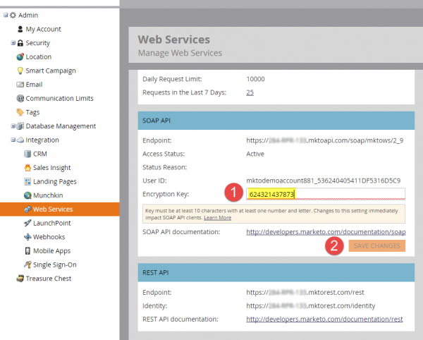

# API SOAP

L’API SOAP est en cours d’obsolescence et ne sera plus disponible après le 31 octobre 2025. Tout nouveau développement doit être effectué avec l’API Marketo [REST](../rest-api/rest-api.md) et les services existants doivent être migrés avant cette date pour éviter toute interruption de service. Si vous disposez d’un service qui utilise l’API SOAP, consultez le [ Guide de migration de l’API SOAP ](./migration.md) pour plus d’informations sur la migration.

## WSDL SOAP

Pour récupérer le document WSDL SOAP, procurez-vous le point d’entrée de l’API SOAP à partir du menu **[!UICONTROL Admin]** > **[!UICONTROL Intégration]** > **[!UICONTROL Services Web]**.

Votre URL WSDL est :

`<SOAP API Endpoint> + ?WSDL`

N’utilisez pas le point de terminaison défini dans le WSDL. Chaque instance Marketo dispose d’un point d’entrée unique vers lequel effectuer des appels.

## Limites

- **Quota quotidien :** la plupart des abonnements reçoivent 10 000 appels API par jour (qui sont réinitialisés tous les jours à 00 h 00 CST). Vous pouvez augmenter votre quota quotidien par l&#39;intermédiaire de votre gestionnaire de compte.
- **Limite de débit :** accès à l’API par instance limité à 100 appels par 20 secondes.
- **Limite de simultanéité :**  Maximum de dix appels API simultanés.

Nous recommandons que la taille des lots ne soit pas supérieure à 300. Les tailles plus volumineuses ne sont pas prises en charge et peuvent entraîner des délais d’expiration et, dans des cas extrêmes, une limitation.

## Paramètres de l’API SOAP dans Marketo

1. Accédez à la section **[!UICONTROL Admin]** et cliquez sur **[!UICONTROL Services web]**.

1. Définissez une [!UICONTROL Clé de chiffrement] appropriée, cliquez sur **[!UICONTROL Enregistrer les modifications]** et utilisez les valeurs de l’API SOAP [!UICONTROL Point d’entrée], [!UICONTROL ID utilisateur] et [!UICONTROL Clé de chiffrement] pour générer la valeur [signature](authentication-signature.md) correcte pour chaque appel API SOAP.

