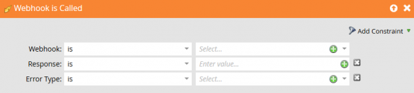

# Erreurs

Cette page décrit les codes de réponse d’erreur pour les webhooks Marketo et explique comment gérer les erreurs webhook.

Marketo génère les codes d&#39;erreur 1000 et 1001. Le système appelé par le webhook Marketo renvoie des codes de réponse 2xx à 5xx.

Marketo mappe les valeurs de réponse à un champ uniquement lorsque le service web renvoie un code de réponse 2xx. Si une réponse webhook est destinée à modifier les valeurs dans un enregistrement de prospect Marketo, tous les autres codes de réponse font que Marketo ignore la réponse pour les mises à jour de champ.

| Code de réponse | Description |
| --- | --- |
| 1 000 | Cela indique que l’action de flux « Appeler le Webhook » est hébergée dans une campagne par lots. Les Webhooks ne peuvent être déclenchés qu’à partir de campagnes de déclenchement. |
| 1001 | Cela indique que le service web a émis un corps de réponse vide. |

## Capturer une erreur Webhook

Utilisez le déclencheur **[!UICONTROL Webhook est appelé]** pour capturer et gérer les erreurs webhook :

* **Response** - Payload de réponse littérale reçue par la requête.
* **Type d’erreur** - Expression de motif du message d’état HTTP.

Utilisez ces valeurs pour répondre aux erreurs et exceptions prévisibles. En fonction du service intégré, vous pouvez récupérer automatiquement de certaines classes d’erreurs et créer des alertes pour les erreurs inattendues.
