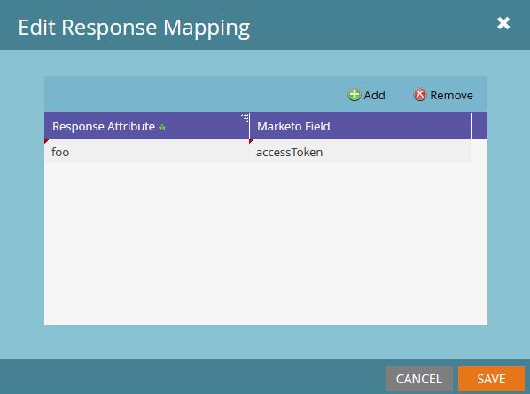

# Response Mappings

Marketo peut traduire les données webhook au format JSON ou XML et écrire les valeurs dans les champs de prospect. Le paramètre Champ Marketo utilise toujours le [nom d’API SOAP du champ](../rest-api/fields.md).

Chaque webhook peut avoir un nombre illimité de mappages de réponse. Pour ajouter ou modifier des mappages, sélectionnez [!UICONTROL Modifier] dans le volet Mappages de réponse du webhook :


Un mappage de réponse associe ces valeurs :

- « Attribut de réponse » : chemin d’accès à la propriété souhaitée dans le document XML ou JSON.
- « Champ Marketo » : champ de prospect dans lequel Marketo écrit la valeur de l’attribut de réponse.

Pour accéder à une propriété par le biais de mappages de réponse Marketo, sa clé ne doit contenir que des caractères alphanumériques, un tiret (-), un trait de soulignement (_), deux-points (:) et un espace.

## Mappages JSON

Accédez aux propriétés JSON avec la notation par points et la notation par tableau. La notation du tableau Marketo accepte uniquement les entiers, et non les chaînes.

Pour récupérer des données d’un document JSON, définissez le type de réponse sur JSON :

```json
{ "foo":"bar"}
```

La propriété `foo` se trouve au premier niveau de l’objet JSON. Utilisez sa propriété `name`, `foo`, dans le mappage de réponse :



L’exemple suivant contient un tableau :

```json
{
    "profileId" : 1234,
    "firstName" : "Jane",
    "lastName" : "Doe",
    "orders" : [
        {
            "orderId" : 5678,
            "orderDate" : "2015-01-01",
            "orderProductId" : "4982"
        },
        {
            "orderId" : 5678,
            "orderDate" : "2014-05-07",
            "orderProductId" : "4982"
        }
    ]
}
```

Pour accéder à orderDate à partir du premier élément du tableau de commandes, utilisez `orders[0].orderDate`.

## Mappings XML

Accédez aux valeurs des éléments XML individuels en utilisant la notation par points, similaire aux mappages JSON. Prenons l’exemple suivant :

```xml
<?xml version="1.0" encoding="UTF-8"?>
<example>
    <foo>bar</foo>
</example>
```

Pour accéder à la propriété foo, utilisez `example.foo`.

Référencez l’élément d’exemple avant d’accéder à `foo`. Un mappage doit référencer chaque élément de la hiérarchie des propriétés.

Pour un document XML avec un tableau , prenez l’exemple suivant :

```xml
<?xml version="1.0" encoding="UTF-8"?>
<elementList>
    <element>
        <foo>baz</foo>
    </element>
    <element>
        <foo>bar</foo>
    </element>
    <element>
        <foo>bar</foo>
    </element>
</elementList>
```

Le tableau parent est `elementList`. Chaque élément enfant contient la propriété `foo`. Les mappages de réponse Marketo référencent le tableau en tant que `elementList.element` et accèdent à ses enfants par le biais de `elementList.element[i]`.

Pour obtenir la valeur de foo à partir du premier enfant de elementList, utilisez l&#39;attribut de réponse `elementList.element[0].foo`. Ce mappage renvoie la valeur « basz » au champ désigné.

L’accès aux propriétés dans des éléments qui contiennent à la fois des noms d’élément uniques et non uniques génère un comportement non défini. Chaque élément doit être une propriété unique ou un tableau. Ne mélangez pas les types.

## Types

Lors du mappage des attributs aux champs, assurez-vous que le type de réponse webhook est compatible avec le champ cible. Par exemple, Marketo n’écrit pas de valeur de réponse de chaîne dans un champ de type entier. Pour plus d’informations, voir [Types de champs](../rest-api/field-types.md).
